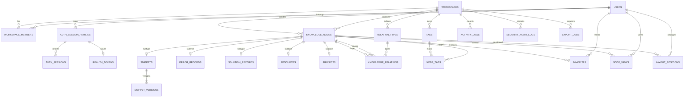
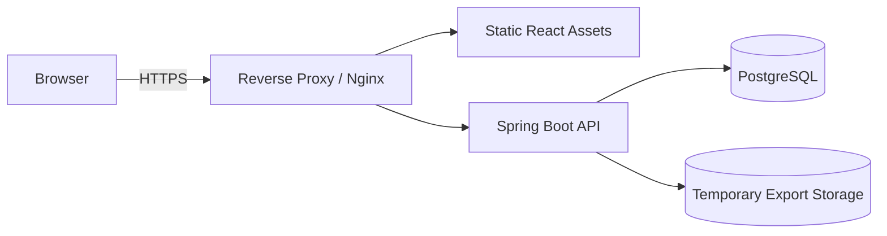

# DevGraph 제품·서비스·기술 설계서

> 문서 상태: 기준안 v2.0 (Phase 0~7 구현 결과 반영)  
> 작성일: 2026-09-28  
> 대상: Product, UX, Frontend, Backend, QA, 운영 담당 및 구현 에이전트  
> 문서 목적: 별도 구두 설명 없이 MVP와 1.0 구현을 시작할 수 있는 Source of Truth
>
> **v1.1 변경 요약:** 릴리스 범위 용어 고정과 요구사항 추적표 추가(§0, §2.3, §9.9), Relation 의미 분리와 대칭 관계 canonical 저장(§13.1), Export 처리 방식을 비동기 Job 단일안으로 통일(§9.8, §12.3, §14.6), 검색 버전 범위·정렬·zero-result 계약 명확화(§9.5), Graph API/DB 누락 보완(§12.3, §13.3, §14.5), 인증·보안 출시 기준 확정(§17.3, §17.7), Trash/Archive 상태 전이와 Endpoint 분리(§11.3, §14.3), 데이터 보존 정책 통합표(§21.5), 화면 상태·접근성·테스트 보강(§10.1, §20.2)을 반영했다.
>
> **v1.2 변경 요약:** 분리 문서(docs-word)의 절 번호를 유지해 `§14.7` 류 상호 참조가 다시 유효하도록 되돌림(빌드 스크립트), Export 범위를 §18.1 MVP 등급표·§19 Phase 7까지 1.0 필수로 통일하고 처리 주체(Spring `@Scheduled` 폴러, 별도 worker 없음)를 명시(§9.8, §19), 검색 cursor SQL을 정렬 방향별 조건으로 수정(§9.5), 검색 highlight를 HTML 문자열에서 구조화 구간 배열로 변경해 렌더링 계약 모순 제거(§14.7), `security_audit_logs`를 `REQUIRES_NEW` 트랜잭션으로 전환(§12.3, §15.2), Trash 복구는 purge 예약 취소로 수정하고 영구 삭제를 `POST + X-Reauth-Token`으로 재설계, 제한 베타 계정 복구를 관리자 CLI 명령으로 교체(§11.3, §14.3, §17.8), Recent reauthentication 메커니즘(`POST /auth/reauth`) 신설(§17.2), 요구사항 추적표에 `SRCH-*`/`EXPT-*`/`SEC-*`/`DATA-*`/`NFR-*` 추가(§9.5, §9.8, §9.9, §11.3, §17, §22), docx 한글 폰트를 "Arial Unicode MS"에서 "Malgun Gothic"(+Arial 조합)으로 교체해 PDF/Word 렌더링 시 한글 누락 문제를 해결했다.
>
> **v1.3 변경 요약:** 재인증 저장 모델을 `auth_session_families`(안정 세션 식별자) + `auth_sessions`(rotation 이력) + `reauth_tokens`(family당 1개, purpose 4종)로 확정하고 Access JWT `sid = token_family_id`, family 절대 만료(`absolute_expires_at`, 기본 90일)를 도입(§12.1, §12.3, §17.2), `GET/DELETE /auth/sessions`를 family 기준 API로 재설계(§14.2), Relation 의미 계약을 확정 — 시스템 13종 닫힌 집합 유지, 사용자 정의 Relation을 1.0에서 Growth로 이동(§9.4, §13.2, §18.1, §25, §9.9), Self-loop를 애플리케이션 사전검증(400) + DB CHECK(최종 방어) 이중 구조로 확정하고 `relation_types.allow_self_loop` 같은 예외 컬럼은 추가하지 않기로 결정(PostgreSQL CHECK의 교차 테이블 조회 불가 제약, §12.3), `APPLIED_IN` Source를 Solution 전용으로 정정해 §9.7 체인과의 기존 불일치를 제거, 모든 DB constraint에 명시적 이름 규칙을 도입하고 SQLState+이름 기반 예외 변환을 infrastructure 계층 책임으로 명시(§12.2, §15.2)했다.
>
> **v1.4 변경 요약:** Node 영구 삭제 cascade에 누락됐던 `node_views`/`layout_positions`를 추가하고 API의 `HAS_DEPENDENCIES`를 제거해 `TRASHED` 전제조건 + `409 INVALID_NODE_STATE`로 통일(§11.3, §14.3), 계정 탈퇴에 `POST /account/deletion-cancel`과 `DELETION_PENDING` 상태를 추가(§9.1, §14.2), `must_change_password`(§17.8 강제 비밀번호 재설정)와 `DELETION_PENDING`을 Access JWT `restriction` claim 기반의 단일 화이트리스트 필터로 통합(§17.2.3 신설), `users.must_change_password`/`status`, `auth_session_families.device_label` 컬럼 추가와 `revoke_reason`에서 중복이던 `ACCOUNT_DELETED`를 `ACCOUNT_DELETION_REQUESTED`로 단일화(§12.3), 회원가입에서 실사용 계획이 없는 `termsVersion`을 제거(§9.1, §14.2), `POST/GET /relation-types`를 실제 구현 범위(GET은 시스템 13종만, POST는 Growth로 라우트 자체를 만들지 않음)에 맞게 정정(§14.5), reauth 토큰 소비를 조건부 `UPDATE ... RETURNING` 기반 원자적 단일 소비로 명시(§17.2.2), 검색 `search_vector`에서 태그를 제외하고 join 기반 스코어링으로 전환해 벡터 갱신 시점 미결 문제를 제거(§15.4)했다. 세부 근거는 각 절 하단의 결정 사유를 참고한다.
>
> **v1.9 변경 요약:** Phase 6(Project / Error / Solution, 그리고 Resource) 구현 결과를 반영했다. 서브타입 4종의 API 계약·검증·상태 전이(Error 해결 상태 머신, 미해결 경고)·체인 원자성(Solution 생성과 `SOLVED_BY`를 한 트랜잭션)·Resource URL 정규화와 중복 경고·Project 그래프를 §14.6에, 검색 범위 확장(Error 메시지·Solution 본문·Project 설명)과 가중치를 §9.5·§15.4에, 구현 결과와 이월 항목을 §19에 기록했다.
>
> **v2.0 변경 요약:** Phase 7(서비스 안정화) 구현 결과를 반영했다. 재인증·비밀번호 변경·계정 탈퇴/취소·영구 삭제·Export·rate limit·보안 헤더의 실제 계약과 수치를 §14.2·§14.6·§17에, 운영 구성(prod compose, 구조화 로그, health 그룹, 백업/복원 스크립트)을 §21에, 구현 결과·측정 결과·이월 항목을 §19에 기록했다. 부하 측정이 찾아낸 검색 결함(순위 함수를 FTS 비해당 행에도 계산해 p95 3.66s)과 복원 리허설·보안 점검 결과는 `docs/NFR_REPORT.md`, `docs/SECURITY_CHECKLIST.md`, `docs/RUNBOOK.md`에 있다. **§17.2의 refresh 응답 유실은 10초 유예 방식으로 확정·구현**했다. 제한 세션이 `POST /auth/refresh`로 제한을 풀 수 있어야 한다는 §17.2.3의 암묵적 전제를 화이트리스트에 명시했다(구현 중 발견한 결함).
>
> **v1.8 변경 요약:** Phase 5(Search) 구현 결과를 반영했다. `GET /search`의 실제 계약(검증, 필터, cursor, 구조화 highlight, 0건 fallback)을 §14.6에, 랭킹 가중치 조정(**정확 제목 일치 100 → 300**, 제목 부분 일치 +35 추가)과 한국어 본문 검색의 한계, 본문 색인 범위(앞 100,000자)를 §9.5·§15.4에, 구현 결과와 이월 항목을 §19에 기록했다.
>
> **v1.7 변경 요약:** Phase 4(Relation & Graph) 구현 결과를 반영했다. Relation 검증 순서·오류 코드, 대칭 관계의 응답 정규화, `GET /relations/target-candidates`(Relation Picker용 보조 endpoint), Node 상세의 `relations`, Graph focus의 BFS·상한·확장 후보, Workspace Graph의 페이지 경계 edge 한계를 §14.5에, 구현 결과와 이월 항목을 §19에 기록했다. 테스트 중 확인된 사실로 `LIKE` 검색의 와일드카드 이스케이프 공통화(§15.2)를 남겼다.
>
> **v1.6 변경 요약:** Phase 3(Snippet) 구현 결과를 반영했다. Snippet API의 실제 계약(secret 확인 흐름 `422 SECRET_CONFIRMATION_REQUIRED`, 코드 원문 보존 규칙, 버전 생성 조건, `PATCH /nodes/{id}`의 subtype 우회 차단, Library 목록에서 Snippet 제외, diff endpoint 이월)을 §14.4에, 구현 결과와 이월 항목을 §19에 기록하고, 브라우저 E2E에서 확인된 **refresh 응답 유실 시 세션 family가 폐기되는 문제**를 §17.2에 미결 결정으로 기록했다.
>
> **v1.5 변경 요약:** Phase 1~2를 실제로 구현·실행하며 확인된 사실을 반영했다. `csrf_token` 쿠키 Path를 `/api/v1`에서 `/`로 정정(SPA 페이지 경로에서는 `document.cookie`로 읽을 수 없어 refresh가 항상 `403 CSRF_FAILED`가 되는 결함, §17.3), Phase 2 API의 실제 구현 범위와 계약 세부(응답 `version`은 갱신 후 값, `413 PAYLOAD_TOO_LARGE`, 수정 시 `null`=변경 없음, 지원 정렬 등)를 §14.3에 명시, Phase 2 구현 결과와 이월 항목을 §19에 기록했다.

---

## 0. 핵심 결정 요약

| 항목 | 결정 | 이유 |
|---|---|---|
| 제품 범위 | 개인용 Developer Knowledge Base로 시작 | 팀 권한·협업을 MVP에 섞으면 핵심 경험 검증이 늦어진다. |
| 1차 핵심 경험 | 지식·코드·오류 해결 경험을 연결하고 다시 찾는 흐름 | 단순 메모/코드 저장 서비스와 구분되는 최소 가치다. |
| Backend | Spring Boot 모듈형 모놀리스 | 개인/소규모 개발에서 배포·트랜잭션·디버깅이 단순하며, 도메인별 모듈 분리가 가능하다. |
| Database | PostgreSQL 단일 저장소 | 트랜잭션, 관계 데이터, 전문 검색, 그래프 인접 목록을 한 저장소에서 처리할 수 있다. |
| Graph 저장 | `knowledge_nodes` + `knowledge_relations` 인접 목록 | MVP의 1~3 depth 탐색에는 충분하며 Graph DB 운영 비용을 피한다. |
| 검색 | PostgreSQL FTS + `pg_trgm` | 별도 검색 클러스터 없이 제목·본문·태그·코드 검색과 랭킹을 구현할 수 있다. |
| Cache | MVP에서 Redis 제외 | 읽기 병목과 다중 인스턴스 요구가 확인되기 전에는 캐시 무효화 복잡도가 더 크다. |
| 실시간/Queue | WebSocket·메시지 큐 제외 | 개인 지식 관리의 핵심 흐름에 실시간 협업이 필요하지 않다. |
| 인증 | 짧은 Access JWT + 회전형 Refresh Session | API 확장성과 세션 탈취 대응을 함께 확보한다. |
| Frontend | React + TypeScript + Vite, feature 중심 혼합 구조 | Graph/Editor의 복잡성을 기능 단위로 격리하면서 공통 레이어를 재사용한다. |
| Graph UI | React Flow 우선 검증 | 노드/엣지 상호작용과 커스텀 노드 구현이 쉽다. 대규모 그래프는 서버 제한과 depth 탐색으로 제어한다. |
| Code Editor | Monaco Editor를 lazy loading | 개발자 친숙성과 언어 지원이 좋지만 번들 비용이 있어 편집 화면에서만 로드한다. |
| 버전 관리 | Snippet에만 명시적 불변 버전 | 모든 지식 본문의 버전화를 MVP에 넣는 것은 과하다. 일반 변경은 활동 로그로 추적한다. |
| 제품 단계 | MVP와 1.0을 분리 | MVP는 Concept/Note/Snippet/Relation/Search 검증, 1.0은 Error/Solution/Project 완결 흐름을 목표로 한다. |
| 릴리스 용어 | `MVP / 1.0 / Growth / Team` 4단계로 고정 | 문서마다 범위 표현이 달라 발생하는 불일치(예: Export 소속)를 방지한다. 기능 범위의 기준 문서는 §9(기능 요구사항)와 §18(MVP 정의)이며, §19(로드맵)·§27(완료 기준)은 이를 인용만 한다. |
| Export 처리 | 인증된 비동기 Export Job 단일 방식 | 동기 streaming과 비동기 job이 문서마다 다르게 설명되던 것을 제거하고 구현을 하나로 고정한다(§9.8, §12.3, §14.6). |

### 0.1 명시적 비범위

MVP에는 팀 협업, 댓글, 공개 공유, Graph DB, Elasticsearch/OpenSearch, Redis, WebSocket, 메시지 큐, 파일 첨부, AI API, Git 동기화, 모바일 앱을 포함하지 않는다. 각 항목은 실제 사용 지표나 운영 병목이 확인된 뒤 도입한다.

---

## 1. Executive Summary

DevGraph는 개발자가 학습한 개념, 메모, 재사용 코드, 오류, 해결 방법, 참고 자료와 실제 프로젝트 경험을 **관계가 있는 지식 단위**로 저장하고 탐색하는 개인 개발 지식 플랫폼이다.

기존 도구에서는 “JWT가 무엇인지”, “어떤 코드로 구현했는지”, “어느 프로젝트에서 썼는지”, “어떤 오류를 어떻게 해결했는지”가 서로 다른 문서·Gist·브라우저 북마크·프로젝트 저장소에 흩어진다. DevGraph는 이들을 하나의 그래프 정체성으로 연결해 다음 질문에 답한다.

- 예전에 이 문제를 어디에서 겪었는가?
- 당시 원인은 무엇이었고 무엇으로 해결했는가?
- 재사용 가능한 실제 코드는 무엇인가?
- 이 지식은 어떤 개념 및 프로젝트와 연결되는가?

제품의 첫 검증 대상은 “그래프가 예쁘게 보이는가”가 아니라 **과거 경험을 더 빠르고 정확하게 회수하고 재사용할 수 있는가**이다. 따라서 목록·검색·상세·코드 복사가 주 사용 경로이고 Graph는 관계를 발견하고 맥락을 확장하는 탐색 도구로 둔다.

---

## 2. 서비스 개요

### 2.1 제품 정의

> DevGraph는 개발 과정에서 생성되는 지식, 코드, 문제 해결 경험과 프로젝트 맥락을 구조화된 노드와 관계로 저장해 검색·탐색·재사용하게 하는 개인용 Developer Knowledge Base다.

### 2.2 제품 원칙

1. **저장보다 회수가 중요하다.** 입력 형식보다 검색 품질, 연결 맥락, 코드 복사를 우선한다.
2. **관계는 선택적이되 쉽게 만든다.** 노드 저장을 관계 입력 때문에 막지 않고, 저장 후 연결을 추천하거나 빠르게 추가하게 한다.
3. **Graph는 목적이 아니라 탐색 수단이다.** 대형 캔버스를 기본 화면으로 강요하지 않는다.
4. **코드는 실행하지 않는다.** Snippet은 표시·검색·복사 대상으로 취급하며 서버나 브라우저에서 평가하지 않는다.
5. **개인 데이터는 기본 비공개다.** 공개 링크와 팀 공유는 명시적 후속 기능이다.
6. **서비스 핵심은 AI 없이 완성한다.** AI 기능이 중단되어도 생성·연결·검색·재사용 흐름이 온전히 작동해야 한다.
7. **복잡성은 사용 근거가 생긴 뒤 추가한다.** Redis, Graph DB, Queue, 검색 엔진을 포트폴리오 장식으로 넣지 않는다.

### 2.3 제품 단계 정의

- **MVP:** Concept, Note, Snippet을 생성·연결하고 검색·Graph·즐겨찾기로 다시 찾을 수 있다.
- **1.0:** Error → Solution → Snippet → Project까지 연결해 제시된 완료 Workflow를 수행하고, JSON/Markdown/Snippet Export로 데이터를 반출할 수 있다.
- **Growth:** Import, 고급 diff, 확장 프로그램, 로컬 AI, 통계 등 반복 사용과 데이터 이동성을 강화한다.
- **Team:** 개인용과 분리된 협업 Workspace, 역할, 공유, 댓글, 감사 기능을 추가한다.

### 2.4 릴리스 범위 표기 규칙

- 릴리스 이름은 본 문서 전체에서 위 4단계(`MVP / 1.0 / Growth / Team`)만 사용한다. `1차 서비스`, `출시` 같은 모호한 표현은 이 4단계 중 하나로 환산해 읽는다.
- 기능별 최종 범위의 기준 문서는 **§9 기능 요구사항**과 **§18 MVP 정의**다. 다른 절(§19 로드맵, §21 운영, §27 완료 기준)의 범위 서술이 이 두 절과 다르면 §9/§18을 우선한다.
- Export는 §9.8에서 확정한 대로 **1.0 필수**다. Import만 Growth로 유지한다.
- 요구사항 ID(`AUTH-*`, `KNOW-*` 등)와 화면·API·테이블·테스트·출시 단계의 매핑은 **§9.9 요구사항 추적표**를 단일 참조로 사용한다.

---

## 3. 해결하려는 문제

| 사용자 문제 | 현재 우회 방식 | 결과 | DevGraph의 해결 |
|---|---|---|---|
| 학습 메모와 실제 코드가 분리됨 | Notion/Obsidian과 GitHub/Gist를 오감 | 개념은 찾았지만 적용 코드를 다시 찾지 못함 | Concept/Note와 Snippet을 명시적 관계로 연결 |
| 오류 해결 경험이 휘발됨 | 검색 기록, 임시 메모, 커밋 메시지 | 같은 오류를 반복 조사 | Error–Solution–Snippet–Project 체인으로 축적 |
| 프로젝트별 경험이 기술별 지식으로 환류되지 않음 | 프로젝트 README에만 기록 | 프로젝트 종료 후 경험 회수가 어려움 | Project를 그래프 노드로 연결해 기술 관점과 프로젝트 관점을 왕복 |
| 코드 조각의 최신 상태를 알기 어려움 | 복사본을 여러 문서에 저장 | 어느 버전이 맞는지 불명확 | Snippet 현재 버전과 불변 Version 이력 제공 |
| 태그만으로 관계 의미를 표현하기 어려움 | `spring`, `jwt`, `error` 같은 평면 태그 | 원인·해결·의존 관계가 보이지 않음 | 방향과 의미가 있는 Relation 제공 |
| 그래프가 커지면 오히려 탐색이 어려움 | 전체 그래프를 무제한 렌더링 | 시각적 소음과 성능 저하 | 중심 노드, depth, 타입/관계 필터, 서버 상한 제공 |

### 3.1 해결하지 않는 문제

- DevGraph는 IDE, Git 저장소, API 문서 도구 또는 실행 가능한 클라우드 IDE를 대체하지 않는다.
- Stack Overflow처럼 공개 집단지성을 제공하지 않는다.
- Notion처럼 범용 문서·프로젝트 관리 기능 전체를 제공하지 않는다.
- 소스코드 전체를 자동 색인하는 코드 검색 플랫폼이 아니다. 사용자가 재사용 가치가 있다고 판단한 지식과 Snippet을 관리한다.

---

## 4. Target User

### 4.1 Primary Persona — 성장 중인 실무/취업 개발자

- 여러 기술 스택을 학습하고 개인·팀 프로젝트에 적용한다.
- 오류 해결 기록과 자주 쓰는 코드를 메모·블로그·Gist·로컬 파일에 분산 저장한다.
- “어디서 썼는지”와 “왜 이렇게 해결했는지”를 나중에 다시 찾기 어렵다.
- 하루 수십 개의 메모를 쓰기보다, 가치 있는 경험을 주 2~10회 축적한다.

핵심 Job-to-be-Done:

> 개발 중 이미 겪었던 문제나 구현이 필요할 때, 과거의 개념·해결 근거·검증된 코드를 한 흐름에서 찾아 현재 프로젝트에 적용하고 싶다.

### 4.2 Secondary Persona — 개인 지식 체계를 운영하는 시니어 개발자

- 반복되는 설계·운영 패턴과 장애 대응 경험을 관리한다.
- 태그 이상의 의미 관계와 역참조가 필요하다.
- 데이터 Export와 장기 보존을 중시한다.

### 4.3 초기 비대상

- 조직 전체의 승인·문서 결재·세밀한 RBAC가 필요한 기업 팀
- 코드 실행 샌드박스가 필요한 교육 플랫폼 사용자
- 대규모 공개 지식 커뮤니티 운영자

---

## 5. 핵심 가치와 성공 판단

### 5.1 가치 제안

1. **맥락 보존:** 개념만이 아니라 적용 프로젝트, 오류, 해결 이유와 코드를 함께 남긴다.
2. **재사용 속도:** 언어·태그·개념·프로젝트를 통해 필요한 Snippet을 빠르게 찾아 복사한다.
3. **관계 기반 발견:** 현재 보고 있는 항목의 원인, 해결, 예제, 역참조를 따라가며 기억을 복원한다.
4. **개인 자산화:** Export 가능한 구조화 데이터로 경험을 특정 SaaS에 가두지 않는다.

### 5.2 출시 후 측정할 제품 지표

수치는 구현 완료 사실이 아니라 **검증 목표**다.

| 지표 | 정의 | 초기 판단 기준 |
|---|---|---|
| Activation | 가입 24시간 내 노드 3개 + 관계 1개 + Snippet 1개 생성 | 사용자 테스트에서 주요 막힘 없이 완료 |
| Retrieval Success | 검색 세션 중 결과 상세 열기 또는 Snippet 복사로 끝난 비율 | 기준선 확보 후 반복 개선 |
| Reuse Action | Snippet 복사 및 Project 연결 횟수 | 주간 반복 사용 여부 확인 |
| Connectedness | 고립되지 않은 노드 비율 | 관계 입력 UX가 작동하는지 확인 |
| Problem Chain Completion | Error에 Solution과 Snippet 또는 Project가 연결된 비율 | 1.0 핵심 가치 검증 |
| Time to First Value | 가입부터 첫 관계가 포함된 지식 생성까지 걸린 시간 | 사용성 테스트에서 5분 내 완료 목표 |

Vanity metric인 전체 노드 수만으로 성공을 판단하지 않는다. 검색 성공, 재사용, 문제 해결 체인의 완성도를 함께 본다.

---

## 6. 서비스 차별점

| 대안 | 강점 | DevGraph가 대체하지 않는 부분 | DevGraph의 차별 가치 |
|---|---|---|---|
| Notion | 자유로운 문서와 데이터베이스 | 범용 문서·협업 | 개발 도메인 타입, 코드 버전, 오류–해결–프로젝트 관계가 기본 모델 |
| Obsidian | 로컬 Markdown, 링크, 플러그인 | 로컬 파일 소유권과 자유도 | 웹 서비스형 구조화 입력, 코드 메타데이터, 정형 Relation과 통합 검색 |
| GitHub Gist | 코드 공유와 버전 | 공개/비공개 코드 조각 호스팅 | 코드가 개념·오류·해결·프로젝트 맥락 안에 위치 |
| GitHub | 전체 소스와 변경 이력 | 저장소·협업·CI | 저장소를 넘나드는 개인 지식과 재사용 단위 중심 |
| Stack Overflow | 공개 Q&A와 검증된 답변 | 집단지성 | 개인 환경, 실제 프로젝트, 선택 이유와 해결 코드 보존 |
| 일반 Snippet Manager | 빠른 코드 저장·검색 | 코드 중심 생산성 | “왜/어디서/무엇을 해결했는가”까지 그래프로 연결 |

차별점은 그래프 시각화 자체가 아니다. 사용자는 과거의 코드를 찾은 뒤 **관련 개념, 당시 오류, 해결 근거, 적용 프로젝트를 같은 상세 맥락에서 확인**할 수 있고, 반대로 프로젝트나 오류에서 재사용 가능한 코드로 이동할 수 있다.

---

## 7. 주요 User Scenario

### 7.1 학습 시나리오

1. 사용자가 Quick Create에서 `Spring Security` Concept을 만든다.
2. 상세 화면에서 Markdown Note `SecurityFilterChain 동작 순서`를 연결한다.
3. Relation Picker로 `JWT` Concept을 선택하고 `DEPENDS_ON` 또는 `RELATED_TO` 관계를 만든다.
4. Snippet Editor에서 `JWT Authentication Filter` 코드를 저장하고 `IS_EXAMPLE_OF → JWT`를 연결한다.
5. 저장 직후 상세의 Related 영역과 중심 Graph에 새 연결이 나타난다.

완료 조건: 노드 생성 때문에 Relation 입력이 강제되지 않으며, 3개 이하의 후속 동작으로 관계를 추가할 수 있다.

### 7.2 개발 문제 해결 시나리오

1. 프로젝트 개발 중 `LazyInitializationException`을 Error로 기록한다.
2. 환경, 재현 조건, 원인 후보와 관련 `Lazy Loading` Concept을 연결한다.
3. 해결 후 Solution `서비스 계층 트랜잭션 범위 조정`을 작성하고 Error와 `SOLVED_BY`로 연결한다.
4. 적용한 코드 Snippet과 `IMPLEMENTED_WITH` 관계를 만든다.
5. `TeamFlow` Project와 `APPLIED_IN`으로 연결하고 해결 상태를 `RESOLVED`로 변경한다.

완료 조건: Error 상세 한 화면에서 원인, 해결, 코드, 프로젝트가 보이며 각 상세로 이동할 수 있다.

### 7.3 코드 재사용 시나리오

1. 사용자가 전역 검색에 `axios refresh token`을 입력한다.
2. `Snippet` 필터와 `TypeScript` 언어 필터를 적용한다.
3. 제목·태그·코드 symbol 일치가 상위에 정렬된다.
4. 결과 상세에서 연결된 인증 Concept과 이전 적용 Project를 확인한다.
5. Copy 버튼으로 코드를 복사한다. 성공 토스트와 최근 사용 시각이 갱신된다.
6. 선택적으로 현재 Project와 연결한다.

완료 조건: 키보드만으로 검색 → 결과 선택 → 코드 복사가 가능하고, 복사 행위는 코드 내용을 로그에 남기지 않는다.

### 7.4 데이터 이동 시나리오

1. Settings > Data에서 Export 범위와 형식을 선택한다.
2. 재인증 후 Export 작업을 시작한다.
3. JSON manifest, Markdown 본문, Snippet 소스 파일을 ZIP으로 내려받는다.
4. Export 파일에 비밀번호·토큰 같은 인증 정보가 포함되지 않음을 확인한다.

---

## 8. 서비스 IA

```text
DevGraph
├── Dashboard
│   ├── Quick Create
│   ├── Recent Items
│   ├── Favorites
│   └── Activity Summary
├── Library
│   ├── All Knowledge
│   ├── Concepts
│   ├── Notes
│   ├── Errors
│   ├── Solutions
│   └── Resources
├── Snippets
│   ├── All Snippets
│   ├── Favorites
│   └── Recently Used
├── Graph
│   ├── Workspace Graph
│   └── Focus Graph
├── Projects
│   ├── Project List
│   └── Project Graph
├── Search
└── Settings
    ├── Account & Security
    ├── Workspace
    ├── Relation Types
    ├── Data Export / Import
    └── Danger Zone
```

### 8.1 IA 개선 이유

- `Knowledge` 아래에 Snippet까지 넣지 않는다. Snippet은 검색·편집·버전·복사가 중심인 독립 작업 공간이다.
- Error와 Solution은 Library의 지식 타입이지만, Library 상단에 `Problems` 저장 뷰를 제공해 함께 필터링할 수 있다.
- Graph를 첫 화면으로 두지 않는다. 신규 사용자는 데이터가 없어 빈 그래프에서 가치를 느끼기 어렵다.
- 전역 Search는 헤더 command field와 전용 결과 페이지를 함께 제공한다.
- Project는 1.0 기능이다. MVP에서는 네비게이션을 숨기거나 “Coming later” 항목을 노출하지 않는다.

### 8.2 전역 내비게이션

- Desktop: 좌측 Sidebar + 상단 Search/Quick Create/User Menu
- Tablet: 축소 Sidebar
- Mobile: 하단 핵심 탭(Dashboard, Library, Snippets, Search) + More; Graph 편집은 desktop 권장 안내
- 모든 주요 목록의 필터·정렬은 URL query string에 반영해 새로고침·뒤로가기를 보존한다.

---

## 9. 기능 요구사항

우선순위는 `MUST(MVP 필수)`, `SHOULD(MVP 권장 또는 1.0 필수)`, `LATER`로 정의한다.

### 9.1 인증·계정

| ID | 우선 | 요구사항 | 동작 및 데이터 | 완료 기준 |
|---|---|---|---|---|
| AUTH-01 | MUST | 회원가입 | 이메일, 표시 이름, 비밀번호를 입력한다. 가입 시 개인 Workspace를 원자적으로 생성한다. 약관 동의 UI/버전 관리는 만들지 않는다(실제 ToS 운영 필요가 확인되면 `user_consents` 테이블과 함께 추가). | 중복 이메일은 일반화된 409 오류, 비밀번호는 해시만 저장 |
| AUTH-02 | MUST | 로그인 | 이메일/비밀번호 검증 후 Access JWT와 Refresh Cookie를 발급한다. | 실패 메시지로 계정 존재 여부를 노출하지 않음 |
| AUTH-03 | MUST | Token Refresh | 사용 중인 Refresh Token을 폐기하고 새 토큰으로 회전한다. | 재사용 감지 시 해당 token family 전체 폐기 |
| AUTH-04 | MUST | 로그아웃 | 현재 Refresh Session 폐기 및 Cookie 만료 | 이미 폐기된 세션에도 멱등 응답 |
| AUTH-05 | SHOULD | 비밀번호 변경 | 현재 비밀번호 재확인 후 변경, 다른 세션 전체 폐기 선택 | 이전 비밀번호 로그인 불가 |
| AUTH-06 | SHOULD | 계정 탈퇴 | 재인증 후 `ACTIVE→DELETION_PENDING`, `POST /account/deletion-cancel`로 취소 가능, 데이터 영향 안내 | `DELETION_PENDING` 동안 제한 세션만 허용(§17.2.3), 정책 기한 내 개인 데이터 제거 |
| AUTH-07 | LATER | 이메일 인증/재설정 | 메일 인프라 준비 후 추가 | 만료·일회용 토큰 사용 |

초기 데모 환경에서 이메일 발송이 없으면 비밀번호 재설정은 제공하지 않고 README에 제한을 명시한다. 보안 질문 같은 약한 대체 수단은 만들지 않는다.

### 9.2 Knowledge 공통

| ID | 우선 | 요구사항 | 동작 및 연결 |
|---|---|---|---|
| KNOW-01 | MUST | Node 생성 | 타입, 제목, 요약/본문, 태그를 입력하고 저장한다. 연결은 선택 사항이다. |
| KNOW-02 | MUST | 조회·목록 | 타입/태그/즐겨찾기/보관 여부/수정일로 필터·정렬하고 cursor pagination한다. |
| KNOW-03 | MUST | 수정 | 부분 수정과 optimistic locking을 사용한다. 충돌 시 최신 내용 비교/재시도 안내를 제공한다. |
| KNOW-04 | MUST | Archive | 일반 삭제 대신 기본 동작으로 보관한다. 검색·Graph 기본 결과에서 제외한다. |
| KNOW-05 | MUST | 휴지통·영구 삭제 | 보관과 삭제를 구분한다. 삭제된 노드는 복구 기간 후 purge한다. MVP는 수동 영구 삭제로 단순화 가능하다. |
| KNOW-06 | MUST | Tag | Workspace 내 태그 이름 중복을 방지하고 자동완성한다. 태그는 분류, Relation은 의미 연결에 사용한다. |
| KNOW-07 | MUST | Favorite | 사용자–노드별 즐겨찾기를 토글하고 Dashboard/목록에서 접근한다. |
| KNOW-08 | SHOULD | 최근 조회/수정 | 상세 조회는 비동기적으로 최근 조회 시각을 갱신한다. 수정일과 구분한다. |
| KNOW-09 | SHOULD | 타입 변경 | 허용 가능한 타입끼리만 변경한다. subtype 데이터가 존재하면 변환 미리보기/경고 후 처리한다. |
| KNOW-10 | SHOULD | Backlink | 현재 노드를 target으로 참조하는 관계를 inverse label로 보여준다. 별도 edge를 중복 저장하지 않는다. |

타입 변경 규칙:

- Concept ↔ Note는 즉시 변경 가능하다.
- Error, Solution, Resource, Project, Snippet으로의 변경은 필요한 subtype 필드 입력이 완료되어야 한다.
- Snippet에서 일반 타입으로 변경할 때 Version 이력 손실 위험이 있으므로 MVP에서는 금지한다. 복제 후 원본 보관을 안내한다.

### 9.3 Code Snippet

| ID | 우선 | 요구사항 | 동작 및 연결 |
|---|---|---|---|
| SNP-01 | MUST | 생성·편집 | 제목, 설명, 언어, framework(선택), 코드, 태그, 연결 Node를 저장한다. |
| SNP-02 | MUST | Highlight/Editor | Monaco로 편집하고 읽기 화면은 Shiki 또는 가벼운 highlighter로 렌더링한다. |
| SNP-03 | MUST | 코드 복사 | 원문 그대로 Clipboard에 복사하고 성공/실패를 알린다. HTML로 주입하지 않는다. |
| SNP-04 | MUST | 검색 | 제목·설명·언어·framework·태그·코드 token/문자열을 검색한다. |
| SNP-05 | MUST | 현재 버전 | 의미 있는 코드 수정 시 immutable `SnippetVersion`을 생성한다. 메타데이터만 변경하면 버전 생성 여부를 사용자가 선택하지 않게 하고 생성하지 않는다. |
| SNP-06 | SHOULD | 변경 이력 | 버전 번호, 작성 시각, 변경 요약, 코드 내용을 조회한다. |
| SNP-07 | SHOULD | Diff | 두 버전의 line diff를 표시한다. MVP 초기에는 버전별 원문 조회만 제공해도 된다. |
| SNP-08 | SHOULD | 최근 사용 | Copy 시 `last_used_at`, `use_count`를 갱신하되 개인 통계 용도로만 사용한다. |
| SNP-09 | SHOULD | Secret 경고 | API key/secret/password/JWT/connection string 의심 패턴을 저장 전에 경고한다. 기본은 차단이 아니라 확인+수정 경로다. |

### 9.4 Relation & Graph

| ID | 우선 | 요구사항 | 동작 및 연결 |
|---|---|---|---|
| REL-01 | MUST | 관계 생성 | source, type, target을 선택한다. 동일 triple 중복을 방지한다. |
| REL-02 | MUST | 관계 수정/삭제 | 관계 타입 변경 또는 삭제를 제공하고 활동 로그를 남긴다. |
| REL-03 | MUST | 시스템 Relation | 의미·방향·inverse label이 고정된 기본 타입을 제공한다. |
| REL-04 | LATER | 사용자 Relation | Workspace별 이름, inverse label, 방향성, 허용 타입을 정의한다. Growth 범위다(§13.2) — MVP·1.0은 시스템 13종 닫힌 집합만 제공한다. |
| GRPH-01 | MUST | 중심 Graph | 기준 Node와 지정 depth(기본 1, 최대 3)의 이웃을 표시한다. |
| GRPH-02 | MUST | 전체 Graph | 서버가 최대 노드/엣지 상한을 적용하고 필터 또는 최근 항목부터 표시한다. |
| GRPH-03 | MUST | 상호작용 | pan/zoom/fit, node click, detail panel, relation label, search focus를 제공한다. |
| GRPH-04 | MUST | 필터 | Node type, relation type, tag, archived 여부, Project scope로 필터한다. |
| GRPH-05 | SHOULD | Layout | force/dagre/elk 중 검증된 1개 자동 배치와 위치 초기화를 제공한다. MVP에 여러 엔진을 넣지 않는다. |
| GRPH-06 | SHOULD | 위치 저장 | Workspace Graph의 사용자 배치 좌표를 저장한다. 중심 Graph는 자동 layout으로 충분하다. |

### 9.5 통합 검색

| ID | 우선 | 요구사항 | 상세 |
|---|---|---|---|
| SRCH-01 | MUST | 통합 검색 대상과 랭킹 | title/tag/body/code/error/solution/project를 가중 스코어로 통합 검색(아래 랭킹 가중치 참조) |
| SRCH-02 | MUST | 현재 버전만 검색 | Snippet은 `current_version_no`만 대상, 과거 버전은 `scope=snippetHistory`로 분리 |
| SRCH-03 | MUST | 정렬·cursor 계약 | `(score DESC, updatedAt DESC, id ASC)` 고정, cursor는 방향별 조건으로 구현 |
| SRCH-04 | SHOULD | Zero-result fallback | 필터 해제 재검색, threshold 완화 재검색, 최근 항목 대체 제안 (아래 zero-result fallback 참조) |

검색 대상은 활성 상태의 Node title/summary/body, Tag, Snippet **현재 버전(`current_version_no`)의** code/language/framework, Error message/environment, Solution body, Project title/description이다. 과거 `snippet_versions`는 기본 검색 대상이 아니다 — 모든 버전을 함께 검색하면 오래된 코드가 결과 상위에 노출될 수 있기 때문이다. 과거 버전 검색은 `GET /search?scope=snippetHistory`처럼 별도 필터로 분리하고, 결과에는 버전 번호를 명시한다.

검색 흐름:

1. 2자 미만 입력은 최근 검색/최근 항목을 보여주고 서버 전문 검색을 보내지 않는다.
2. 서버는 workspace 범위를 먼저 고정한다.
3. title exact/prefix, tag exact, FTS, code trigram 결과를 합친다.
4. 결과를 동일 scoring scale로 정규화하고 타입·태그·언어 필터를 적용한다.
5. 결과에는 일치 필드와 구조화된 highlight 구간 배열을 반환한다(HTML 문자열이 아니다. 형식은 §14.7 참조).

정렬·cursor 계약:

- 기본 정렬은 `(score DESC, updatedAt DESC, id ASC)`로 고정한다. score와 updatedAt이 모두 같을 때만 id로 최종 tie-break해 페이지 경계에서 결과가 흔들리지 않게 한다.
- 정렬·비교에는 원본 float `score`가 아니라 **`score_key = round(score * 1_000_000)::bigint`**를 쓴다 — 부동소수점을 cursor에 실어 `=` 비교하면 직렬화 과정의 정밀도 차이로 페이지 누락·중복이 생길 수 있다. `score_key`는 쿼리마다 계산되는 값이며 별도 컬럼으로 저장하지 않는다.
- cursor는 `(scoreKey, updatedAt, id)` 세 값의 opaque 조합(base64 인코딩)이다. 정렬 방향이 `scoreKey DESC, updatedAt DESC, id ASC`로 서로 다르므로, 단순 튜플 비교 `(scoreKey, updatedAt, id) < 커서값`는 `id`만 방향이 반대라 부정확하다. 대신 아래처럼 방향별로 펼친 조건을 사용한다:

  ```sql
  WHERE (score_key < :cursorScoreKey)
     OR (score_key = :cursorScoreKey AND updatedAt < :cursorUpdatedAt)
     OR (score_key = :cursorScoreKey AND updatedAt = :cursorUpdatedAt AND id > :cursorId)
  ```
- 검색 도중 데이터가 수정되면 스냅샷 일관성은 보장하지 않는다 — keyset pagination의 일반적인 한계로 명시적으로 받아들인다.
- `normalized_rank`는 PostgreSQL `ts_rank_cd`를 문서 길이로 나눈 뒤 0~1로 clamp한 값을 사용한다.
- code trigram 최소 유사도(`pg_trgm` threshold)는 `0.15`로 시작하고, zero-result 비율을 관찰해 조정한다.
- 최소 검색어 길이는 2자(위 1번)이며, 자모 단위 입력은 서버에 보내지 않는다.
- **Zero-result fallback:** 정확 조건으로 0건이면 (1) 타입/태그/언어 필터를 해제한 재검색 결과 개수를 함께 안내하고, (2) trigram threshold를 `0.1`로 완화한 재시도 결과를 "유사 결과"로 구분해 보여준다. 두 재시도 모두 0건이면 최근 생성/최근 조회 항목을 대체 제안한다.

초기 랭킹 가중치(v1.8에서 구현하며 조정한 값 포함 — 아래 표 아래 "구현 조정" 참고):

```text
exact title                 +300  (설계 초안 +100)
title prefix                 +70
title contains (추가)        +35
exact tag                    +60
title full-text rank         +50 × normalized_rank
snippet language/framework   +45
code token/trigram           +40 × similarity
summary/body full-text       +25 × normalized_rank
favorite                      +5
recently used/updated         +0..5 (30일 이내 완만한 감쇠)
```

랭킹은 SQL 상수 또는 설정 클래스로 중앙화하고 검색 회귀 테스트로 관리한다.

**구현 조정(v1.8, fixture에서 확인):** ① 정확 제목 일치를 100에서 **300**으로 올렸다. 100이면 "제목 접두어 70 + 코드 일치 40 + 제목 FTS"처럼 약한 일치가 겹친 항목이 제목이 정확히 같은 항목을 앞질렀다(`JWT` 검색에서 코드에 `jwt`가 든 Snippet이 `JWT` Concept보다 위). 정확 일치가 나머지 모든 일치의 합(70+60+50+45+40+25=290)보다 크도록 둔다. ② 단어 중간의 부분 일치(`sec` → `Spring Security`)를 위해 **제목 부분 일치 +35**를 추가했다(접두어보다 낮게). ③ 정확/접두어/부분 일치는 가장 높은 하나만 적용한다(누적하지 않음). ④ 최신성은 연속 감쇠가 아니라 **하루 단위 계단식**으로 둔다 — 연속이면 페이지를 넘기는 사이 `now()`가 바뀌어 `score_key`가 흔들려 cursor가 어긋난다. ⑤ 코드 점수는 부분 문자열 일치를 similarity 1.0으로 본다(대소문자 무시). 대용량 코드에서 행마다 trigram 유사도를 계산하는 비용을 피하기 위한 단순화이며, 유사도 계산은 0건 fallback에서만 쓴다. 최신성 때문에 오래된 정확 일치가 밀리지 않도록 최신성 점수 상한을 낮게 둔다.

### 9.6 Project

| ID | 우선 | 요구사항 | 동작 및 연결 |
|---|---|---|---|
| PROJ-01 | MUST | Project 생성 | 이름, 설명, 상태(`ACTIVE/PAUSED/COMPLETED/ARCHIVED`), 저장소 URL(선택), 시작/종료일을 저장한다. Project는 1.0 범위이며 Graph에 참여하는 Node다. |
| PROJ-02 | MUST | 기술 Stack 연결 | 단순 문자열 배열이 아니라 Concept과 연결한다. 저장은 `Concept --USED_IN--> Project`(§13.1)이며, Project 상세에는 inverse label `uses`로 "이 프로젝트가 사용하는 기술"처럼 표시한다. 별도의 `USES` key를 새로 만들지 않는다. |
| PROJ-03 | MUST | Knowledge/Error/Solution 연결 | 사용 Knowledge/Snippet은 `USED_IN`, 발생 Error는 `OCCURRED_IN`, 적용 Solution은 `APPLIED_IN`으로 `knowledge_relations`에 표현한다. 별도 `project_node` junction은 만들지 않는다 — 관계 의미가 빠진 중복 연결을 방지하기 위해 Relation을 단일 연결 모델로 사용한다. |
| PROJ-04 | SHOULD | Project 상세 탭 | Overview, Connected Knowledge, Problems, Snippets, Project Graph 탭을 제공한다. |

### 9.7 Error / Solution

| ID | 우선 | 요구사항 | 동작 및 연결 |
|---|---|---|---|
| ERR-01 | MUST | Error 생성 | error message, environment, reproduction steps, cause hypothesis, status(`OPEN/INVESTIGATING/RESOLVED/WONT_FIX`), occurred_at을 저장한다. |
| ERR-02 | MUST | 상태 전환 | `RESOLVED`로 바꿀 때 Solution 연결이 없으면 경고하되 저장은 막지 않는다(아래 참고). |
| SOL-01 | MUST | Solution 생성 | approach, steps, verification, trade-offs, resolved_at을 저장한다. |
| SOL-02 | SHOULD | 해결 체인 연결 | `SOLVED_BY`, `IMPLEMENTED_WITH`, `APPLIED_IN`, `REFERENCES`로 Error/Snippet/Project/Resource와 연결한다. |

권장 체인:

```text
Error --CAUSED_BY--> Concept
Error --SOLVED_BY--> Solution
Solution --IMPLEMENTED_WITH--> Snippet
Error --OCCURRED_IN--> Project
Concept/Snippet --USED_IN--> Project
Solution --APPLIED_IN--> Project
Solution --REFERENCES--> Resource
```

`APPLIED_IN`/`OCCURRED_IN`/`USED_IN`의 의미 구분은 §13.1을 기준으로 한다: Error는 발생 사실(`OCCURRED_IN`), 일반 지식/Snippet 활용은 `USED_IN`, Solution의 실제 적용은 `APPLIED_IN`이다.

Error를 `RESOLVED`로 바꿀 때 Solution 연결이 없으면 경고하지만 저장을 막지는 않는다. 사용자가 실제 해결하지 않고 상태만 정리할 수 있기 때문이다.

### 9.8 Activity, Export, Backup

- ActivityLog는 생성·수정·archive·restore·relation 변경·snippet version 생성·보안 설정 변경을 기록한다. 일반 활동과 보안 감사 이벤트의 저장 경로 차이는 §15.2를 따른다.
- 코드 본문, 비밀번호, token, secret 의심 문자열은 로그 payload에 남기지 않는다.

| ID | 우선 | 요구사항 | 상세 |
|---|---|---|---|
| EXPT-01 | MUST(1.0) | Export Job 생성 | `X-Reauth-Token` 필요, 동시 1개, `export_jobs` PENDING 생성 |
| EXPT-02 | MUST(1.0) | 상태 조회·다운로드 | `GET /exports/{jobId}`로 상태·일회성 download URL 조회 |
| EXPT-03 | MUST(1.0) | 만료·재시도 | download token 15분 만료, 실패 시 최대 2회 자동 재시도 |
| EXPT-04 | MUST(1.0) | Manifest 무결성 | `schemaVersion`, `generatedByAppVersion`, 파일별 `checksum` 포함 |

- **Export는 1.0 필수**이며 **인증된 비동기 Export Job 단일 방식**으로만 구현한다(§0, §2.4에서 확정). 동기 streaming 방식은 채택하지 않는다 — 데이터가 커질수록 timeout이 아니라 응답 자체가 불가능해지는 실패 모드를 피하기 위함이다.
  - 처리 흐름: `POST /exports` → `export_jobs` 행 생성(`PENDING`) → 비동기 처리(`PROCESSING`) → 완료 시 `COMPLETED` + 일회성 download token 발급, 실패 시 `FAILED` + 사유 저장.
  - **처리 주체:** 별도 worker 프로세스나 메시지 큐를 두지 않는다(§25 Message Queue 제외 결정과 일관). Spring Boot 백엔드 프로세스 안에서 `@Scheduled` 폴러가 수 초 간격으로 `export_jobs`에서 `PENDING` 행을 하나씩 집어(row-level lock으로 동시 인스턴스 중복 처리 방지) 같은 프로세스 내 스레드 풀에서 처리한다. 단일 인스턴스 배포(§21.1)를 벗어나 인스턴스가 여러 개가 되면 이 폴링에 advisory lock 또는 `SELECT ... FOR UPDATE SKIP LOCKED`를 추가한다.
  - 상태 전이: `PENDING → PROCESSING → (COMPLETED | FAILED)`, `COMPLETED → EXPIRED`(다운로드 미사용 만료). 실패는 최대 2회까지 자동 재시도 후 `FAILED`로 확정한다.
  - 만료: download token은 발급 후 15분, 미사용 시 재요청이 필요하다. 생성된 파일은 만료 또는 다운로드 완료 후 1시간 이내 임시 저장소에서 삭제한다.
  - manifest에는 `schemaVersion`(예: `"1.0"`), `generatedByAppVersion`, 각 포함 파일의 `checksum`(SHA-256)을 포함해 재수입 시 무결성을 검증할 수 있게 한다.
  - ZIP 구성: JSON manifest, Markdown 본문, Snippet 소스 파일. 상세 테이블은 §12.3 `export_jobs`, API는 §14.6을 참조한다.
- Import는 Growth 범위다. 최초 구현은 동일 DevGraph export 재가져오기만 지원하고, Notion/Obsidian/GitHub Import는 별도 adapter로 추가한다.
- Backup은 운영 저장소 수준에서 수행하고 사용자의 Export와 구분한다.

### 9.9 요구사항 추적표

기능별 화면·API·테이블·테스트·출시 단계가 중복 문서 없이 하나로 연결되도록 ID 기준으로 정리한다. 화면은 §10, API는 §14, 테이블은 §12.3, 테스트 범주는 §20을 참조한다.

| ID | 화면(§10) | API(§14) | 테이블(§12.3) | 테스트(§20) | 출시 단계 |
|---|---|---|---|---|---|
| AUTH-01 | Sign Up | `POST /auth/signup` | users, workspaces, workspace_members | 중복 이메일 409, Workspace 원자 생성 | MVP |
| AUTH-02 | Login | `POST /auth/login` | users, auth_sessions | 실패 메시지 비노출 | MVP |
| AUTH-03 | (silent) | `POST /auth/refresh` | auth_sessions | rotation/reuse detection | MVP |
| AUTH-04 | Settings/Account | `POST /auth/logout` | auth_sessions | 멱등 204 | MVP |
| AUTH-05 | Settings/Account | `PATCH /auth/password` | users, auth_sessions | 이전 비밀번호 로그인 불가 | MVP+ |
| AUTH-06 | Settings/Data | `POST /account/deletion-request`, `POST /account/deletion-cancel` | users, auth_session_families | 탈퇴 정책·유예 기간·취소 흐름 | MVP+ |
| AUTH-07 | Settings/Account(후속) | 미정(§9.1 참고) | users(추가 컬럼 필요) | - | LATER(공개 1.0 게이트, §17.7 참고) |
| KNOW-01 | Knowledge Editor | `POST /nodes` | knowledge_nodes | validation | MVP |
| KNOW-02 | Library | `GET /nodes` | knowledge_nodes 인덱스 | pagination/cursor | MVP |
| KNOW-03 | Knowledge Editor | `PATCH /nodes/{id}` | knowledge_nodes.version | 409 VERSION_CONFLICT | MVP |
| KNOW-04 | Knowledge Detail | `POST /nodes/{id}/archive` | knowledge_nodes.archived_at | archive 기본 제외 | MVP |
| KNOW-05 | Knowledge Detail, Settings/Data | `POST /nodes/{id}/trash`, `POST /nodes/{id}/trash/restore`, `POST /nodes/{id}/permanent-delete`(§14.3) | knowledge_nodes.trashed_at | trash/restore/purge 상태 전이 | MVP |
| KNOW-06 | Knowledge Editor, Library | `GET/POST /tags` | tags, node_tags | 이름 중복 방지 | MVP |
| KNOW-07 | Knowledge Detail, Library | `PUT/DELETE /nodes/{id}/favorite` | favorites | toggle 멱등성 | MVP |
| KNOW-08 | Dashboard, Library | `GET /nodes/{id}`(비동기 갱신) | node_views | 조회/수정일 구분 | MVP+ |
| KNOW-09 | Knowledge Editor | `PATCH /nodes/{id}`(type change) | knowledge_nodes + subtype | 허용 타입 전이만 성공 | MVP+ |
| KNOW-10 | Knowledge Detail | `GET /nodes/{id}`(관계 포함) | knowledge_relations | backlink 중복 저장 없음 | MVP+ |
| SNP-01 | Snippet Editor | `POST /snippets` | snippets, snippet_versions | 필드 validation | MVP |
| SNP-02 | Snippet Detail | (렌더링, API 아님) | - | 실행되지 않고 표시됨 | MVP |
| SNP-03 | Snippet Detail | `POST /snippets/{id}/usage` | snippets.use_count | 원문 그대로 clipboard 일치 | MVP |
| SNP-04 | Snippet List | `GET /snippets` | snippets, code trigram index | 언어/태그/코드 검색 | MVP |
| SNP-05 | Snippet Editor | `PATCH /snippets/{id}` | snippet_versions | 코드 변경 시에만 버전 생성 | MVP |
| SNP-06 | Version/Diff | `GET /snippets/{id}/versions` | snippet_versions | 버전 목록 정확성 | MVP+ |
| SNP-07 | Version/Diff | `GET /snippets/{id}/diff` | snippet_versions | line diff 정확성 | MVP+ |
| SNP-08 | Snippet Detail | `POST /snippets/{id}/usage` | snippets.last_used_at | 최근 사용 갱신 | MVP+ |
| SNP-09 | Snippet Editor | `POST/PATCH /snippets` | - | secret 패턴 경고·확인 흐름 | MVP+ |
| REL-01 | Knowledge Detail, Graph | `POST /relations` | knowledge_relations | 중복 triple 409 | MVP |
| REL-02 | Knowledge Detail, Graph | `PATCH/DELETE /relations/{id}` | knowledge_relations | 활동 로그 기록 | MVP |
| REL-03 | Settings/Relations | `GET /relation-types` | relation_types(system) | seed relation 무결성 | MVP |
| REL-04 | Settings/Relations | `POST /relation-types` | relation_types(custom) | 사용 중 타입 삭제 금지 | Growth |
| GRPH-01~04 | Graph | `GET /graph/focus/{nodeId}`, `GET /graph/workspace` | knowledge_relations | depth/limit/cycle | MVP |
| GRPH-05 | Graph | `GET /graph/focus`(layout 계산) | - | layout 렌더 회귀 없음 | MVP+ |
| GRPH-06 | Graph | `PUT /graph/layout` | layout_positions(§12.3) | 좌표 저장/복원 | MVP+ |
| PROJ-01~04 | Project List/Detail | `POST /projects`, `GET /projects/{id}/graph` | projects | Project 생성·탭 렌더 | 1.0 |
| ERR-01, ERR-02 | Problems, Knowledge Detail | `POST /errors`, `PATCH /errors/{id}/status` | error_records | 상태 전이, 미해결 경고 | 1.0 |
| SOL-01, SOL-02 | Problems, Knowledge Detail | `POST /solutions` | solution_records | 체인 연결 정확성 | 1.0 |
| SRCH-01~04 | Search Results | `GET /search?q=` | knowledge_nodes(search_vector), snippets | 랭킹 fixture, cursor 방향 조건, zero-result | MVP |
| EXPT-01~04 | Settings/Data | `POST /exports`, `GET /exports/{jobId}` | export_jobs | 상태 전이, 만료, checksum 무결성 | 1.0 |
| SEC-01~04 | (횡단 관심사, 화면 없음) | `POST /auth/reauth`, `POST/PATCH /relations` 등 전체 mutation | auth_sessions, security_audit_logs | CSRF, 보안 헤더, 감사 로그 rollback 비영향, reauth 만료 | MVP |
| DATA-01~04 | Knowledge Detail, Settings/Data | `POST /nodes/{id}/archive`, `/trash`, `/permanent-delete` | knowledge_nodes, export_jobs | 상태 전이, 보존기간 배치 삭제 | MVP |
| NFR-01~08 | (전체 화면 횡단) | (전체 API 횡단) | - | load test, axe, Playwright viewport | MVP~1.0 |

---

## 10. 화면 목록 및 역할

| 화면 | 목적 | 주요 UI Component | 사용자 Action | 이동 가능 화면 |
|---|---|---|---|---|
| Sign Up | 계정과 개인 Workspace 생성 | 이메일/이름/비밀번호, 비밀번호 규칙, 약관 | 가입, 로그인 이동 | Onboarding, Login |
| Login | 인증 | 이메일/비밀번호, 오류 메시지 | 로그인 | Dashboard, Sign Up |
| Onboarding | 첫 가치 경험 유도 | 3단계 starter flow, sample 선택 | 첫 Concept/Snippet/Relation 생성 또는 건너뛰기 | Dashboard, Node Editor |
| Dashboard | 작업 재개와 빠른 생성 | Quick Create, Recent, Favorites, counts, unresolved errors | 생성, 최근 항목 열기, 검색 | 모든 핵심 화면 |
| Library | 모든 Knowledge 탐색 | 검색, type/tag/status filter, sort, card/table view | 열기, favorite, archive, bulk tag(후속) | Knowledge Detail/Editor |
| Knowledge Detail | 한 Node의 내용과 맥락 확인 | header, Markdown body, tag chips, outgoing/incoming relations, linked items, mini graph | 수정, 관계 추가, favorite, archive | 연결 상세, Focus Graph, Editor |
| Knowledge Editor | 생성/수정 | type selector, title, Markdown editor, tags, relation picker | 저장, 취소, archive | Detail |
| Snippet List | 재사용 코드 탐색 | language/framework/tag filter, search, recent/favorite tabs | 열기, copy, favorite, create | Snippet Detail/Editor |
| Snippet Detail | 코드와 연결 맥락 확인 | highlighted code, copy, metadata, relation, version list | copy, 수정, 버전 보기, Project 연결 | Editor, Diff, Related Detail |
| Snippet Editor | 안전한 코드 작성 | Monaco, language selector, metadata, secret warning, relation picker | 저장, 경고 수정/확인 | Snippet Detail |
| Version/Diff | 변경 근거 확인 | version list, split/unified diff | 버전 선택, 원문 복사 | Snippet Detail |
| Graph | 관계 탐색 | React Flow canvas, filter panel, search, depth, layout, detail drawer | focus, expand, filter, fit view | Node/Snippet/Project Detail |
| Problems | Error/Solution 중심 탐색 | status/type/project filter, problem chain preview | Error/Solution 생성, 해결 상태 변경 | Error/Solution Detail |
| Project List | 실제 프로젝트 맥락 탐색 | status filter, cards/table | 생성, 열기, archive | Project Detail |
| Project Detail | 프로젝트 관련 지식 종합 | overview, connected tabs, project graph | 관계 추가, 항목 열기 | Graph, 각 Detail |
| Search Results | 전체 타입 통합 검색 | search box, type/tag/language filters, matched-field preview | 결과 열기, filter, copy snippet | 각 Detail |
| Settings/Account | 계정·세션 관리 | profile, password, active sessions | 정보/비밀번호 변경, 세션 폐기 | Login |
| Settings/Relations | 사용자 Relation 관리 | list/editor, direction preview | 생성, 수정, 비활성화 | Graph |
| Settings/Data | 이동성·삭제 관리 | export format, import, backup 안내, danger zone | export, import, 탈퇴 | Download/Confirm |

### 10.1 공통 UX 규칙

- 생성은 full page editor와 Quick Create 두 경로를 제공하되 같은 validation을 사용한다.
- 저장 성공 시 상세로 이동하고, Graph/검색 index가 비동기라면 즉시 조회 일관성을 보장하도록 같은 DB transaction 또는 즉시 refresh한다.
- 위험 동작은 `Archive → Trash → Permanent Delete` 순서다.
- 빈 상태에는 기능 설명보다 첫 생성 CTA와 예시를 보여준다.
- 그래프의 색만으로 타입을 구분하지 않고 icon/label/shape 중 하나를 병행한다.
- 모바일에서는 목록·검색·상세·복사를 완전 지원하고, 대형 Graph 편집은 축소된 탐색 또는 desktop 권장으로 명확히 제한한다.

### 10.2 화면 상태별 동작

목록·상세·편집 화면 공통으로 아래 상태를 명시적으로 처리한다. 화면마다 다르게 구현하지 않고 shared UI 컴포넌트(`shared/ui`)로 통일한다.

| 상태 | 동작 |
|---|---|
| `empty` | 기능 설명 대신 첫 생성 CTA와 예시를 보여준다(기존 규칙). |
| `loading` | skeleton을 사용하고 200ms 미만 응답에는 표시하지 않는다(깜빡임 방지). |
| `error`(5xx/네트워크) | 재시도 버튼과 traceId를 보여준다. 폼 입력은 보존한다. |
| `403` | "접근 권한이 없습니다"와 함께 안전한 상위 화면으로 돌아가는 링크만 제공한다(리소스 존재 여부는 암시하지 않음, §17.1). |
| `404` | 삭제/이동되었을 수 있음을 안내하고 목록으로 이동하는 CTA를 제공한다. |
| `409`(버전 충돌) | 아래 전용 흐름을 따른다. |
| `offline` | 저장/수정 버튼을 비활성화하고 배너로 안내한다. 자동 저장이 없으므로(§16.4) 데이터 유실 경고를 먼저 띄운다. |
| `truncated`(Graph/목록 상한) | 몇 건이 더 있는지와 필터/확장 CTA를 함께 보여준다. 잘림을 숨기지 않는다(§13.3). |

**409 충돌 전용 흐름:** `PATCH` 요청이 `409 VERSION_CONFLICT`를 받으면 (1) 사용자의 입력을 화면에 그대로 유지하고, (2) 서버의 최신 버전을 나란히 비교(diff 또는 필드별 대조)로 보여주며, (3) "내 입력 유지하고 다시 적용" 또는 "최신 내용으로 새로고침" 중 하나를 선택하게 한다. 자동 병합은 하지 않는다.

**Graph 접근성 Acceptance Criteria:**

- Tab 순서는 목록 대체 UI(§16.3 list alternative)에서 depth 오름차순 → 같은 depth 내 `updated_at DESC`로 고정한다(§13.3 traversal 순서와 동일).
- 각 Node는 `"{title}, {nodeType}, {incoming 개수}개 참조됨"` 형식으로 screen reader에 읽힌다.
- 각 Edge는 `"{source title}에서 {target title}로 {forward label}"` 형식으로 읽힌다.
- 화살표 키로 선택된 Node의 이웃으로 이동, Enter로 detail drawer 열기, Escape로 drawer 닫기를 지원한다.

---

## 11. Domain Model

### 11.1 Aggregate와 책임

| Aggregate/Module | 책임 | 주요 불변식 |
|---|---|---|
| User/AuthSession | 신원, password credential, refresh session | email unique, token hash만 저장, 만료/폐기 상태 검증 |
| Workspace | 데이터 격리 경계 | 모든 사용자 콘텐츠는 정확히 한 Workspace 소속 |
| KnowledgeNode | 공통 graph identity와 일반 콘텐츠 | workspace 내부 title 필수, type 유효, archived/deleted 상태 일관성 |
| RelationType | 관계 의미·방향·표시 | key/label unique, inverse semantics 명확, 비활성 타입으로 신규 edge 생성 금지 |
| KnowledgeRelation | 두 Node 사이의 의미 연결 | source/target 같은 workspace, 동일 triple 중복 금지, self-loop 정책 준수 |
| Snippet | 코드 메타데이터와 현재 버전 | 최소 1개 version, version number 연속 증가, code 비어 있지 않음 |
| ErrorRecord | 문제 상황의 구조화 정보 | status 유효, Node type ERROR와 1:1 |
| SolutionRecord | 해결 방법의 구조화 정보 | Node type SOLUTION과 1:1 |
| ProjectRecord | 실제 적용 맥락 | Node type PROJECT와 1:1 |
| Tag | 가벼운 분류 | normalized name이 workspace 내 unique |
| Favorite | 사용자별 빠른 접근 | user-node pair unique, 같은 workspace |
| ActivityLog | 감사·최근 활동 | append-only, 민감 본문 미저장 |

### 11.2 Knowledge Node 타입

```text
CONCEPT   기술/원리/용어
NOTE      자유 형식 학습·설계 메모
SNIPPET   재사용 코드; snippets/snippet_versions subtype 보유
ERROR     발생 문제; error_records subtype 보유
SOLUTION  해결 방법; solution_records subtype 보유
RESOURCE  문서/블로그/저장소 링크; resources subtype 보유
PROJECT   실제 프로젝트; projects subtype 보유
```

모든 연결 가능한 객체가 `knowledge_nodes.id`를 공유한다. Concept/Note는 공통 필드만으로 충분하고, 구조화 필드가 필요한 타입만 1:1 subtype table을 둔다. 타입별 데이터를 하나의 거대한 nullable table이나 무제한 JSONB에 넣지 않는다.

### 11.3 상태와 삭제

| ID | 우선 | 요구사항 | 상세 |
|---|---|---|---|
| DATA-01 | MUST | Archive | `ACTIVE ↔ ARCHIVED`, 기본 결과 제외(§9.2 KNOW-04) |
| DATA-02 | MUST | Trash | `ARCHIVED/ACTIVE → TRASHED`, 30일 보존(§21.5) |
| DATA-03 | MUST | Permanent Delete | `X-Reauth-Token` 필요, cascade 삭제(§9.2 KNOW-05, §17.2) |
| DATA-04 | MUST | 보존 정책 | 데이터 종류별 보존기간 단일 표(§21.5) |

- `ACTIVE`: 기본 조회·검색·Graph에 노출
- `ARCHIVED`: 보존하지만 기본 결과에서 제외
- `TRASHED`: 휴지통에서만 조회, 관계는 렌더링 제외
- `PURGED`: hard delete 완료 상태(행 자체는 삭제되므로 실제로는 상태가 아니라 삭제 사건을 가리키는 논리적 표시)

상태 전이는 각각 명시적 Endpoint를 가지며(§14.3), 한 Endpoint가 여러 전이를 겸하지 않는다.

```text
ACTIVE --archive--------> ARCHIVED --restore--------> ACTIVE
ARCHIVED/ACTIVE --trash--> TRASHED --restore--------> ARCHIVED
TRASHED --permanent delete--> (PURGED, 행 삭제)
TRASHED --보존기간 경과-------> (PURGED, 배치 작업이 자동 삭제)
```

- `TRASHED` 보존기간은 §21.5 정책표의 기본 30일이며, 경과 시 배치 작업이 자동으로 hard delete한다.
- `ARCHIVED → TRASHED`(우회) 전이는 허용하지만 `TRASHED → ACTIVE` 직접 복구는 없다 — 사용자가 실수로 영구 삭제 직전까지 가지 않도록 항상 `ARCHIVED`를 거치게 한다.
- hard delete 시 subtype, tag mapping, favorites, relations, **node_views, layout_positions**은 cascade한다(빠짐없이 전부 — 그래야 API가 `HAS_DEPENDENCIES`를 반환할 필요가 없다, §14.3). ActivityLog는 대상 제목 대신 삭제된 object id와 action만 보존하거나 사용자 탈퇴 시 workspace와 함께 제거한다.
- 사용자가 호출하는 영구 삭제는 **`TRASHED` 상태에서만** 허용한다(`ACTIVE`/`ARCHIVED`에서 직접 호출하면 `409 INVALID_NODE_STATE`). 30일 자동 purge 배치도 같은 cascade 유스케이스를 재사용한다. 이미 purge된 대상에 대한 재요청은 `404`(§17.1 존재 비노출 정책과 동일).

---

## 12. PostgreSQL 데이터베이스 설계

### 12.1 ERD



### 12.2 공통 규칙

- PK는 UUIDv7 또는 애플리케이션 생성 UUID를 사용한다. 정렬 가능한 UUIDv7 지원이 불편하면 UUIDv4로 시작해도 된다.
- 모든 tenant table은 `workspace_id NOT NULL`을 가진다.
- 시간은 PostgreSQL `timestamptz`, 애플리케이션에서는 UTC로 저장하고 사용자 locale로 표시한다.
- 문자열 enum은 `varchar + CHECK`를 우선한다. PostgreSQL enum은 변경 migration 부담 때문에 초기에는 사용하지 않는다.
- 유연한 metadata용 JSONB는 Relation의 시각 속성 등 제한된 곳에만 쓴다. 핵심 검색/권한 필드는 정규 column으로 둔다.
- 각 tenant table에 `(workspace_id, id)` unique를 두고, 가능한 관계 FK는 workspace까지 포함해 교차 Workspace 참조를 DB에서도 막는다.
- **모든 PK/FK/UNIQUE/CHECK/INDEX는 Flyway migration에서 이름을 명시적으로 짓는다**(`ALTER TABLE ... ADD CONSTRAINT <name> ...`). JPA/Hibernate 자동 생성 이름에 의존하지 않는다 — constraint 이름으로 DB 예외를 API 오류로 번역하는 계약(§15.2)이 이름 안정성에 의존하기 때문이다. 규칙: `pk_<table>`, `fk_<child>__<parent>`, `uq_<table>__<meaning>`, `ck_<table>__<rule>`, `ix_<table>__<purpose>`. PostgreSQL 식별자 63자 제한을 고려해 테이블·컬럼 전체명이 아니라 의미 중심의 짧은 이름을 쓴다. 예: `ck_knowledge_relations__no_self_loop`, `uq_knowledge_relations__edge`.

### 12.3 Entity 상세

#### `users`

- 목적: 전역 사용자 신원 및 계정 상태
- 주요 column: `id PK`, `email`, `email_normalized`, `display_name`, `password_hash`, `status`, `must_change_password BOOLEAN NOT NULL DEFAULT false`, `password_changed_at`, `created_at`, `updated_at`, `deletion_requested_at`
- `status` 허용값: `ACTIVE`, `DELETION_PENDING`(탈퇴 유예 중, §9.1 AUTH-06). 삭제 예약 시각은 `deletion_requested_at` 하나만 저장하고 별도 `deletion_scheduled_at`은 두지 않는다 — 만료 시점은 `deletion_requested_at + 7일`로 계산한다(§21.5 정책표가 유일한 기준).
- `must_change_password`: 관리자 CLI의 강제 비밀번호 재설정(§17.8)이 `true`로 설정한다. 비밀번호 변경 성공 시 서버가 `false`로 되돌린다.
- unique: `email_normalized`
- index: `(status)`, `(deletion_requested_at) WHERE deletion_requested_at IS NOT NULL`
- 보안: 원본 비밀번호, refresh token, export token을 저장하지 않는다.

#### `workspaces`

- 목적: 콘텐츠 격리 단위; 개인용에서도 명시적으로 유지해 팀 확장 시 데이터 migration을 줄인다.
- 주요 column: `id PK`, `name`, `slug`, `plan`, `created_at`, `updated_at`
- unique: `slug`
- 관계: member, node, tag, custom relation type, activity를 소유

#### `workspace_members`

- 목적: User–Workspace 소속. 개인 MVP는 가입 시 `OWNER` 1행 생성
- column: `workspace_id`, `user_id`, `role`, `joined_at`
- PK: `(workspace_id, user_id)`
- unique: 개인 Workspace 정책 적용 시 `(user_id) WHERE role='OWNER'`를 애플리케이션 규칙으로 검증
- index: `(user_id, workspace_id)`

#### `auth_session_families`

- 목적: 로그인 1회에 대응하는 **기기 세션**의 안정 식별자(§17.2.1). Access JWT의 `sid` claim이 가리키는 대상이며, `GET/DELETE /auth/sessions`(§14.2)가 다루는 단위다.
- column: `id PK`, `user_id FK`, `device_label VARCHAR`, `created_at`, `last_rotated_at`, `absolute_expires_at`, `revoked_at NULLABLE`, `revoke_reason VARCHAR NULLABLE`
- `device_label`: 로그인 시 User-Agent를 서버가 정규화해 한 번 저장한다(예: "Chrome on macOS"). 원문 User-Agent는 저장하지 않는다 — rotation row의 `user_agent_hash`(보안 핑거프린트 비교용)와는 목적이 다르며 서로 대체하지 않는다.
- `revoke_reason` 허용값: `USER_REQUEST`, `PASSWORD_CHANGED`, `ACCOUNT_DELETION_REQUESTED`, `REUSE_DETECTED`, `ABSOLUTE_EXPIRED`. 실제 탈퇴 완료(7일 경과 hard delete) 시점에는 이 테이블 자체가 사용자 cascade로 삭제되므로 별도의 "완료" 사유값은 두지 않는다.
- `absolute_expires_at`: 생성 시 `now + AUTH_SESSION_ABSOLUTE_TTL_DAYS`(기본 90일)로 고정하고 rotation으로 연장하지 않는다 — 회전형 Refresh가 무기한 세션이 되는 것을 막는다.
- index: `(user_id, revoked_at)`

#### `auth_sessions`

- 목적: 개별 Refresh Token **rotation 이력**. 사용자에게 노출하는 세션 식별자가 아니다(그건 `auth_session_families.id`).
- column: `id PK`, `family_id FK auth_session_families(id) NOT NULL`, `refresh_token_hash`, `user_agent_hash`, `ip_prefix`, `expires_at`, `rotated_at`, `revoked_at`, `created_at`
- `expires_at = min(now + REFRESH_TOKEN_TTL, family.absolute_expires_at)`로 매 rotation마다 계산한다.
- unique: `refresh_token_hash`
- index: `(family_id, revoked_at, expires_at)`
- 주의: 과도한 fingerprinting을 피하고 IP 전체값 대신 보안 목적에 필요한 최소 정보만 보관한다.

#### `reauth_tokens`

- 목적: §17.2.2의 recent reauthentication 저장소.
- column: `id PK`, `token_family_id UUID NOT NULL UNIQUE FK auth_session_families(id)`, `purpose VARCHAR NOT NULL`, `target_id UUID NULLABLE`, `token_hash BYTEA NOT NULL UNIQUE`, `expires_at`, `used_at NULLABLE`, `created_at`, `updated_at`
- `purpose` 허용값: `EXPORT_CREATE`, `IMPORT_CREATE`, `NODE_PERMANENT_DELETE`, `ACCOUNT_DELETE_REQUEST`
- `UNIQUE(token_family_id)`로 기기 세션(family)당 유효 토큰 1개만 유지한다. 재발급은 upsert.
- `target_id`는 목적에 따라 Workspace/Node/User 중 하나를 가리키는 다형 참조이며, `purpose`가 어느 쪽인지 결정하므로 별도 `target_type` 컬럼은 두지 않는다.
- 만료: 발급 후 5분. 검증 순서와 오류 매핑은 §17.2.2 표를 따른다.

#### `knowledge_nodes`

- 목적: 모든 Graph vertex의 공통 identity와 검색 가능한 기본 콘텐츠
- column: `id PK`, `workspace_id FK`, `created_by FK`, `node_type`, `title`, `summary`, `body_md`, `status`, `version BIGINT`, `search_vector tsvector`, `created_at`, `updated_at`, `archived_at`, `trashed_at`
- index:
  - `(workspace_id, status, updated_at DESC, id)`
  - `(workspace_id, node_type, status, updated_at DESC)`
  - `GIN(search_vector)`
  - `GIN(title gin_trgm_ops)`
- unique: `(workspace_id, id)`; 제목은 중복 허용한다.
- optimistic locking: `version`을 update 조건에 포함한다.

#### `snippets`

- 목적: SNIPPET subtype 메타데이터와 사용 통계
- PK/FK: `node_id PK -> knowledge_nodes.id`
- column: `workspace_id`, `language`, `framework`, `current_version_no`, `last_used_at`, `use_count`, `secret_scan_status`
- index: `(workspace_id, language, framework)`, `(workspace_id, last_used_at DESC)`
- constraint: parent node type이 SNIPPET인지는 trigger 없이 **정합성 검사 SQL + 통합 테스트**로 보장한다. 배포 파이프라인에 `SELECT count(*) FROM snippets s JOIN knowledge_nodes n ON n.id = s.node_id WHERE n.node_type <> 'SNIPPET'`류의 검증 쿼리를 CI 또는 release gate에 추가하고, 결과가 0이 아니면 배포를 막는다. `error_records`/`solution_records`/`resources`/`projects`도 동일 패턴의 검증 쿼리를 둔다(§20.2 자동화 계약에 포함).

#### `snippet_versions`

- 목적: 불변 코드 버전
- column: `id PK`, `workspace_id`, `snippet_node_id FK`, `version_no`, `code TEXT`, `change_summary`, `content_hash`, `created_by`, `created_at`
- unique: `(snippet_node_id, version_no)`
- index: `(workspace_id, snippet_node_id, version_no DESC)`, 필요 시 `GIN(code gin_trgm_ops)`
- 규칙: update/delete하지 않는다. 영구 삭제 시 parent와 함께 제거한다.

#### `error_records`

- PK/FK: `node_id -> knowledge_nodes.id`
- column: `workspace_id`, `error_message`, `environment`, `reproduction_steps_md`, `cause_hypothesis_md`, `resolution_status`, `occurred_at`, `resolved_at`
- index: `(workspace_id, resolution_status, occurred_at DESC)`, error message trigram index

#### `solution_records`

- PK/FK: `node_id -> knowledge_nodes.id`
- column: `workspace_id`, `approach_md`, `steps_md`, `verification_md`, `tradeoffs_md`, `resolved_at`
- index: `(workspace_id, resolved_at DESC)`

#### `resources`

- PK/FK: `node_id -> knowledge_nodes.id`
- column: `workspace_id`, `url`, `url_normalized`, `resource_kind`, `site_name`, `last_checked_at`
- index: `(workspace_id, url_normalized)`
- unique: 중복 URL은 경고하되 저장을 막지 않는다. 같은 문서를 서로 다른 맥락으로 기록할 수 있다.
- `url_normalized` 계산 규칙(중복 경고 판단 기준):
  1. scheme을 소문자로 통일한다(`HTTPS` → `https`).
  2. host를 소문자로 통일하고 기본 포트(`:80`/`:443`)는 제거한다.
  3. path 끝의 trailing slash를 제거한다(루트 `/` 자체는 유지).
  4. fragment(`#...`)는 제거한다.
  5. query parameter는 key 기준 오름차순 정렬 후 유지한다. 단 알려진 추적 파라미터(`utm_*`, `ref`, `fbclid`, `gclid`)는 제거한다.

#### `projects`

- PK/FK: `node_id -> knowledge_nodes.id`
- column: `workspace_id`, `project_status`, `repository_url`, `started_on`, `ended_on`
- index: `(workspace_id, project_status, started_on DESC)`

#### `relation_types`

- 목적: 시스템/사용자 Relation 정의
- column: `id PK`, `workspace_id NULLABLE`, `key`, `forward_label`, `inverse_label`, `description`, `directionality`, `allowed_source_types TEXT[]`, `allowed_target_types TEXT[]`, `is_system`, `is_active`, `created_at`
- 시스템 타입은 `workspace_id IS NULL`, 사용자 타입은 Workspace 소속
- unique: 시스템 `(key) WHERE workspace_id IS NULL`, 사용자 `(workspace_id, lower(key)) WHERE workspace_id IS NOT NULL`
- 시스템 타입은 수정/삭제 불가; 사용자 타입은 사용 중이면 비활성화만 허용
- **참조 무결성:** `node_type`은 §11.2에서 7종으로 고정된 닫힌 집합이므로, 별도 관계 규칙 테이블로 정규화하는 대신 `TEXT[]`에 `CHECK` 제약으로 허용 값을 강제한다: `CHECK (allowed_source_types <@ ARRAY['CONCEPT','NOTE','SNIPPET','ERROR','SOLUTION','RESOURCE','PROJECT']::text[])`(target도 동일). 이 CHECK가 §13.1.1 표를 seed하는 유일한 진실 소스이며, 신규 node type 추가 시 이 CHECK와 §11.2를 함께 migration한다.

#### `knowledge_relations`

- 목적: 방향이 있는 인접 목록 edge
- column: `id PK`, `workspace_id`, `source_node_id`, `target_node_id`, `relation_type_id`, `note`, `created_by`, `created_at`, `updated_at`
- FK: `(workspace_id, source_node_id)`와 `(workspace_id, target_node_id)`로 교차 Workspace edge 차단
- unique: `uq_knowledge_relations__edge (workspace_id, source_node_id, relation_type_id, target_node_id)`
- index: `(workspace_id, source_node_id, relation_type_id)`, `(workspace_id, target_node_id, relation_type_id)`
- self-loop: **전면 금지**(MVP·1.0의 시스템 Relation 13종 전부). `CHECK ck_knowledge_relations__no_self_loop (source_node_id <> target_node_id)`를 건다. `relation_types`에 `allow_self_loop` 같은 예외 컬럼은 추가하지 않는다 — PostgreSQL `CHECK`는 다른 테이블(`relation_types`)의 값을 조회할 수 없어 그런 컬럼이 있어도 자동으로 예외를 열어주지 못하기 때문이다. Growth 단계에서 실제 요구가 확인되면 constraint·서비스 검증·migration을 함께 다시 설계한다.
- 오류 변환(SQLState + constraint 이름, §15.2): `23514 ck_knowledge_relations__no_self_loop → 400 SELF_RELATION_NOT_ALLOWED`, `23505 uq_knowledge_relations__edge → 409 DUPLICATE_RELATION`, `23503`(알려진 Workspace FK) `→ 400 INVALID_RELATION_NODE`, 그 외/미등록 → 내부 상세를 숨긴 `500 INTERNAL_ERROR`. 애플리케이션은 이 DB 예외에 도달하기 전에 먼저 `sourceNodeId == targetNodeId`를 검사해 `400 SELF_RELATION_NOT_ALLOWED`로 선응답한다(§15.2) — DB CHECK는 서비스 계층 우회·배치·수동 SQL에 대한 최종 방어선이다.

#### `tags` / `node_tags`

- `tags`: `id PK`, `workspace_id`, `name`, `normalized_name`, `color`, `created_at`; unique `(workspace_id, normalized_name)`
- `node_tags`: `workspace_id`, `node_id`, `tag_id`, `created_at`; PK `(node_id, tag_id)`
- index: `(workspace_id, tag_id, node_id)`

#### `favorites`

- column: `workspace_id`, `user_id`, `node_id`, `created_at`
- PK: `(user_id, node_id)`
- index: `(workspace_id, user_id, created_at DESC)`

#### `node_views`

- 목적: 최근 조회. ActivityLog와 분리해 조회 이벤트 폭증을 막는다.
- column: `workspace_id`, `user_id`, `node_id`, `last_viewed_at`, `view_count`
- PK: `(user_id, node_id)`; upsert
- index: `(workspace_id, user_id, last_viewed_at DESC)`

#### `activity_logs`

- 목적: 일반 사용자 활동(최근 활동 UI, 통계용). `AFTER_COMMIT` domain event로 기록하며, 기록 실패가 원본 트랜잭션을 되돌리지 않는다. 유실 허용 범위는 UX 참고용 로그로 한정한다.
- column: `id PK`, `workspace_id`, `actor_user_id`, `action`, `object_type`, `object_id`, `safe_metadata JSONB`, `created_at`
- index: `(workspace_id, created_at DESC)`, `(workspace_id, object_type, object_id, created_at DESC)`
- 보존: §21.5 데이터 보존 정책표를 따른다(기본 180일).

#### `security_audit_logs`

- 목적: 로그인 실패, 비밀번호 변경, 세션 폐기, refresh 재사용 감지, 탈퇴 요청 같은 보안 감사 이벤트. `activity_logs`와 분리해 `AFTER_COMMIT` 유실 위험을 없앤다.
- column: `id PK`, `workspace_id NULLABLE`(로그인 실패 등 인증 전 이벤트는 NULL 허용), `actor_user_id NULLABLE`, `event_type`, `ip_prefix`, `user_agent_hash`, `outcome`(`SUCCESS/FAILURE`), `metadata JSONB`, `created_at`
- 기록 시점: 트리거 동작과 **별도의 `REQUIRES_NEW` transaction**으로 즉시 커밋한다. 원 동작과 같은 트랜잭션에 묶으면 로그인 실패처럼 원 트랜잭션 자체가 rollback되는 사건에서 감사 로그도 함께 사라진다 — 감사 로그는 실패 사건일수록 더 남아야 하므로 이 결합은 허용하지 않는다. `REQUIRES_NEW`는 outbox나 별도 저장소 없이 Spring `@Transactional(propagation = REQUIRES_NEW)` 한 줄로 구현되므로 MVP 규모에 과설계가 아니다.
- index: `(workspace_id, created_at DESC)`, `(actor_user_id, event_type, created_at DESC)`
- 보존: §21.5 데이터 보존 정책표를 따른다(보안 로그는 activity_logs보다 길게, 기본 1년).

#### `layout_positions`

- 목적: `GRPH-06`(Workspace Graph 사용자 배치 좌표 저장, MVP+ 권장)의 저장소. API `PUT /graph/layout`이 이 테이블에 upsert한다.
- column: `workspace_id`, `user_id`, `node_id`, `x DOUBLE PRECISION`, `y DOUBLE PRECISION`, `updated_at`
- PK: `(user_id, node_id)`
- index: `(workspace_id, user_id)`
- 범위: Workspace Graph에만 적용한다. 중심(focus) Graph는 매번 자동 layout을 계산하므로 좌표를 저장하지 않는다(§13.3 참고).

#### `export_jobs`

- 목적: §9.8에서 확정한 비동기 Export Job의 상태 저장소.
- column: `id PK`, `workspace_id`, `requested_by FK`, `status`(`PENDING/PROCESSING/COMPLETED/FAILED/EXPIRED`), `format`, `include_archived BOOLEAN`, `file_storage_key`, `download_token_hash`, `manifest_checksum`, `failure_reason`, `retry_count`, `created_at`, `completed_at`, `expires_at`
- unique: `download_token_hash`
- index: `(workspace_id, requested_by, created_at DESC)`, `(status, expires_at)`(만료 정리 배치용)
- 규칙: 동시 진행 가능한 job은 사용자당 1개(§17.6 rate limit과 연동). `file_storage_key`가 가리키는 파일은 만료/다운로드 완료 후 정리 배치가 삭제한다.

### 12.4 제거·통합한 후보 Entity

- `ProjectNode`: `KnowledgeRelation`과 역할이 겹치므로 제거한다. Project 연결 의미는 `USED_IN`, `OCCURRED_IN`, `APPLIED_IN`(§13.1) Relation이 보존한다.
- 별도 `NodeTag`는 `node_tags`로 유지한다. 다대다와 index 최적화에 필요하다.
- 별도 `Favorite`는 유지한다. `is_favorite`를 Node에 두면 향후 다중 사용자 Workspace에서 사용자별 상태를 표현할 수 없다.
- 일반 `KnowledgeVersion`은 MVP에서 제거한다. Snippet만 버전 가치가 명확하다.

---

## 13. Relation Model과 Graph 저장 전략

### 13.1 기본 Relation 재설계

관계는 같은 의미의 양방향 edge를 두 번 저장하지 않는다. source → target 한 행과 inverse label로 양쪽 UI를 표현한다.

| Key | Forward 예시 | Inverse 표시 | 방향 | 용도 |
|---|---|---|---|---|
| `RELATED_TO` | A is related to B | related to | symmetric | 의미가 구체적이지 않지만 관련 있음 |
| `IS_PART_OF` | Access Token is part of JWT Auth | has part | directed | 구성/포함 |
| `DEPENDS_ON` | JWT Filter depends on Security Context | dependency of | directed | 기술적 선행/의존 |
| `IS_EXAMPLE_OF` | JWT Filter Snippet is example of JWT | has example | directed | 코드/메모가 개념을 예시 |
| `IMPLEMENTS` | Snippet implements Retry Policy | implemented by | directed | 구현체–개념 |
| `USED_IN` | JWT Concept/Snippet used in TeamFlow | uses | directed | 지식·Snippet이 프로젝트에서 활용됨(사실 관계, 원인·해결 의미 없음) |
| `OCCURRED_IN` | LazyInitializationException occurred in TeamFlow | had occurrence of | directed | Error가 특정 프로젝트에서 발생함 |
| `APPLIED_IN` | Transaction Solution applied in TeamFlow | applied from | directed | Solution이 프로젝트에 실제 적용됨(적용된 Snippet은 `IMPLEMENTED_WITH`로 Solution에 연결되어 있으므로 별도 edge를 만들지 않는다) |
| `CAUSED_BY` | Error caused by Lazy Loading | causes | directed | 오류 원인 |
| `SOLVED_BY` | Error solved by Transaction Solution | solves | directed | 오류–해결 |
| `IMPLEMENTED_WITH` | Solution implemented with Snippet | implements solution | directed | 해결–코드 |
| `LEARNED_FROM` | Note learned from Resource | source of learning | directed | 학습 출처 |
| `REFERENCES` | Node references Resource | referenced by | directed | 일반 참조 |

`APPLIED_IN` 하나로 지식·Snippet·Solution·Error와 Project의 관계를 모두 표현하지 않는다. 의미를 셋으로 분리한다.

- **`OCCURRED_IN`**: Error가 어느 프로젝트에서 발생했는지(사실 기록, 해결 여부와 무관).
- **`USED_IN`**: Concept/Note/Snippet/Resource가 프로젝트에서 참고·활용됨(적용 성공 여부를 함의하지 않음).
- **`APPLIED_IN`**: Solution이 프로젝트에 실제 반영됨(문제 해결 완료를 함의). Snippet은 Source에서 제외한다 — 적용된 Snippet은 `Solution --IMPLEMENTED_WITH--> Snippet`으로 이미 연결되어 있어 `Snippet --APPLIED_IN--> Project`를 추가하면 같은 사실을 두 경로로 중복 표현하게 된다.

9.7의 권장 체인은 `Error --OCCURRED_IN--> Project`, `Snippet/Concept --USED_IN--> Project`, `Solution --APPLIED_IN--> Project`로 갱신한다(§9.7 참조). 기존 후보였던 `USES`/`USED_IN`, `SOLVES`/`SOLVED_BY`를 각각 두 edge로 저장하는 방식은 쓰지 않는다. 저장 key는 한 방향으로 표준화하고 UI가 inverse label을 표시한다.

### 13.1.1 관계별 허용 Source/Target 타입

| Relation Key | 허용 Source | 허용 Target | 대칭 여부 |
|---|---|---|---|
| `RELATED_TO` | 전체 타입 | 전체 타입 | symmetric |
| `IS_PART_OF` | 전체 타입 | 전체 타입 | directed |
| `DEPENDS_ON` | CONCEPT, SNIPPET | CONCEPT | directed |
| `IS_EXAMPLE_OF` | SNIPPET, NOTE | CONCEPT | directed |
| `IMPLEMENTS` | SNIPPET | CONCEPT | directed |
| `USED_IN` | CONCEPT, NOTE, SNIPPET, RESOURCE | PROJECT | directed |
| `OCCURRED_IN` | ERROR | PROJECT | directed |
| `APPLIED_IN` | SOLUTION | PROJECT | directed |
| `CAUSED_BY` | ERROR | CONCEPT | directed |
| `SOLVED_BY` | ERROR | SOLUTION | directed |
| `IMPLEMENTED_WITH` | SOLUTION | SNIPPET | directed |
| `LEARNED_FROM` | CONCEPT, NOTE | RESOURCE | directed |
| `REFERENCES` | 전체 타입 | RESOURCE | directed |

이 표가 `relation_types.allowed_source_types`/`allowed_target_types`의 seed 데이터이며, `POST /relations`는 이 조합을 벗어나면 `400 TYPE_NOT_ALLOWED`를 반환한다.

### 13.1.2 대칭 Relation의 저장과 방향 충돌 처리

- `RELATED_TO`처럼 `directionality=symmetric`인 타입은 두 Node ID를 정렬한 **canonical pair**로 한 행만 저장한다: `source = min(sourceId, targetId)`, `target = max(sourceId, targetId)`. 정렬 기준은 모호한 "문자열 비교"가 아니라 **표준 소문자 hyphenated UUID 문자열의 lexicographic 비교**로 모든 구현(백엔드, 배치, 향후 마이그레이션 스크립트)에서 동일하게 고정한다 — 대소문자나 포맷이 섞이면 같은 쌍이 다르게 정렬되어 canonical 보장이 깨진다. 애플리케이션 계층이 입력 순서와 무관하게 정렬 후 저장하므로 `A→B`, `B→A`가 동시에 존재할 수 없다.
- 애플리케이션 정렬만으로 동시 요청 race가 해결되는 것은 아니다 — 최종 방어는 `uq_knowledge_relations__edge` DB UNIQUE가 담당한다. 동시 요청은 같은 canonical tuple로 정렬되므로 하나만 INSERT에 성공하고 나머지는 UNIQUE 충돌을 `409 DUPLICATE_RELATION`으로 변환한다(§12.3).
- 사용자가 이미 존재하는 대칭 관계를 반대 방향으로 다시 생성 요청하면 새 행을 만들지 않고 기존 관계를 가리키는 **`409 DUPLICATE_RELATION`**으로 응답한다(자동 반전으로 조용히 성공 처리하지 않는다). 클라이언트는 이 오류를 받으면 기존 관계 상세로 이동한다.
- 방향성 타입(`directed`)에서 반대 방향 생성 요청은 의미가 다른 별개 edge이므로 차단하지 않는다. 단, 동일 `(source, type, target)` triple 중복은 기존 `REL-01` 규칙대로 `409 DUPLICATE_RELATION`을 반환한다.

### 13.2 시스템 Relation과 사용자 Relation

- 시스템 Relation: 위 표의 핵심 의미. key, 방향, inverse label을 변경할 수 없다.
- 사용자 Relation: **Growth 범위**(1.0에서 제외 — MVP·1.0은 시스템 13종 닫힌 집합만 제공한다). 예: `ALTERNATIVE_TO`, `DEPRECATED_BY`.
- 사용자 생성 폼은 forward 문장과 inverse 문장을 함께 preview한다.
- 관계 타입을 삭제하면 기존 그래프 의미가 사라지므로 사용 중 타입은 `is_active=false`만 허용한다.
- MVP에서는 시스템 Relation만으로 출시해도 핵심 가치가 성립한다.

### 13.3 PostgreSQL 적합성 평가

`knowledge_nodes + knowledge_relations`는 다음 이유로 초기 요구에 적합하다.

- 1~3 depth 이웃 탐색은 양방향 index와 recursive CTE로 처리 가능하다.
- Node/Relation 생성은 관계형 transaction으로 원자적으로 보장된다.
- 인증, 태그, 버전, 검색과 동일 저장소를 사용해 운영이 단순하다.
- 데이터 양보다 사용자별 scope가 작고, 무제한 전체 그래프가 핵심 요구가 아니다.

Graph 조회 정책:

- 기본 depth 1, 최대 depth 3
- 기본 최대 node 200, 사용자가 확장해도 hard limit 500
- edge hard limit 1,500
- cycle 방지를 위해 recursive CTE의 visited path 추적
- archive/trash node 제외
- 필터는 recursion 이후가 아니라 가능한 경우 traversal 조건에 포함
- traversal 순서는 BFS(낮은 depth부터)로 고정하고, 동일 depth 내에서는 `updated_at DESC, id ASC`로 정렬해 잘림 지점을 결정적으로 만든다.
- 중복 제거: 동일 Node가 여러 경로로 도달되면 가장 낮은 depth로 한 번만 포함한다.
- 후보 확장(`nextExpansionCandidates`) 규칙: 상한 때문에 제외된 Node 중 이미 포함된 Node와 직접 연결된 것을 depth/최근성 순으로 최대 20개까지 후보로 제시한다.
- 응답에는 `truncated`, `truncationReason`(`MAX_NODES | MAX_EDGES | MAX_DEPTH | NONE`), `nextExpansionCandidates`, 실제 적용된 `appliedFilters`(depth/nodeTypes/relationTypes)를 포함해 잘림을 숨기지 않는다(§14.5 `GraphResponse` 참고).

`/graph/focus/{nodeId}`의 확장은 traversal 자체이므로 depth와 상한을 넘는 다음 단계는 `nextExpansionCandidates`로 안내한다(별도 cursor가 아니다). `/graph/workspace`는 traversal이 아니라 **필터링된 Node 집합의 일반 목록 pagination**이며, `cursor`는 `GET /nodes`와 동일한 `(updated_at DESC, id)` 커서 규약을 따른다 — 반환된 Node들 사이의 edge는 그 Node 집합 안에서만 조회해 함께 반환한다.

### 13.4 Graph DB 전환 기준

아래 중 2개 이상이 반복 측정되고 PostgreSQL index/query 최적화로 해결되지 않을 때 PoC를 시작한다.

1. 4 depth 이상 가변 길이 경로 탐색이 핵심 사용자 기능이 된다.
2. 사용자별 수십만 Node/수백만 Edge에서 p95 목표를 지속적으로 넘는다.
3. shortest path, centrality, community detection 같은 graph algorithm이 제품 핵심이 된다.
4. 관계 패턴 질의가 SQL/CTE로 유지하기 어려워 기능 개발 속도를 현저히 떨어뜨린다.
5. 실제 profiling에서 Graph query가 DB 부하의 지배적 원인이다.

전환 시에도 PostgreSQL을 사용자·인증·결제·원본 콘텐츠의 Source of Truth로 유지하고, Neo4j를 비동기 projection으로 둘 수 있다. 초기부터 dual-write하지 않는다.

---

## 14. API Architecture

### 14.1 공통 규칙

- Base path: `/api/v1`
- JSON field: `camelCase`, DB column: `snake_case`
- 시간: ISO-8601 UTC (`2026-09-28T10:15:30Z`)
- 목록: cursor pagination `?cursor=&size=20`; size 기본 20, 최대 100
- 수정: request의 `version` 또는 `If-Match`로 optimistic locking. 초기 일관성을 위해 body `version`을 선택한다.
- 응답 envelope는 성공 데이터에 불필요하게 중첩하지 않고, 오류 형식만 표준화한다.
- Workspace id를 일반 개인용 URL에서 client가 임의 전달하지 않는다. 인증 principal의 active Workspace에서 결정한다.

오류 형식:

```json
{
  "code": "NODE_VERSION_CONFLICT",
  "message": "다른 위치에서 수정되었습니다. 최신 내용을 확인해 주세요.",
  "fieldErrors": [{"field": "title", "reason": "REQUIRED"}],
  "traceId": "01J...",
  "timestamp": "2026-09-28T10:15:30Z"
}
```

공통 오류: `400 VALIDATION_FAILED`, `401 AUTH_REQUIRED`, `403 ACCESS_DENIED`, `404 RESOURCE_NOT_FOUND`, `409 VERSION_CONFLICT/DUPLICATE_RELATION`, `413 PAYLOAD_TOO_LARGE`, `429 RATE_LIMITED`, `500 INTERNAL_ERROR`.

### 14.2 Auth API

| Method / Endpoint | 기능 | Request → Response | 권한 | 주요 오류 |
|---|---|---|---|---|
| `POST /auth/signup` | 가입+개인 Workspace 생성 | `{email, displayName, password}` → `201 {user, accessToken}` + refresh cookie | Public | 400, 409 EMAIL_UNAVAILABLE, 429 |
| `POST /auth/login` | 로그인 | `{email,password}` → `{user,accessToken}` + cookie | Public | 401 INVALID_CREDENTIALS, 429 |
| `POST /auth/refresh` | token rotation | CSRF header + cookie → `{accessToken}` + new cookie | Refresh session | 401 TOKEN_EXPIRED, 401 TOKEN_REUSED, 401 SESSION_REVOKED, 401 SESSION_ABSOLUTE_EXPIRED, 403 CSRF_FAILED |
| `POST /auth/logout` | 현재 세션(family) 종료 | 없음 → `204` | Auth/refresh | 멱등 204 |
| `GET /auth/me` | 현재 사용자/Workspace/제한 상태 | 없음 → `{user,workspace,restriction}` (`restriction`: `NONE`\|`MUST_CHANGE_PASSWORD`\|`DELETION_PENDING`, §17.2.3) | User(제한 세션 허용) | 401 |
| `PATCH /auth/password` | 비밀번호 변경 | `{currentPassword,newPassword,revokeOtherSessions}` → `204` | User | 400, 401 |
| `GET /auth/sessions` | 활성 세션(family) 목록 | 없음 → `{items:[{id,current,deviceLabel,ipPrefix,createdAt,lastRotatedAt,absoluteExpiresAt}]}` | User | 401 |
| `DELETE /auth/sessions/{id}` | 세션(family) 폐기 | 없음 → `204` | Session owner | 404, 멱등 204(이미 폐기됨) |
| `POST /auth/reauth` | 민감 작업용 재인증(§17.2.2) | `{password,purpose,targetId?}` → `{reauthToken,purpose,expiresAt}` | User | 400 INVALID_REAUTH_PURPOSE, 400 REAUTH_TARGET_REQUIRED, 400 REAUTH_TARGET_NOT_ALLOWED, 401 INVALID_CREDENTIALS, 404, 429 |
| `POST /account/deletion-request` | 탈퇴 예약(`ACTIVE→DELETION_PENDING`) | `{confirmation}` + `X-Reauth-Token`(`purpose=ACCOUNT_DELETE_REQUEST`) → `{scheduledAt}` | User | 401 REAUTH_REQUIRED, 403 REAUTH_PURPOSE_MISMATCH, 409 |
| `POST /account/deletion-cancel` | 탈퇴 취소(`DELETION_PENDING→ACTIVE`) | 없음 → `204` | User(제한 세션 허용, §17.2.3) | 401, 409(이미 `ACTIVE`) |

`GET /auth/sessions`의 `id`는 `auth_session_families.id`다(내부 rotation row id는 응답에 노출하지 않는다). `current`는 호출자 Access JWT의 `sid`와 일치하는지로 판정하고, 기기·IP 정보는 해당 family의 가장 최신 rotation row에서 조회한다. `DELETE /auth/sessions/{id}`는 family를 `revoke_reason='USER_REQUEST'`로 폐기하고, 그 family의 미폐기 rotation row와 `reauth_tokens`도 함께 무효화한다. `POST /auth/logout`은 별도 로직 없이 호출자 Access JWT의 `sid`로 동일한 family 폐기 유스케이스를 호출한다(§17.2.1).

### 14.3 Knowledge/Tag/Favorite API

| Method / Endpoint | 기능 | Request → Response | 권한 | 주요 오류 |
|---|---|---|---|---|
| `POST /nodes` | 일반 Node 생성 | `{type,title,summary,bodyMd,tagIds,relations[]}` → `201 NodeDetail` | Member | 400 TYPE_FIELDS_REQUIRED |
| `GET /nodes` | 목록/필터 | `type,tagId,status,favorite,sort,cursor,size` → `NodePage` | Member | 400 INVALID_CURSOR |
| `GET /nodes/{id}` | 상세+관계 | 없음 → `NodeDetail` | Member | 404 |
| `PATCH /nodes/{id}` | 부분 수정 | `{version,...changes}` → `NodeDetail` | Member | 409 VERSION_CONFLICT |
| `POST /nodes/{id}/archive` | ACTIVE→ARCHIVED | `{version}` → `NodeSummary` | Member | 409 |
| `POST /nodes/{id}/archive/restore` | ARCHIVED→ACTIVE | `{version}` → `NodeSummary` | Member | 409 |
| `POST /nodes/{id}/trash` | ARCHIVED/ACTIVE→TRASHED | `{version}` → `NodeSummary` | Member | 409 |
| `POST /nodes/{id}/trash/restore` | TRASHED→ARCHIVED, 예정된 purge 취소 | `{version}` → `NodeSummary` | Member | 409, 404(이미 purge된 경우) |
| `POST /nodes/{id}/permanent-delete` | 영구 삭제(hard delete, `TRASHED`에서만) | `X-Reauth-Token` header(`purpose=NODE_PERMANENT_DELETE`, `targetId={id}`) → `204` | Member; §17.2.2 재인증 필요 | 401 REAUTH_REQUIRED, 403 REAUTH_PURPOSE_MISMATCH, 403 REAUTH_TARGET_MISMATCH, 404(이미 purge됨), 409 INVALID_NODE_STATE(`TRASHED` 아님) |
| `PUT /nodes/{id}/favorite` | 즐겨찾기 | 없음 → `204` | Member | 404 |
| `DELETE /nodes/{id}/favorite` | 해제 | 없음 → `204` | Member | 멱등 204 |
| `GET /tags` | 자동완성/목록 | `q,cursor,size` → `TagPage` | Member | 400 |
| `POST /tags` | 태그 생성 | `{name,color}` → `201 Tag` | Member | 409 TAG_EXISTS |
| `PATCH /tags/{id}` | 이름/색 수정 | `{name,color}` → `Tag` | Member | 409 |

**Phase 2 구현 범위와 세부 계약(v1.5 확정)**

- `POST /nodes`는 Phase 2에서 `type`이 `CONCEPT`/`NOTE`일 때만 허용하며, 다른 타입은 `400 UNSUPPORTED_TYPE`이다(Snippet은 Phase 3, 나머지는 Phase 6). 요청의 `relations[]`는 Phase 4 전까지 받지 않는다.
- 검증: `title` 1~200자, `summary` 최대 1,000자, `bodyMd` 최대 1,000,000바이트(초과 시 `413 PAYLOAD_TOO_LARGE`), NUL 문자 거부, 실패는 `400 VALIDATION_FAILED` + `fieldErrors`.
- `PATCH /nodes/{id}`: 요청에 없거나 `null`인 필드는 변경하지 않는다. 실제 변경이 없으면 `version`을 올리지 않는다. `TRASHED` Node 수정은 `409 INVALID_NODE_STATE`. 응답의 `version`은 **갱신 후 값**이며, 클라이언트는 이 값을 다음 요청에 사용한다.
- 상태 전이 endpoint는 모두 `version`을 요구한다. 허용되지 않은 전이는 `409 INVALID_NODE_STATE`, `version` 불일치는 `409 VERSION_CONFLICT`다.
- `GET /nodes`: `status` 미지정 시 `ACTIVE`만 반환한다. 정렬은 `updatedAt DESC, id ASC` 하나이며 `sort`에 다른 값을 주면 `400`이다. cursor는 opaque(마이크로초 단위 `updatedAt` + `id`)이고 잘못된 값은 `400 INVALID_CURSOR`, `size`가 1~100을 벗어나면 `400`이다.
- 다른 Workspace의 Node/Tag id는 존재 여부를 숨기기 위해 `404`(Node) 또는 `400`(요청 본문의 `tagIds` 참조)로 응답한다.
- 태그 이름은 앞뒤 공백 제거, 연속 공백 축소, 소문자 정규화 값으로 Workspace 내 유일성을 판정한다(대소문자만 다른 이름은 `409 TAG_EXISTS`).
- `POST /nodes/{id}/permanent-delete`는 재인증(§17.2.2)에 의존하므로 Phase 2에서 구현하지 않고 Phase 7로 이월한다. `NodeDetail`의 관계 정보와 backlink도 Phase 4에서 추가한다.

`NodeDetail`은 subtype에 따라 `snippet`, `error`, `solution`, `project`, `resource` object 중 하나를 포함한다. 관계는 `outgoing`과 `incoming`으로 나누거나 공통 배열에 `displayDirection`을 함께 반환한다.

### 14.4 Snippet API

| Method / Endpoint | 기능 | Request → Response | 권한 | 주요 오류 |
|---|---|---|---|---|
| `POST /snippets` | Snippet+v1 생성 | metadata/code/tags/relations → `201 SnippetDetail` | Member | 400, 422 SECRET_CONFIRMATION_REQUIRED |
| `GET /snippets` | 코드 목록 | language,framework,tag,favorite,sort,cursor → page | Member | 400 |
| `GET /snippets/{id}` | 상세/현재 코드 | 없음 → metadata + currentVersion | Member | 404 |
| `PATCH /snippets/{id}` | 메타데이터/코드 수정 | `{version,code,changeSummary,...}` → detail; code 변경 시 새 version | Member | 409, 422 |
| `GET /snippets/{id}/versions` | 버전 목록 | cursor,size → version metadata | Member | 404 |
| `GET /snippets/{id}/versions/{no}` | 버전 원문 | 없음 → version | Member | 404 |
| `GET /snippets/{id}/diff?from=1&to=2` | line diff | 없음 → hunks | Member | 400/404 |
| `POST /snippets/{id}/usage` | copy/use 기록 | `{action:"COPY"}` → `204` | Member | rate limited, 멱등성 불필요 |

Clipboard 자체는 Frontend에서 수행한다. usage API 실패가 복사를 실패시켜서는 안 된다.

**Phase 3 구현 범위와 세부 계약(v1.6 확정)**

- Snippet은 `knowledge_nodes(node_type='SNIPPET')`의 subtype이다. 제목·설명(`summary`)·태그·상태·즐겨찾기는 Node 공통 로직을 그대로 쓰므로 **상태 전이와 즐겨찾기는 `/nodes/{id}/archive`·`/trash`·`/favorite` 등 공통 endpoint**를 사용한다(Snippet 전용 endpoint 없음).
- 응답 모양: `SnippetDetail = {공통 Node 필드, snippet:{language, framework, currentVersionNo, useCount, lastUsedAt, secretScanStatus}, currentVersion:{versionNo, code, changeSummary, createdAt}}`. 목록(`SnippetSummary`)은 코드 원문을 싣지 않는다.
- **Library와 분리:** `GET /nodes`는 `type` 미지정 시 Concept/Note만 반환하고 Snippet은 제외한다(§8.1: Snippet은 독립 작업 공간). Node 공통 `PATCH /nodes/{id}`로 Snippet을 수정하려 하면 `400 VALIDATION_FAILED(type: USE_SUBTYPE_API)`이고, `POST /nodes`로 `SNIPPET`을 만들 수 없다(`400 UNSUPPORTED_TYPE`). 반대로 Concept/Note id를 `/snippets/{id}`로 조회·수정하면 `404`다.
- **코드 원문 보존(SNP-03):** 코드는 trim·줄바꿈 정규화 없이 **입력 그대로** 저장·반환한다. 검증: 공백뿐이면 `400`, NUL 문자·짝 없는 surrogate는 `400 INVALID_CHARACTER`(조용히 치환하지 않음), UTF-8 **바이트** 기준 512 KB 초과는 `413 PAYLOAD_TOO_LARGE`(field `code`, `MAX_512KB`). DB CHECK(`octet_length(code) <= 524288`)가 최종 방어선이다. 참고: Monaco 편집기는 줄바꿈을 하나의 EOL로 통일하므로, 줄바꿈이 섞인 코드를 **편집**하면 다수 쪽으로 맞춰진다(읽기·복사는 저장된 원문 그대로).
- **버전 생성 조건(SNP-05):** `PATCH`의 `code`가 현재 버전과 **SHA-256이 다를 때만** 새 버전(`versionNo+1`)을 만든다. 같은 코드를 다시 보내거나 제목·설명·태그·언어·framework만 바꾸면 버전은 늘지 않는다. 어떤 변경이든 Node의 `version`(낙관적 락)은 오르고, 아무것도 안 바뀌면 오르지 않는다. 동시에 같은 `version`으로 코드를 수정하면 정확히 하나만 성공하고 나머지는 `409 VERSION_CONFLICT`이며 버전 번호는 연속이다(통합 테스트로 검증). 버전 행은 불변이다(Hibernate `@Immutable`, 수정·삭제 경로 없음).
- `language`는 소문자 `[a-z0-9][a-z0-9+#._-]{0,29}`, `framework`(선택)는 소문자 `[a-z0-9][a-z0-9+#._ -]{0,49}`로 정규화해 저장하며 목록 필터도 같은 정규화를 거친다. `framework`에 빈 문자열을 보내면 지운다(`null`/생략은 변경 없음).
- **Secret 확인 흐름(SNP-09, §17.5):** 코드가 새로 저장될 때(생성, 코드 변경 시) 서버가 스캔한다(private key, API key 접두어, JWT, 자격 증명 대입(`password=`, `DB_PASSWORD=`, `API_TOKEN=` 등), 계정이 든 접속 문자열). 의심되면 `422 SECRET_CONFIRMATION_REQUIRED`와 `fieldErrors:[{field:"code", reason:"<KIND>@L<줄>"}]`을 반환하고 **아무것도 저장하지 않는다**. 응답·로그에는 종류와 줄 번호만 있고 의심 값은 없다. 재요청에 `secretConfirmation: "CONFIRMED"`를 담으면 저장되고(`secretScanStatus=CONFIRMED_WITH_FINDINGS`), private key는 `"CONFIRMED_HIGH_RISK"`(재확인)여야 통과한다. 코드를 고쳐 secret이 없어지면 `CLEAN`으로 돌아간다. 고엔트로피 문자열 감지는 해시·UUID 오탐이 커서 제외했다. 스캔은 한 줄을 1,024자 창(겹침 256)으로 나눠 수행해, 512 KB 한 줄 입력에서도 정규식 백트래킹이 폭발하지 않는다.
- 버전 목록은 최신순 cursor 페이지이며 코드 원문 대신 `codeLength`(문자 수)를 준다. 원문은 `GET /snippets/{id}/versions/{no}`.
- `POST /snippets/{id}/usage`는 `{action:"COPY"}`만 허용(그 외 `400`)하고 `use_count`를 DB에서 원자적으로 증가시킨다. Node `version`은 올리지 않으므로 동시 편집 충돌 원인이 되지 않는다. 이전 버전 원문 복사는 통계에 포함하지 않는다. rate limit은 Phase 7.
- **제외/이월:** `GET /snippets/{id}/diff`(SNP-07, SHOULD — "초기에는 버전별 원문 조회만" 허용), 요청의 `relations[]`(Phase 4). 알 수 없는 요청 필드는 무시된다.

### 14.5 Relation/Graph API

| Method / Endpoint | 기능 | Request → Response | 권한 | 주요 오류 |
|---|---|---|---|---|
| `POST /relations` | edge 생성 | `{sourceNodeId,targetNodeId,relationTypeId,note}` → `201 Relation` | Member | 400 TYPE_NOT_ALLOWED, 409 DUPLICATE |
| `PATCH /relations/{id}` | 타입/note 변경 | `{relationTypeId,note}` → `Relation` | Member | 400, 404, 409 |
| `DELETE /relations/{id}` | edge 삭제 | 없음 → `204` | Member | 404 |
| `GET /relation-types` | 사용 가능 타입 | 없음 → 시스템 13종만(§13.1) | Member | - |

`POST /relation-types`(사용자 정의 Relation 생성)는 Growth 범위다(§13.2) — MVP·1.0 API 표에는 올리지 않는다. 미구현 라우트를 `501`로 미리 열어두지 않고 아예 만들지 않는다. `relation_types` 테이블 자체는 시스템/사용자 타입을 함께 담도록 설계돼 있으므로(§12.3) Growth에서 Controller·화면·권한만 추가하면 된다.

| `GET /graph/focus/{nodeId}` | 중심 그래프(traversal) | `depth=1,nodeTypes,relationTypes,maxNodes` → `GraphResponse` | Member | 400 LIMIT_EXCEEDED, 404 |
| `GET /graph/workspace` | 전체/필터 그래프(Node 목록 pagination, §13.3) | `nodeTypes,relationTypes,tag,archived,cursor,size` → `GraphResponse` | Member | 400 INVALID_CURSOR |
| `PUT /graph/layout` | Workspace Graph 사용자 좌표 저장 | `{positions:[{nodeId,x,y}]}` → `204` | Member | 400 |

`GraphResponse`(§13.3 truncation 규칙과 §14.7 공통 스키마 참고):

```json
{
  "nodes": [{"id":"...","type":"CONCEPT","title":"JWT","status":"ACTIVE"}],
  "edges": [{"id":"...","source":"...","target":"...","type":"DEPENDS_ON","label":"의존"}],
  "truncated": false,
  "truncationReason": "NONE",
  "appliedFilters": {"depth": 1, "nodeTypes": [], "relationTypes": []},
  "nextExpansionCandidates": [{"nodeId":"...","title":"Security Context","viaRelation":"DEPENDS_ON"}],
  "cursor": null,
  "limits": {"maxNodes": 200, "maxEdges": 600}
}
```

`/graph/workspace` 응답의 `cursor`는 Node pagination 커서이며 `nextExpansionCandidates`는 사용하지 않는다(traversal이 아니므로 항상 `[]`). `/graph/focus`는 반대로 `cursor` 없이 `nextExpansionCandidates`로 확장을 안내한다.

**Phase 4 구현 범위와 세부 계약(v1.7 확정)**

- **Relation 검증 순서와 오류:** self-loop(`400 SELF_RELATION_NOT_ALLOWED`) → 관계 타입(`400 INVALID_RELATION_TYPE`) → 두 Node가 같은 Workspace에 존재(`400 INVALID_RELATION_NODE` — 다른 Workspace id는 없음과 구분되지 않는다) → 휴지통 Node 금지(`409 INVALID_NODE_STATE`) → §13.1.1 허용 조합(`400 TYPE_NOT_ALLOWED`) → 중복(`409 DUPLICATE_RELATION`, `fieldErrors:[{field:"relationId", reason:"<기존 id>"}]`로 기존 관계를 알려 준다). 동시 요청 경합은 DB UNIQUE/CHECK가 막고, constraint 이름 기반 변환은 infrastructure의 `RelationStore`가 맡는다. `note`는 최대 500자.
- **`PATCH /relations/{id}`:** `relationTypeId`/`note` 중 보낸 것만 바꾼다(`null`/생략은 변경 없음, 빈 메모 문자열은 지움). 타입을 바꾸면 같은 허용 조합·중복 규칙이 적용되고, 방향성 → 대칭으로 바꾸면 canonical 순서로 저장 방향이 정리된다. 아무것도 바뀌지 않으면 `updated_at`도 바꾸지 않는다. 휴지통 Node가 낀 관계는 수정할 수 없고(`409`), 삭제는 언제나 가능하다. 낙관적 락 `version`은 없다(마지막 쓰기가 이기며 UNIQUE가 무결성을 지킨다).
- **`GET /relation-types`:** 활성 시스템 13종(+ 해당 Workspace의 사용자 타입, 현재는 없음). 허용 Source/Target 조합은 이 응답의 `allowedSourceTypes`/`allowedTargetTypes`이며 화면이 선택지를 미리 거르는 데 쓴다. `POST /relation-types` 라우트는 없다.
- **보조 endpoint `GET /relations/target-candidates?nodeId&relationTypeId&side=OUTGOING|INCOMING&q`(Relation Picker용, 표에 없던 추가):** 그 타입·방향에서 허용되는 타입의 Node 중 **아직 연결되지 않은** 것만(대칭 타입은 양방향 기준), 휴지통·자기 자신 제외, 제목 부분 일치(대소문자 무시, `%` `_`는 문자 그대로), 최근 수정 순 최대 20건. 이 Node의 타입이 그 방향으로 허용되지 않으면 빈 목록. 통합 검색(Phase 5) 이전의 최소 기능이다.
- **Node 상세의 `relations`:** `GET /nodes/{id}`, `GET /snippets/{id}`(및 생성·수정 응답)는 `relations:{outgoing[], incoming[], truncated}`를 포함한다. 각 항목은 `{id, relationTypeId, type, label, nodeId, nodeTitle, nodeType, nodeStatus, note}`이며 `label`은 이 Node 기준으로 forward/inverse가 이미 골라져 있다. **대칭 타입은 저장 방향과 무관하게 항상 `outgoing`에 담고** 상대 Node를 `nodeId`로 준다(§13.1.2의 canonical 저장을 화면이 알 필요가 없다). 휴지통 Node와 이어진 관계는 제외한다. 한 Node에 싣는 관계는 최대 200건이며 넘으면 `truncated=true`로 알린다.
- **`GET /graph/focus/{nodeId}`:** `depth`(기본 1, 1~3, 3 초과는 `400 LIMIT_EXCEEDED`, 1 미만은 `400`), `maxNodes`(기본 200, 최대 500, 초과는 `400 LIMIT_EXCEEDED`), `nodeTypes`/`relationTypes`(콤마 구분 목록, 모르는 관계 key는 `400`), `archived`(기본 false, true면 보관 Node 포함; 휴지통은 항상 제외). 중심 Node가 없거나 휴지통이면 `404`. **낮은 depth부터 BFS**로 확장하고 같은 depth에서는 `updatedAt DESC, id ASC` 순으로 담아 잘림 지점이 결정적이다. visited 집합으로 cycle에서도 종료하며 여러 경로로 닿는 Node는 가장 낮은 depth로 한 번만 담는다(응답의 `depth` 필드). `nodeTypes` 필터는 중심 Node 자신에는 적용하지 않는다. edge는 담긴 Node **사이**의 것만이며 상한은 `min(1500, 3×maxNodes)`(`limits.maxEdges`)다. 상한에 닿으면 `truncated=true` + `truncationReason`(`MAX_NODES` 또는 `MAX_EDGES`)이고, 상한 때문에 빠진 Node와 요청 depth 바로 다음 단계의 Node를 최대 20개까지 `nextExpansionCandidates`로 준다. `MAX_DEPTH`는 사용하지 않는다(depth 초과는 잘림이 아니라 400이다).
- **`GET /graph/workspace`:** Node 목록 pagination이다(기본 `size` 50, 최대 100, `GET /nodes`와 같은 cursor 규약). `tag`, `nodeTypes`, `relationTypes`, `archived` 필터를 traversal 이후가 아니라 조회 조건에 넣는다. edge는 **이번 페이지의 Node 사이만** 반환하므로 페이지를 넘나드는 edge는 보이지 않는다(화면은 첫 페이지만 사용한다). edge가 1,500개를 넘으면 `truncated=true, MAX_EDGES`.
- **제외/이월:** `PUT /graph/layout`과 `layout_positions` 테이블(GRPH-06, SHOULD), Graph 필터의 Project scope(GRPH-04 — Project는 Phase 6), 사용자 정의 Relation(Growth).

### 14.6 Search, Project, Problem, Data API

_(검색의 구현 계약은 이 표 아래 "Phase 5 구현 범위" 참고)_

| Method / Endpoint | 기능 | Request → Response | 권한 | 주요 오류 |
|---|---|---|---|---|
| `GET /search?q=` | 통합 검색 | filters,cursor,size → ranked hits + matchedFields | Member | 400 QUERY_TOO_SHORT |
| `POST /projects` | Project Node 생성 | project fields + relation ids → detail | Member | 400 |
| `GET /projects/{id}/graph` | Project 범위 Graph | depth/filters → graph | Member | 404 |
| `POST /errors` | Error Node 생성 | common + error subtype → detail | Member | 400 |
| `PATCH /errors/{id}/status` | 문제 상태 전환 | `{version,status,resolvedAt}` → detail | Member | 409 |
| `POST /solutions` | Solution Node 생성 | common + solution subtype + errorRelation | Member | 400 |
| `POST /exports` | Export Job 생성 | `{format,includeArchived}` + `X-Reauth-Token`(`purpose=EXPORT_CREATE`) → `202 {jobId,status:"PENDING"}` | Owner; §17.2.2 재인증 필요 | 401 REAUTH_REQUIRED, 403 REAUTH_PURPOSE_MISMATCH, 409 EXPORT_IN_PROGRESS, 429 |
| `GET /exports/{jobId}` | 상태/일회 download URL 조회 | 없음 → `{status,downloadUrl?,expiresAt?,failureReason?}` | Owner | 404, 410 EXPIRED |
| `POST /imports` | DevGraph import(Growth) | multipart + strategy + `X-Reauth-Token`(`purpose=IMPORT_CREATE`) → `202` | Owner; §17.2.2 재인증 필요 | 401 REAUTH_REQUIRED, 403 REAUTH_PURPOSE_MISMATCH, 400 SCHEMA_UNSUPPORTED |

Export는 §9.8/§12.3에서 확정한 대로 항상 `export_jobs`를 거치는 비동기 방식 하나만 사용한다(동기 streaming 대안은 두지 않는다). `downloadUrl`은 `download_token_hash`로 검증되는 일회성 URL이며 15분 후 만료된다.

**Phase 7 구현 범위와 세부 계약(v2.0 확정)**

- **재인증 (`POST /auth/reauth {password, purpose, targetId?}`):** `purpose`는 `EXPORT_CREATE`·`ACCOUNT_DELETE_REQUEST`·`NODE_PERMANENT_DELETE`·`IMPORT_CREATE` 네 가지(§17.2.2). 토큰은 **세션 family당 하나**이며 새로 발급하면 이전 것이 무효가 된다. 원문은 응답으로만 전달하고 DB에는 SHA-256만 저장하며 TTL은 5분이다. 검증 순서는 입력(400) → 비밀번호(401 `INVALID_CREDENTIALS`, 실패는 이메일+IP 대역별 분당 5회로 제한 → 429) → 대상 소유 확인(다른 Workspace의 Node는 404). 사용 시에는 `verify`(소비하지 않음) → 상태·대상 검사 → `consume`(원자적 `UPDATE … RETURNING`, 동시에 두 요청이 써도 정확히 한 번만 성공) 순서라서, 토큰이 틀렸거나 이미 쓴 경우는 항상 같은 `401 REAUTH_REQUIRED`이고(존재 여부를 알리지 않음) 용도 불일치는 `403 REAUTH_PURPOSE_MISMATCH`, 대상 불일치는 `403 REAUTH_TARGET_MISMATCH`다. **작업이 상태 검사에서 실패(예: `409 EXPORT_IN_PROGRESS`)하면 토큰은 소비되지 않는다.**
- **비밀번호 변경 (`PATCH /auth/password`):** 현재 비밀번호 확인(실패는 같은 5회/분 제한), 성공하면 `must_change_password=false`, `revokeOtherSessions=true`면 호출 family를 뺀 모든 family를 `PASSWORD_CHANGED`로 폐기한다. 프론트엔드는 성공 직후 `POST /auth/refresh`로 제한이 풀린 토큰을 받는다.
- **계정 탈퇴 (`POST /account/deletion-request`, `…/deletion-cancel`):** 요청은 재인증(`ACCOUNT_DELETE_REQUEST`)과 `confirmation`(본인 이메일과 일치)을 요구한다. 성공하면 모든 family를 `ACCOUNT_DELETION_REQUESTED`로 폐기하고 refresh 쿠키를 만료시키며 `{scheduledAt = 요청 +7일}`을 돌려준다. 같은 계정으로 다시 로그인하면 `restriction=DELETION_PENDING`이고 `deletion-cancel`만 쓸 수 있다. 정리 배치(`ScheduledJobs`, 시간당)가 유예가 지난 계정의 Workspace 콘텐츠를 FK 순서대로 삭제하고, `security_audit_logs`의 사용자 연결을 끊고(`actor_user_id`/`workspace_id`를 비움) `users`를 지우며 `ACCOUNT_PURGED`를 남긴다.
- **영구 삭제 (`POST /nodes/{id}/permanent-delete` + `X-Reauth-Token`, `purpose=NODE_PERMANENT_DELETE`, `targetId`=Node):** `TRASHED`가 아니면 `409 INVALID_NODE_STATE`, 다른 Workspace는 404. DB cascade로 subtype·태그·즐겨찾기·관계·뷰가 함께 지워지고 `activity_logs`에는 id와 동작만 남는다(제목 등 내용은 남기지 않음). 휴지통 30일 경과 항목은 같은 로직의 배치가 지운다.
- **Export (`POST /exports`, `GET /exports`, `GET /exports/{jobId}`, `GET /exports/{jobId}/download?token=`):** `POST`는 재인증(`EXPORT_CREATE`) → 진행 중 job 확인(`409 EXPORT_IN_PROGRESS`, 사용자당 활성 job 하나는 부분 유니크 인덱스 `uq_export_jobs__active_per_user`가 DB에서도 보장) → rate limit(10분 간격, 429) → 소비 → 삽입 순서이고 `202 {jobId,status:"PENDING"}`다. `GET /exports`(최근 job 목록)는 새로고침 뒤에도 진행 상황을 이어 보여 주려는 **보조 조회**로 이 단계에서 추가했다. `GET /exports/{jobId}`는 **조회할 때마다 새 일회성 다운로드 토큰을 발급하고 이전 토큰은 무효화**한다(토큰은 해시로만 저장, 15분 TTL). 완료 후 `expires_at`이 지나면 배치 전이라도 `410`이다. 다운로드 endpoint는 Bearer 없이 토큰만으로 열리며(브라우저 링크) 잘못되었거나 만료·사용된 토큰은 모두 `404`, 성공하면 `attachment`+`no-store`로 스트리밍하고 **다운로드가 끝나면 파일을 즉시 지우고 job을 `EXPIRED`로 바꾼다**(§21.5의 "다운로드 완료 후 1시간"보다 엄격). 감사 로그 `EXPORT_DOWNLOAD`에는 토큰을 남기지 않는다.
- **Export 처리:** 별도 worker 없이 Spring `@Scheduled` 폴러(3초)가 `FOR UPDATE SKIP LOCKED`로 job을 하나씩 가져간다. 실패는 최대 2회 재시도 후 `FAILED`(`failureReason`은 `EXPORT_FAILED`·`EXPORT_TOO_LARGE`만, 내부 경로·예외 문구는 노출하지 않음)이고 **크기 한도(기본 250MB) 초과는 재시도 없이 즉시 확정**한다. 15분 넘게 `PROCESSING`인 job은 5분 주기 정리 배치가 대기열로 되돌리거나(재시도 한도 초과면 `FAILED`) 어떤 job도 가리키지 않는 2시간 넘은 임시 파일을 지운다.
- **Export ZIP 형식 (`manifest.json` `schemaVersion "1.0"`):** `nodes/<type>/<id>.md`(JSON 문자열로 인용한 YAML frontmatter — 제목의 `"`·`---`·줄바꿈이 구조를 깨지 않는다 — + 본문; Error는 본문의 ``` 와 충돌하지 않는 울타리로 메시지를 감싼다), `snippets/<nodeId>/v<N>.<확장자>`(**모든 버전의 원문을 줄바꿈·탭·이모지까지 그대로**), `relations.json`·`tags.json`·`favorites.json`, 마지막에 `manifest.json`(`schemaVersion`, `generatedByAppVersion`, `includeArchived`, 파일별 `sha256`/`bytes`, `counts`). 휴지통 Node와 그에 연결된 관계, 다른 사용자 데이터는 포함하지 않고 보관 Node는 `includeArchived=true`일 때만 포함한다. **양 끝 Node가 모두 포함된 관계만** 담는다. `export_jobs.manifest_checksum`은 `manifest.json`의 sha256이다.
- **Rate limit (`devgraph.rate-limit.*`, 단일 인스턴스 in-memory 슬라이딩 윈도우):** 로그인 실패 5/분(키 `이메일 해시+IP 대역`, 성공하면 초기화 — **한도에 걸린 동안은 올바른 비밀번호도 429**), 재인증·비밀번호 확인 실패 5/분(사용자 기준), 검색 60/분, 변경 요청(POST/PUT/PATCH/DELETE) 120/분(둘 다 인증된 사용자 기준, `RateLimitFilter`), Export 10분 간격. 초과는 `429 RATE_LIMITED` + `Retry-After`다. §17.6의 "점진 지연"은 구현하지 않았다. 카운터는 프로세스 메모리에 있어 재시작하면 초기화된다.
- **프론트엔드:** `/settings`(비밀번호 변경, 로그인된 기기 목록·로그아웃, Export 생성→재인증→진행→다운로드, 계정 삭제 요청)와 공통 `ReauthDialog`(네이티브 `<dialog>`, 비밀번호는 저장하지 않음), 휴지통 항목의 "영구 삭제", 제한 계정 전용 화면(`MUST_CHANGE_PASSWORD`면 비밀번호 변경, `DELETION_PENDING`이면 삭제 취소와 로그아웃만 — 일반 화면으로 이동 불가). 다운로드 링크는 서버가 주는 절대 URL에서 경로·query만 써서 같은 origin으로 연다.

**Phase 6 구현 범위와 세부 계약(v1.9 확정)**

- **공통:** Error/Solution/Project/Resource는 `knowledge_nodes`의 1:1 subtype이다(V9). 제목·요약·태그·상태·즐겨찾기는 Node 공통 로직을 쓰며 **보관·휴지통·즐겨찾기는 `/nodes/{id}/...` 공통 endpoint**다. 각 타입의 `PATCH`는 `version`(낙관적 락)을 요구하고, `null`/생략은 변경 없음, 선택 텍스트의 빈 문자열은 지움이며, 바뀐 것이 없으면 `version`을 올리지 않는다. Node 공통 `PATCH /nodes/{id}`로 subtype 데이터를 바꾸려 하면 `400 USE_SUBTYPE_API`, `POST /nodes`로 만들려 하면 `400 UNSUPPORTED_TYPE`이다. 다른 타입의 id를 열면 `404`, 다른 Workspace의 id도 `404`다. 목록은 `status`(Node 보관 상태, 기본 `ACTIVE`)와 cursor를 `GET /nodes`와 같은 규약으로 쓴다. **Library(`GET /nodes`)는 Concept·Note·Error·Solution·Resource를 보여 주고 Snippet과 Project는 제외한다**(각자의 작업 공간).
- **Error (`/errors`):** `errorMessage`(필수, 최대 100,000바이트 — 스택 트레이스 용도), `environment`(≤500), `reproductionStepsMd`·`causeHypothesisMd`(각 ≤100,000바이트), `occurredAt`(생략하면 지금). 크기 초과는 `413 PAYLOAD_TOO_LARGE`, 공백뿐인 메시지·NUL 문자는 `400`. 응답은 `{공통 Node 필드, error{…resolutionStatus, occurredAt, resolvedAt}, relations, warnings[]}`. 목록 필터 `resolution`(콤마 목록), `projectId`(`OCCURRED_IN`), `tagId`이며 항목마다 체인 미리보기 `solutionCount`·`projectCount`와 메시지 앞 200자를 준다.
- **Error 상태 전환 (`PATCH /errors/{id}/status {version, status, resolvedAt?}`):** 허용 전이는 `OPEN → INVESTIGATING|RESOLVED|WONT_FIX`, `INVESTIGATING → OPEN|RESOLVED|WONT_FIX`, `RESOLVED|WONT_FIX → OPEN`(재오픈)뿐이다. 종료 상태끼리는 바로 오갈 수 없으며 `409 INVALID_STATUS_TRANSITION`. 같은 상태로의 요청은 아무것도 바꾸지 않는다. `resolvedAt`은 `RESOLVED`일 때만 의미가 있고(다른 상태에서는 무시·`null`로 정리, DB CHECK `ck_error_records__resolved_at`이 같은 불변식을 강제) 생략하면 지금이며 발생 시각보다 이르면 `400 BEFORE_OCCURRED_AT`. 휴지통 Error는 `409 INVALID_NODE_STATE`. **`RESOLVED`로 바꿀 때 Solution(`SOLVED_BY` 나가는 관계)이 없으면 저장은 하되 응답과 이후 조회에 `warnings:["NO_SOLUTION_LINKED"]`를 싣는다**(§9.7 — 막지 않는다).
- **Solution (`/solutions`):** `approachMd`(필수), `stepsMd`·`verificationMd`·`tradeoffsMd`(선택), `resolvedAt`(선택). **`errorNodeId`를 주면 Solution과 `Error --SOLVED_BY--> Solution`을 한 트랜잭션으로 만든다** — Error가 아니면(`400 TYPE_NOT_ALLOWED`)·다른 Workspace면(`400 INVALID_RELATION_NODE`) Solution도 만들어지지 않는다(통합 테스트가 행 수로 확인). 설계 초안의 `errorRelation` 필드명 대신 `errorNodeId`를 쓴다. 목록 필터 `errorId`(그 Error를 해결하는 것), `projectId`(`APPLIED_IN`)이고 항목마다 `errorCount`·`snippetCount`·`projectCount`를 준다.
- **Project (`/projects`):** `description`은 Node의 `bodyMd`(Markdown), `projectStatus`(`ACTIVE|PAUSED|COMPLETED|ARCHIVED`, 기본 `ACTIVE` — Node의 보관 상태와는 별개의 업무 상태이며 목록에서 숨기는 보관은 Node archive), `repositoryUrl`(http/https만, 계정 정보가 든 URL 거부, ≤500), `startedOn`·`endedOn`(`endedOn ≥ startedOn`, 수정 시 기존 값과의 조합으로도 검사). 수정에서 날짜를 지우려면 `clearStartedOn`/`clearEndedOn: true`(생략과 구분하기 위해). 연결은 junction이 아니라 Relation이고(PROJ-03), 목록은 `problemCount`(들어오는 `OCCURRED_IN`)·`knowledgeCount`(`USED_IN`)·`solutionCount`(`APPLIED_IN`)를 준다. **`GET /projects/{id}/graph`**는 그 Project를 중심으로 한 focus 그래프(기본 depth 2, §13.3의 상한·잘림 규칙 그대로)이며 Project가 아닌 id는 `404`.
- **Resource (`/resources`):** `url`(필수, http/https 절대 URL만; `javascript:`·`data:`·`file:`·`ftp:`·scheme 없음·host 없음·계정 정보(`user:pass@`)·2,000자 초과는 `400 INVALID_URL`, DB CHECK `ck_resources__url_scheme`가 최종 방어), `kind`(`WEB|DOC|VIDEO|REPO|BOOK|OTHER`, 기본 `WEB`), `siteName`(생략하면 host). 원문 URL은 입력 그대로 보관하고 `url_normalized`(§12.3 규칙 5가지; 경로·쿼리 값은 디코딩하지 않음)로 중복을 찾는다. **같은 정규화 URL의 다른 Resource(휴지통·다른 Workspace 제외)가 있으면 응답에 `duplicates:[{id,title}]`로 경고만 하고 저장은 막지 않는다.** 서버는 URL 내용을 가져오지 않는다(§17.4).
- **관계 규칙(§13.1.1)은 그대로 적용된다.** 권장 체인 7개 edge가 허용 방향으로만 만들어지고(`Snippet --APPLIED_IN--> Project`, `Error --USED_IN--> Project` 등 설계가 막은 조합은 `TYPE_NOT_ALLOWED`), 휴지통 Solution은 Error 목록의 `solutionCount`에서 빠진다.
- **제외/이월:** Project 상태(`ARCHIVED`)와 Node 보관의 통합 정리, `GET /graph/workspace`의 Project scope 필터(GRPH-04 — Project 그래프는 전용 endpoint로 대신), Resource 메타데이터 자동 수집(`last_checked_at`은 항상 `null`), Error/Solution/Project의 타입 변경(KNOW-09), 영구 삭제(Phase 7 재인증 의존).

**Phase 5 구현 범위와 세부 계약(v1.8 확정)**

- **`GET /search?q&types&tagId&language&framework&archived&cursor&size`:** 휴지통은 항상 제외, `archived=true`일 때만 보관 항목 포함, 기본 `size` 20(최대 100). 대상은 현재 구현된 Concept/Note/Snippet이며 다른 타입은 해당 Phase에서 `title/summary/body`가 같은 규칙으로 검색된다.
- **검색어 검증:** 공백을 정리한 뒤 2자 미만이거나 **한글 자모(조합 중인 글자)만**으로 된 입력은 `400 QUERY_TOO_SHORT`, 200자 초과는 `400`. 화면도 같은 규칙(`isSearchable`)으로 서버 호출 없이 최근 검색어·최근 항목을 보여 준다.
- **후보와 점수:** Workspace로 범위를 먼저 고정한 뒤 제목 부분 일치 · `search_vector` FTS(`websearch_to_tsquery('simple', q)`, 문법 오류가 나지 않는다) · 태그 정확 일치 · Snippet 언어/framework 정확 일치 · Snippet **현재 버전** 코드 부분 일치 중 하나라도 맞으면 후보다. 정렬은 `(score_key DESC, updated_at DESC, id ASC)`, `score_key = round(score×1e6)::bigint`. cursor는 `(scoreKey, updatedAt(마이크로초), id)`의 opaque 조합이고 방향별로 펼친 조건으로 비교한다. 점수·updatedAt이 모두 같은 행은 id 순으로 안정적으로 나뉜다(통합 테스트가 25행 동점으로 확인).
- **응답:** `{items, cursor, hasMore, fallback}`. 각 `items[]`는 `{id, type, title, status, score, matchedFields[title|tag|language|body|code], highlight{title, summary?, body?, code?}, language, framework, favorite, updatedAt}`. `highlight`의 각 필드는 `{text, matched}` 구간 배열이고 `text`는 원문 그대로다. 본문·코드는 전체가 아니라 **첫 일치 주변의 발췌**(본문 약 220자, 코드 약 240자)이며 앞/뒤가 잘렸으면 `"…"` 구간을 붙인다. 발췌는 페이지에 오른 항목만 2단계로 가져온다.
- **0건 fallback(첫 페이지만):** `fallback={unfilteredCount, similar[], recent[]}` — 필터가 있었다면 필터를 풀었을 때의 건수(`unfilteredCount`, 필터가 없으면 `null`), 제목 trigram 유사도 ≥ 0.1인 "유사 결과", 유사 결과도 없으면 최근 수정 항목 5개. 결과가 있으면 `fallback`은 `null`이다.
- **지표:** `devgraph.search.duration`(태그 `result=hit|zero`)과 `devgraph.search.zero_results`. **검색어는 지표·로그에 남기지 않는다**(길이와 건수만, 개인 지식이므로).
- **보안:** 모든 값은 바인드 파라미터이며 `%` `_`는 문자 그대로 검색된다(`LikeEscape`). SQL 조각은 서버 상수뿐이다. `'; drop table …`, `& | ! (`, `foo:*` 같은 입력이 오류 없이 처리됨을 테스트로 확인했다.
- **제외/이월:** `scope=snippetHistory`(과거 버전 검색), 사용자 검색 rate limit(Phase 7), Relation Picker의 후보 검색은 "허용 타입·미연결" 조건이 있어 통합 검색으로 교체하지 않고 전용 endpoint를 유지한다.

### 14.7 공통 스키마 참고

OpenAPI 자동 생성 전에도 아래 계약은 수기로 고정한다. 실제 생성된 schema가 이와 다르면 이 문서를 기준으로 수정한다.

`NodeDetail` (예시 — SNIPPET subtype):

```json
{
  "id": "01J...",
  "type": "SNIPPET",
  "title": "JWT Authentication Filter",
  "summary": "Access token 검증 필터",
  "bodyMd": null,
  "status": "ACTIVE",
  "version": 3,
  "tags": [{"id": "...", "name": "jwt"}],
  "snippet": {"language": "java", "framework": "spring", "currentVersionNo": 2},
  "relations": {
    "outgoing": [{"id": "...", "type": "IS_EXAMPLE_OF", "targetId": "...", "targetTitle": "JWT"}],
    "incoming": [{"id": "...", "type": "IMPLEMENTED_WITH", "sourceId": "...", "sourceTitle": "Transaction Solution", "displayLabel": "implements solution"}]
  },
  "createdAt": "2026-09-01T00:00:00Z",
  "updatedAt": "2026-09-20T00:00:00Z"
}
```

`error`/`solution`/`project`/`resource` subtype도 `snippet` 자리에 각 subtype object(§12.3 column 기준)가 들어가는 동일 구조를 따른다. `relations.incoming`의 `displayLabel`은 §13.1 inverse label을 그대로 사용한다.

Cursor 목록 공통 구조(`NodePage`, `TagPage`, `SnippetPage`, 검색 결과 등 모두 동일):

```json
{
  "items": ["..."],
  "cursor": "eyJ1cGRhdGVkQXQiOiIuLi4iLCJpZCI6Ii4uLiJ9",
  "hasMore": true
}
```

`cursor`는 정렬 기준 필드를 base64 JSON으로 인코딩한 opaque 값이다. 클라이언트는 값의 내부 구조에 의존하지 않고 그대로 다음 요청의 `cursor`로 전달한다.

검색 결과의 highlight는 HTML 문자열이 아니라 **구조화된 구간 배열**로 반환한다. API가 `<mark>` 같은 HTML을 내려보내면서 Frontend는 `dangerouslySetInnerHTML` 없이 렌더링한다고 규정하면 그 HTML은 문자 그대로 화면에 노출되어 서로 모순된다 — 구조화 배열은 이 모순을 없애고 서버가 HTML을 전혀 만들지 않게 한다.

```json
{
  "id": "...",
  "type": "SNIPPET",
  "matchedFields": ["code", "title"],
  "highlight": {
    "title": [
      {"text": "JWT ", "matched": false},
      {"text": "Authentication", "matched": true},
      {"text": " Filter", "matched": false}
    ],
    "code": [
      {"text": "public class ", "matched": false},
      {"text": "JwtAuthenticationFilter", "matched": true},
      {"text": " { ... }", "matched": false}
    ]
  }
}
```

각 필드는 `{text, matched}` 구간의 배열이며, `text`는 원문 그대로(escape 불필요)다. 프론트엔드는 이 배열을 순회하며 `matched: true` 구간만 `<mark>`(또는 스타일 적용된 `<span>`)로 감싸 React 엘리먼트를 직접 구성한다 — 원문 자체가 HTML로 해석될 경로가 없으므로 `dangerouslySetInnerHTML`도, 서버 측 HTML sanitizer도 필요 없다.

공통 오류 예시(중복 관계):

```json
{
  "code": "DUPLICATE_RELATION",
  "message": "이미 존재하는 관계입니다.",
  "existingRelationId": "01J...",
  "traceId": "01J...",
  "timestamp": "2026-09-28T10:15:30Z"
}
```

---

## 15. Backend Architecture

### 15.1 선택: Package-by-feature 모듈형 모놀리스 + 내부 계층

단순 `controller/service/repository` 전역 레이어는 기능 하나를 바꿀 때 여러 최상위 폴더를 오가고 모듈 경계가 약해진다. 반대로 완전한 Hexagonal Architecture와 모든 use case interface는 현재 규모에 보일러플레이트가 크다.

따라서 **도메인 기능별 package를 먼저 나누고, 각 기능 내부에서 presentation/application/domain/infrastructure를 필요한 만큼 사용**한다.

```text
com.devgraph
├── DevGraphApplication
├── common
│   ├── config
│   ├── error
│   ├── security
│   ├── web
│   ├── persistence
│   └── observability
├── auth
│   ├── presentation
│   ├── application
│   ├── domain
│   └── infrastructure
├── workspace
├── knowledge
├── snippet
├── relation
├── graph
├── search
├── problem
├── project
├── tag
├── activity
└── dataexchange
```

각 모듈 예시:

```text
knowledge/
├── presentation/KnowledgeController, request/, response/
├── application/CreateNodeService, UpdateNodeService, query/
├── domain/KnowledgeNode, NodeType, NodeStatus, KnowledgePolicy
└── infrastructure/JpaKnowledgeRepository, KnowledgeJpaEntity, SearchVectorUpdater
```

### 15.2 의존 규칙

- presentation → application → domain 방향을 기본으로 한다.
- infrastructure는 domain/application이 정의한 repository port를 구현한다. 단순 CRUD 모듈은 Spring Data repository를 application에서 직접 노출하지 않는 선에서 과도한 port 분리를 피한다.
- 다른 모듈의 JPA entity/repository에 직접 접근하지 않고 공개 application service 또는 명시적 query facade를 호출한다.
- cross-module transaction이 필요한 생성 흐름(예: Snippet + Version + Relation)은 orchestration service가 transaction boundary를 가진다.
- DB 제약 위반(SQLState + constraint 이름)을 API 오류로 바꾸는 예외 변환은 **infrastructure 계층**의 책임이다(서비스 계층에 흩어놓지 않는다). Flyway가 붙인 명시적 constraint 이름(§12.2)에 의존하므로, JPA 자동 생성 이름을 쓰는 schema에서는 이 매핑이 깨진다 — `ddl-auto=validate`(§15.5)와 짝을 이루는 규칙이다. 매핑 예시는 §12.3 `knowledge_relations`를 참고한다.
- **모듈 의존 방향(v1.7, Phase 4에서 확정):** `knowledge → relation`(Node 상세가 관계를 싣는다), `snippet → knowledge`, `relation`과 `graph`는 다른 모듈의 Java 클래스를 import하지 않고 Node/Relation 엔티티를 **JPQL 엔티티 이름으로만** 읽는다(`knowledge.domain`의 `NodeType`/`NodeStatus` enum만 공유 어휘로 쓴다). 그렇지 않으면 knowledge ↔ relation이 순환 의존이 된다. 이 방식의 대가는 엔티티 이름을 바꿔도 컴파일러가 알려 주지 않는다는 것이므로, 해당 쿼리들은 통합 테스트가 직접 실행해 검증한다.
- **LIKE 검색의 와일드카드:** 사용자 입력의 `%` `_`는 공용 `LikeEscape`(이스케이프 문자 `!`, 쿼리에 `escape '!'`)를 거친다. 태그 검색과 Relation Picker 후보 검색이 쓰며, 와일드카드가 문자 그대로 검색되는지는 통합 테스트가 확인한다.
- 일반 `activity_logs`는 domain event를 `AFTER_COMMIT`에 받아 기록하되, 핵심 저장 성공을 활동 로그 실패가 되돌리지 않게 한다(유실 허용).
- 반면 `security_audit_logs`(로그인 실패, 세션 폐기, refresh 재사용 감지 등)는 `AFTER_COMMIT` 유실을 허용하지 않는다. 원 동작의 트랜잭션이 rollback되더라도 감사 기록은 남아야 하므로 **별도 `REQUIRES_NEW` transaction**으로 즉시 커밋한다(§12.3). 원 트랜잭션과 같은 트랜잭션에 묶지 않는다 — 그러면 rollback 시 감사 로그도 함께 사라진다.

### 15.3 Transaction과 동시성

- 생성/수정/관계 연결은 짧은 DB transaction으로 묶는다.
- 외부 URL fetch, Export 파일 생성, AI 호출은 transaction 안에서 수행하지 않는다.
- Node의 `version`으로 lost update를 감지하고 409를 반환한다.
- Snippet version number는 parent row lock 또는 atomic increment로 중복을 막는다.
- 관계 생성은 unique constraint를 최종 방어선으로 사용하고 constraint violation을 `DUPLICATE_RELATION`으로 변환한다.

### 15.4 Search 구현

- `knowledge_nodes.search_vector`는 title(A), summary/body(C)만 가중한 tsvector를 저장한다. **태그는 여기 포함하지 않는다.**
- 태그 일치는 `node_tags + tags` 조인으로 별도 계산한다(exact match면 §9.5의 고정 `+60`). tag 이름이 바뀌어도 `search_vector`를 다시 만들 필요가 없다 — "서비스 트랜잭션에서 갱신할지 조회 시 합산할지" 미결이었던 문제를 애초에 없앤다.
- Snippet code는 자연어 FTS와 성격이 달라 trigram 또는 normalized token 검색을 별도로 합친다.
- **Phase 6 검색 확장(v1.9):** `error_records`(메시지 B, 환경·재현·원인 C)와 `solution_records`(접근 B, 단계·검증·트레이드오프 C)에 같은 방식의 생성 `search_vector`와 GIN 인덱스를 두고, 검색 후보·`body` 점수에 합산한다. Error 메시지는 trigram(`ix_error_records__message_trgm`) 부분 일치로도 찾아(예외 이름 일부 `NullPointer`) 일치 필드 `error`와 `highlight.error`를 준다(가중치 `ERROR_MESSAGE=40`, 코드와 같은 비중). Project 설명은 Node 본문이라 기존 `search_vector`에 들어간다. 발췌 원천은 Node 본문에 subtype 서술 필드를 이어 붙인 텍스트다. Resource의 URL 자체는 검색 대상이 아니다.
- **색인 범위와 FTS 설정(v1.8):** `search_vector`는 `'simple'` 설정(형태소 분석 없음, 소문자 + 공백·구두점 분리)의 생성 컬럼이다. tsvector는 값 하나가 1 MB를 넘으면 오류이므로 본문은 **앞 100,000자만** 색인한다(그 뒤 내용은 FTS 대상이 아니며, 1 MB 본문 저장이 실패하지 않는지와 뒤쪽 토큰이 검색되지 않는지를 테스트로 확인했다). 제목은 `lower(title)` trigram GIN, 코드는 `snippet_versions.code` trigram GIN(V6)으로 부분 일치를 한다.
- **한국어 한계(v1.8 확인):** 본문은 공백으로 나뉜 토큰 단위로만 일치한다. 조사가 붙은 본문(`만료시간을`)은 그 형태 그대로 검색해야 맞고 `만료시간`으로는 찾지 못한다. 제목은 trigram이라 부분 일치(`격리` → `Transaction 격리 수준`)가 된다. 본문 부분 일치가 필요하면 본문 trigram 인덱스(크기 부담)나 PGroonga/OpenSearch를 검토한다 — 통합 테스트가 이 한계를 명시적으로 고정해 둔다.
- **인덱스 활용:** 단일 SQL은 후보 조건이 `OR`로 이어져 여러 테이블(코드는 `snippet_versions`)에 걸쳐 있어 전체 후보에 대해 인덱스 하나로 푸시다운되지 않는다. Workspace 범위 개인 KB(수만 건)에서는 허용하는 단순화이며, 각 조건이 인덱스 가능한 형태인지는 쿼리 플랜 테스트로 확인했다. 느려지면 조건별 `UNION ALL`로 나눈다.
- 한국어 형태소 분석은 기본 PostgreSQL 설정만으로 제한이 있다. MVP는 trigram/부분 일치로 보완하고, 실제 한국어 검색 실패 로그가 축적되면 PGroonga/OpenSearch를 검토한다.

### 15.5 API 문서와 Migration

- Springdoc OpenAPI로 endpoint schema를 생성하되 이 문서의 행위 규칙을 대체하지 않는다.
- Flyway만 schema 변경 권한을 갖는다. `ddl-auto=validate`를 운영 기본값으로 둔다.
- migration은 forward-only로 작성하고 파괴적 변경은 expand → migrate → contract 단계로 수행한다.

---

## 16. Frontend Architecture

### 16.1 구조 비교와 선택

| 방식 | 장점 | 단점 | 판단 |
|---|---|---|---|
| 전역 layer(`components/hooks/api`) | 시작이 빠름 | 기능이 커지면 소유권과 의존이 불명확 | 단독 사용하지 않음 |
| feature-only | 기능 응집도가 높음 | 공통 entity와 UI 중복 가능 | 핵심 방향으로 채택 |
| 엄격한 FSD 전체 규칙 | 대규모 팀에서 경계 명확 | 개인 프로젝트에 규칙 비용이 큼 | 축약형으로 적용 |

선택 구조:

```text
src/
├── app/               # router, providers, global styles, error boundary
├── pages/             # route composition only
├── widgets/           # sidebar, topbar, node-related-panel
├── features/
│   ├── auth/
│   ├── create-node/
│   ├── edit-snippet/
│   ├── manage-relation/
│   ├── search/
│   ├── explore-graph/
│   └── export-data/
├── entities/
│   ├── knowledge-node/
│   ├── snippet/
│   ├── relation/
│   ├── project/
│   └── tag/
└── shared/
    ├── api/
    ├── ui/
    ├── lib/
    ├── config/
    └── types/
```

의존 방향은 `app/pages → widgets/features → entities → shared`다. feature 간 직접 import를 최소화하고 공통 계약은 entity/shared로 내린다.

### 16.2 상태 관리

| 상태 | 도구/위치 | 원칙 |
|---|---|---|
| 서버 데이터 | TanStack Query | Node, relation, graph, search, versions cache와 invalidation |
| Form | React Hook Form + Zod | API schema와 별개로 사용자 입력 오류를 즉시 표시 |
| URL 상태 | React Router search params | 목록 filter/sort/search/depth를 공유·복원 가능하게 유지 |
| Graph 일시 상태 | React Flow local store/useNodesState | selection, viewport, temporary positions; 전역 store로 과도하게 올리지 않음 |
| 전역 UI | 작은 Zustand store 또는 Context | sidebar, command palette, theme 정도만 저장 |
| 인증 | Access token memory + `/auth/me`; refresh cookie | localStorage에 refresh/access token을 장기 저장하지 않음 |

Graph query key에는 focus id, depth, filters가 모두 포함되어야 한다. mutation 성공 후 관련 Node detail, graph, search result query를 선택적으로 invalidate한다. 전체 cache invalidate는 피한다.

**필수 아키텍처 규칙 — API client의 401 refresh single-flight 처리:** 여러 요청이 동시에 401을 받으면 refresh 요청은 정확히 1회만 발생시키고, 나머지 요청은 그 결과를 기다렸다가 재시도한다(in-flight promise 공유). 이는 §28 체크리스트의 선택 항목이 아니라 API client 구현의 필수 조건이다 — single-flight 없이는 동시 다발 401에서 refresh token이 중복 회전되며 하나가 재사용 감지(§17.2)로 폐기되어 정상 사용자가 로그아웃된다.

### 16.3 Graph UI 전략

- 서버 응답을 UI node/edge view model로 변환하는 adapter를 둔다.
- 최대 표시 수를 초과하면 사용자에게 축약 상태와 filter/expand 선택지를 보여준다.
- Node click은 즉시 route 이동 대신 side detail drawer를 열고, 명시적 “상세 보기”로 이동하게 해 탐색 맥락을 보존한다.
- keyboard focus, zoom controls, list alternative를 제공한다.
- layout 계산이 100ms 이상 UI를 막는 규모가 되면 Web Worker를 검토한다. 초기부터 worker를 넣지 않는다.

### 16.4 Code Editor 전략

- Monaco는 Snippet Editor route에서 dynamic import한다.
- read-only 상세은 Shiki의 안전한 tokenized HTML 또는 React component를 사용한다.
- 사용자 코드가 HTML/JS여도 실행·preview하지 않고 plain text로 처리한다.
- 자동 저장은 MVP에서 제외한다. dirty state에서 route 이탈 경고를 제공한다.
- editor preference(theme, font size, tab size)는 local storage에 저장해도 되지만 인증/콘텐츠는 저장하지 않는다.

---

## 17. 권한과 보안

| ID | 우선 | 요구사항 | 상세 |
|---|---|---|---|
| SEC-01 | MUST | CSRF 방어 | double-submit cookie(§17.3) |
| SEC-02 | MUST | 응답 보안 헤더 | CSP/HSTS/Referrer-Policy 등(§17.7) |
| SEC-03 | MUST | 보안 감사 로그 | `security_audit_logs`, `REQUIRES_NEW` 트랜잭션(§12.3, §15.2) |
| SEC-04 | MUST | Recent reauthentication | `POST /auth/reauth`, `X-Reauth-Token`(§17.2) |

### 17.1 데이터 격리

1. 인증에서 `userId`와 active `workspaceId`를 서버가 결정한다.
2. 모든 repository query는 `workspaceId` 조건을 포함한다.
3. 응답 전 DTO mapping에서 entity를 직접 노출하지 않는다.
4. Relation FK는 두 Node가 같은 workspace인지 DB constraint로 검증한다.
5. 다른 Workspace id 접근은 리소스 존재 여부를 숨기기 위해 404로 응답한다.
6. 통합 테스트에 “사용자 A의 모든 주요 id를 사용자 B가 조회/수정/연결할 수 없음” 매트릭스를 둔다.

PostgreSQL RLS는 defense-in-depth로 유효하지만 JPA transaction마다 session variable을 안전하게 설정해야 한다. MVP 필수로 넣지 않고, Team 단계 또는 보안 감사 전 PoC한다.

### 17.2 인증 설계

- Password: Argon2id 우선, 운영 환경 메모리 비용을 검증한다. 제약이 있으면 BCrypt cost 12 이상을 벤치마크 후 사용한다.
- Access JWT: 10~15분, 서명 key rotation 가능한 `kid`, 최소 claim(`sub`, `sid`, issued/expiry)만 포함한다. **`sid` = `auth_session_families.id`**(아래 참고)이며, refresh rotation으로 `auth_sessions.id`가 바뀌어도 `sid`는 로그인부터 로그아웃까지 동일하게 유지된다.
- Refresh Token: 7~30일 정책, `HttpOnly; Secure; SameSite=Lax/Strict; Path=/api/v1/auth`, DB에는 SHA-256 등 단방향 hash만 저장한다.
- Rotation: refresh마다 이전 token 폐기, 이미 회전된 token 재사용 시 family 전체 폐기.
- **결정 — refresh 응답 유실(v2.0 확정, 10초 유예):** 서버가 refresh를 처리해 token을 회전했지만 응답이 브라우저에 닿기 전에 페이지 이동·탭 닫기·네트워크 끊김이 발생하면 브라우저는 이미 회전된 옛 token을 다시 보낸다(v1.6 E2E에서 확인). **직전 token이 회전 후 10초(`devgraph.auth.refresh-grace`) 안에 다시 오고, 그 후속 token이 아직 한 번도 쓰이지 않았다면**(= 회전 사슬에서 직전 token일 때만) 후속 token을 다시 회전해 새 token을 준다(응답이 사라진 token은 폐기된다). 그 밖의 재사용 — 유예 경과, 후속 token이 이미 쓰임, 그보다 오래된 token, 폐기된 token — 은 이전처럼 `TOKEN_REUSED`로 family 전체를 폐기한다. 같은 토큰의 동시 재전송은 두 번째까지만 허용된다(세 번째부터는 직전 토큰이 아니므로 재사용으로 폐기 — 프론트는 refresh를 하나만 날린다). 감수하는 약점: 탈취자가 회전 직후 10초 안에 직전 token을 쓰면 정상 사용자의 다음 refresh가 재사용으로 판정되어 그 시점에 family가 폐기되므로 탈취는 여전히 한 번 안에 드러나지만, 10초 동안은 탈취자 세션이 유효할 수 있다. 유예 내 재사용은 `AUTH_REFRESH` 성공으로만 기록되며 별도 이벤트는 없다.
- Logout/Password change(다른 세션 전체 폐기 선택 시)/탈퇴는 session(family)을 폐기한다.
- 브라우저 Access Token은 memory에 유지하고 새로고침 시 refresh endpoint로 복구한다.
- **Access JWT는 무상태다** — family가 방금 폐기되어도 이미 발급된 Access JWT는 자신의 남은 TTL(최대 10~15분)까지는 유효하다. 이 한계를 감수하며, "즉시 차단"이 필요해지면 그때 짧은 revocation deny-list 도입을 검토한다(지금은 만들지 않는다 — 측정된 요구 없이 추가하는 복잡도).

#### 17.2.1 세션 Family 모델

`auth_sessions` 한 row는 refresh rotation마다 새로 생기는 **내부 rotation 이력**이다. 사용자에게 노출하는 "기기 세션"과 `reauth_tokens`가 참조할 안정적인 식별자는 이 row의 `id`가 아니라 **`auth_session_families`**(§12.3)의 `id`다 — `token_family_id`는 여러 rotation row가 공유하는 값이라 그 자체로는 FK 대상(UNIQUE/PK)이 될 수 없기 때문에 별도 테이블로 둔다.

- `auth_session_families`: 로그인 1회 = family 1행. `absolute_expires_at`(기본 90일, 환경변수 `AUTH_SESSION_ABSOLUTE_TTL_DAYS`)은 **rotation으로 연장되지 않는** 절대 세션 수명이다. `auth_sessions.expires_at = min(now + REFRESH_TOKEN_TTL, family.absolute_expires_at)`로 매 rotation마다 재계산한다.
- `revoked_at`/`revoke_reason`은 family에만 있다. `revoke_reason` 허용값: `USER_REQUEST`(세션 목록에서 사용자가 폐기), `PASSWORD_CHANGED`(AUTH-05에서 다른 세션 전체 폐기 선택), `ACCOUNT_DELETION_REQUESTED`(AUTH-06 탈퇴 요청 시점, §17.2.3), `REUSE_DETECTED`(refresh 재사용 감지), `ABSOLUTE_EXPIRED`(90일 절대 만료).
- 절대 만료 도달 시: refresh 요청은 `401 SESSION_ABSOLUTE_EXPIRED`로 거부하고 family를 `revoke_reason='ABSOLUTE_EXPIRED'`로 폐기, 연결된 `reauth_tokens`도 함께 무효화한다. 사용자는 비밀번호로 재로그인해야 한다.
- `GET/DELETE /auth/sessions`, `POST /auth/logout`은 모두 family 단위로 동작한다(§14.2).

#### 17.2.2 Recent reauthentication(재인증) 메커니즘

Export 생성, Import, Node 영구 삭제, 계정 탈퇴는 "최근 재인증 필요"로만 서술되고 구체적 구현이 없었다. 하나의 메커니즘으로 통일한다.

- 저장: 별도 테이블 `reauth_tokens`(§12.3). `token_family_id`에 `UNIQUE + FK auth_session_families(id)`를 걸어 **기기 세션(family)당 유효 토큰 1개**만 존재하게 한다. 재요청 시 해당 행을 upsert한다. rotation이 일어나도 `token_family_id`는 바뀌지 않으므로 정상 rotation은 재인증을 무효화하지 않는다 — family가 폐기될 때만 함께 무효화된다.
- `purpose`는 4종으로 고정한다: `EXPORT_CREATE`, `IMPORT_CREATE`, `NODE_PERMANENT_DELETE`, `ACCOUNT_DELETE_REQUEST`. Import가 Growth 범위여도 API가 이미 존재하므로 enum에 포함한다.
- `target_id`는 목적에 따라 서버가 결정한다. `NODE_PERMANENT_DELETE`만 클라이언트가 요청에 `targetId`(Node id)를 포함하고, 나머지는 서버가 인증 문맥에서 채운다(클라이언트가 보낸 값을 신뢰하지 않는다).

| Purpose | target_id | 클라이언트가 targetId를 보내는가 |
|---|---|---|
| `EXPORT_CREATE` | 현재 Workspace ID | 아니오(서버 결정) |
| `IMPORT_CREATE` | 현재 Workspace ID | 아니오(서버 결정) |
| `NODE_PERMANENT_DELETE` | 요청한 Node ID | 예 |
| `ACCOUNT_DELETE_REQUEST` | 현재 User ID | 아니오(서버 결정) |

`POST /auth/reauth`:

```json
// Request
{"password": "...", "purpose": "NODE_PERMANENT_DELETE", "targetId": "node-uuid"}
// Response 200
{"reauthToken": "opaque-token", "purpose": "NODE_PERMANENT_DELETE", "expiresAt": "2026-09-28T15:05:00Z"}
```

발급 검증 순서와 오류:

1. 지원하지 않는 `purpose` → `400 INVALID_REAUTH_PURPOSE`
2. `NODE_PERMANENT_DELETE`인데 `targetId` 누락 → `400 REAUTH_TARGET_REQUIRED`
3. `NODE_PERMANENT_DELETE` 이외 purpose에 `targetId` 전달 → `400 REAUTH_TARGET_NOT_ALLOWED`
4. `targetId`(Node)가 없거나 다른 Workspace 소속 → `404`(§17.1 패턴과 동일, 존재 여부를 숨김)
5. 비밀번호 불일치 → `401 INVALID_CREDENTIALS`

민감 API가 `X-Reauth-Token`을 소비할 때의 검증 순서와 오류(위에서부터 순서대로 검사하며, 1~3번은 정보 누출을 막기 위해 **모두 같은 오류**로 응답한다):

| 조건 | 응답 |
|---|---|
| 토큰 누락·존재하지 않음·만료·이미 사용됨 | `401 REAUTH_REQUIRED` |
| 호출자 Access JWT의 `sid`와 토큰의 `token_family_id` 불일치 | `401 REAUTH_REQUIRED` |
| 토큰이 속한 family가 폐기됨 | `401 REAUTH_REQUIRED` |
| `purpose`가 호출한 엔드포인트와 다름 | `403 REAUTH_PURPOSE_MISMATCH` |
| `target_id`가 요청 대상과 다름 | `403 REAUTH_TARGET_MISMATCH` |

엔드포인트별 기대값: `POST /exports` → `EXPORT_CREATE` + 현재 workspaceId, `POST /imports` → `IMPORT_CREATE` + 현재 workspaceId, `POST /nodes/{id}/permanent-delete` → `NODE_PERMANENT_DELETE` + `{id}`, `POST /account/deletion-request` → `ACCOUNT_DELETE_REQUEST` + 현재 userId.

토큰은 1회성이다. 두 요청이 동시에 같은 토큰을 소비하려 할 수 있으므로 "확인 후 갱신"이 아니라 **조건부 UPDATE 하나로 원자적으로 소비**한다:

```sql
UPDATE reauth_tokens
SET used_at = now()
WHERE id = :id
  AND used_at IS NULL
  AND expires_at > now()
RETURNING id;
```

`purpose`·`target_id`·family 일치를 먼저 검증한 뒤 이 UPDATE를 실행하고, 반환 행이 없으면(이미 다른 요청이 먼저 소비했거나 만료됨) `401 REAUTH_REQUIRED`다. 이 소비는 **별도의 짧은 트랜잭션으로 먼저 커밋**한다 — 그래야 뒤따르는 민감 작업(Export 생성, 영구 삭제 등)이 실패해도 토큰은 재사용할 수 없고, 사용자는 실패 원인과 무관하게 다시 재인증해야 한다. 재발급 시 upsert는 `token_hash`, `purpose`, `target_id`, `expires_at`을 교체하고 `used_at`을 `NULL`로 되돌린다.

발급 실패·성공, 소비 실패(purpose/target 불일치 포함)·성공을 모두 `security_audit_logs`에 `REQUIRES_NEW`로 기록하되(§12.3), `reauthToken` 원문, `token_hash` 전체값, 입력 비밀번호, 삭제 대상의 민감한 본문은 절대 남기지 않는다 — `event_type`, `outcome`, `reason`, `purpose`, 안전한 `target_id`, `token_family_id` 정도만 남긴다.

#### 17.2.3 계정 제한 상태(Account Restriction)

`must_change_password`(관리자 강제 비밀번호 재설정, §17.8)와 `DELETION_PENDING`(계정 탈퇴 유예, §9.1 AUTH-06)은 둘 다 "로그인은 되지만 소수 엔드포인트만 허용"이라는 같은 패턴이다. 각각 별도 필터를 만들지 않고 하나의 메커니즘으로 처리한다.

- Access JWT에 `restriction` claim을 추가한다: `NONE`(기본) | `MUST_CHANGE_PASSWORD` | `DELETION_PENDING`. 로그인·refresh 시 서버가 `users.must_change_password`와 `users.status`를 조회해 채운다.
- 전역 필터가 `restriction != NONE`이면 화이트리스트 엔드포인트 외 전부 `403 ACCOUNT_RESTRICTED`로 차단한다.
  - `MUST_CHANGE_PASSWORD` 화이트리스트: `PATCH /auth/password`, `POST /auth/refresh`, `POST /auth/logout`, `GET /auth/me`
  - `DELETION_PENDING` 화이트리스트: `POST /account/deletion-cancel`, `POST /auth/refresh`, `POST /auth/logout`, `GET /auth/me`
  - `POST /auth/refresh`가 화이트리스트에 있어야 하는 이유(v2.0, 브라우저 E2E에서 확인): refresh는 쿠키로 인증하지만 브라우저 클라이언트는 제한이 찍힌 현재 Access JWT도 함께 보낸다. 막으면 제한을 푸는 동작 뒤에 새 토큰을 받을 방법이 없어 제한이 영영 풀리지 않는다. 새 토큰의 `restriction`은 서버가 매번 users 상태에서 다시 계산한다.
- 제한을 해제하는 동작(비밀번호 변경 성공, 탈퇴 취소 성공) 자체는 `restriction`이 찍힌 현재 Access JWT를 바꾸지 못한다 — Access JWT는 무상태이기 때문이다(§17.2 access token 한계와 동일). 프론트엔드는 두 성공 응답을 받으면 즉시 `POST /auth/refresh`를 호출해 `restriction: NONE`이 반영된 새 Access JWT를 받는다.

### 17.3 CSRF/XSS/Injection

CSRF 방식은 **double-submit cookie**로 확정한다(다른 방식은 채택하지 않는다).

- 로그인/refresh 성공 시 서버가 `HttpOnly`가 아닌 `csrf_token` 쿠키(`Secure; SameSite=Lax; Path=/`)를 함께 발급한다.
- Frontend는 이 쿠키 값을 읽어 refresh/logout/account-deletion 같은 cookie 인증 mutation 요청에 `X-CSRF-Token` header로 동봉한다.
- 서버는 header 값과 쿠키 값이 일치하는지, 그리고 Origin/Referer가 `ALLOWED_ORIGINS`(§21.2)에 있는지를 함께 검증한다. 둘 중 하나라도 실패하면 `403 CSRF_FAILED`.
- `csrf_token`의 `Path`는 반드시 `/`다. 브라우저의 `document.cookie`는 API 경로가 아니라 **현재 페이지 경로** 기준으로 쿠키를 노출하므로 `/api/v1`로 제한하면 SPA 화면에서 값을 읽을 수 없다(구현 중 발견한 결함). refresh token 쿠키는 `HttpOnly`이므로 `Path=/api/v1/auth`를 유지한다.
- `csrf_token`은 refresh token과 함께 회전한다(매 refresh마다 재발급). 최초 발급/회전/검증 로직은 `common/security` 모듈에 단일 구현으로 둔다.
- Markdown은 raw HTML을 기본 금지하고 allowlist sanitizer를 거쳐 렌더링한다.
- React의 escaping을 우회하는 `dangerouslySetInnerHTML`은 sanitizer 출력 외 사용 금지다.
- SQL은 JPA parameter binding/QueryDSL parameter를 사용하고 sort field는 서버 allowlist로 변환한다.
- Snippet은 절대 실행하지 않는다. syntax highlighter 결과도 sanitizer/신뢰 가능한 renderer를 사용한다.

### 17.4 Resource URL 보안

- `http/https`만 허용하고 `javascript:`, `data:`, `file:` scheme을 차단한다.
- 서버가 URL preview를 가져오는 기능은 MVP에서 제외한다. 도입 시 DNS rebinding, localhost/private IP, redirect chain을 차단하는 SSRF 정책이 필요하다.
- 외부 링크는 `rel="noopener noreferrer"`와 명시적 새 창 표시를 사용한다.

### 17.5 Secret 감지

저장 전 client와 server가 다음을 점검한다.

- 일반적인 API key prefix
- PEM private key header
- `password=`, `secret=`, `token=` 같은 key-value
- JWT 형태
- DB connection string의 credential
- 고엔트로피 긴 문자열

오탐이 있으므로 기본 정책은 다음과 같다.

1. 의심 구간을 마스킹해 경고한다.
2. 사용자가 수정, 자동 치환(`${SECRET}`), 또는 위험 확인 후 저장을 선택한다.
3. private key처럼 위험도가 매우 높은 패턴은 재확인 문구를 요구한다.
4. 원문 secret을 로그·분석·AI에 전송하지 않는다.

장기적으로 client-side encryption을 검토할 수 있지만 검색·미리보기·복구와 상충한다. “암호화됨”을 과장하지 않고 위협 모델을 먼저 정의한다.

### 17.6 Rate Limit과 Export 보안

- Login: IP + email hash 기준 예: 5회/분, 점진 지연
- Search: user 기준 예: 60회/분
- Mutation: user 기준 예: 120회/분
- Export: 1회/10분, 동시 1개
- 단일 인스턴스 MVP는 in-memory limiter로 시작할 수 있지만 다중 인스턴스 전환 시 Redis 등 공유 저장소가 필요하다.
- Export는 §17.2의 `reauthToken`을 요구하고, 일회성 짧은 만료 download URL을 사용한다(§9.8, §12.3 `export_jobs`).
- Export 임시 파일은 암호화된 임시 저장소/권한 제한 디렉터리에 두고 만료 후 삭제한다.
- **구현 값(v2.0, 상세는 §14.6 Phase 7):** 로그인 실패 5/분(이메일+IP 대역), 재인증 실패 5/분, 검색 60/분, 변경 120/분, Export 10분 간격. 점진 지연은 구현하지 않았다. 임시 파일 암호화도 구현하지 않았다(권한 제한 디렉터리·즉시 삭제로 대신하며, 호스트 디스크 암호화에 의존한다).

### 17.7 응답 보안 헤더

모든 API 및 정적 자산 응답에 다음 헤더를 기본 적용한다(reverse proxy 또는 Spring Security 설정 중 한 곳에서 일괄 적용하고 중복 설정하지 않는다).

| 헤더 | 값 | 목적 |
|---|---|---|
| `Content-Security-Policy` | `default-src 'self'; script-src 'self'; style-src 'self' 'unsafe-inline'; img-src 'self' data:; connect-src 'self'; frame-ancestors 'none'` | 인라인 script 실행 차단, XSS 영향 최소화 |
| `Strict-Transport-Security` | `max-age=31536000; includeSubDomains` | HTTPS 강제(운영 도메인에만 적용, 로컬 개발 제외) |
| `Referrer-Policy` | `strict-origin-when-cross-origin` | 외부 링크로 내부 경로/쿼리 누출 방지 |
| `X-Content-Type-Options` | `nosniff` | MIME sniffing으로 인한 XSS 방지 |
| `X-Frame-Options` | `DENY` | clickjacking 방지(CSP `frame-ancestors`와 중복 방어) |
| `Permissions-Policy` | `geolocation=(), camera=(), microphone=()` | 불필요한 브라우저 권한 API 비활성화 |

CSP는 Monaco/React Flow가 요구하는 inline style을 허용해야 하면 `style-src`에 한해 완화하고, `script-src`는 완화하지 않는다.

**구현(v2.0):** 헤더는 두 곳이 서로 다른 응답을 맡는다 — `/api/*` 응답은 Spring Security가, SPA 정적 응답은 nginx(`location /`)가 붙이고 nginx는 `/api` 응답에 헤더를 더하지 않는다(중복 방지, prod 스택에서 응답마다 한 번만 붙음을 확인). 정적 응답의 CSP에는 Monaco를 위해 `worker-src 'self' blob:`와 `font-src 'self' data:`가 추가된다(`script-src`는 `'self'` 그대로). HSTS는 Spring이 HTTPS 요청(`X-Forwarded-Proto`)에만 붙인다. API 응답은 `Cache-Control: no-store`, nginx는 해시된 `/assets/*`만 장기 캐시하고 `index.html`은 `no-cache`다.

### 17.8 출시 형태와 인증 완성도 결정

- **비공개 배포/제한된 사용자 대상 데모·베타**로 시작한다. 이 형태에서는 이메일 인프라가 없어도 `AUTH-07`(이메일 인증/재설정) 없이 출시 가능하다 — 계정 복구는 운영 DB에 직접 SQL을 실행하는 방식 대신, `security_audit_logs`에 실행 기록이 남는 **관리자 전용 CLI 명령**(예: `admin force-password-reset --user <id>`)으로 제한한다. 이 명령은 임시 비밀번호를 발급하고 해당 계정의 다음 로그인 시 비밀번호 변경을 강제하며, 기존 세션을 모두 폐기한다. 원본 비밀번호 값을 로그나 채팅으로 전달하지 않는다.
- **공개 1.0 GA**로 전환하려면 `AUTH-07`(이메일 인증 + 비밀번호 재설정)이 **release gate**로 반드시 선행되어야 한다. 이메일 인프라 없이 공개 가입을 여는 것은 금지한다 — 비밀번호를 잊은 사용자가 계정을 영구히 잃거나, 보안 질문 같은 약한 대체 수단으로 회귀할 위험이 크다.
- 이 결정은 §9.1 AUTH-07의 우선순위(`LATER`)와 모순되지 않는다: `LATER`는 "지금 만들지 않는다"는 의미이며, "공개 GA 전 필수"라는 게이트 조건을 겸한다.

---

## 18. MVP 정의

### 18.1 등급별 범위

| 기능 | 필수(MVP) | 권장(MVP+) | 이후(1.0/Growth) |
|---|---|---|---|
| 인증 | 가입, 로그인, refresh, logout | 비밀번호 변경, 세션 목록 | 이메일 인증/재설정, OAuth |
| Workspace | 가입 시 개인 Workspace, 데이터 격리 | Workspace 이름 설정 | 다중 Workspace/Team |
| Knowledge | Concept/Note CRUD, archive, tag | backlink, recent view, 휴지통 | 일반 본문 version, template |
| Snippet | CRUD, 언어, highlight, copy, v1/current | version list, secret warning | visual diff, GitHub sync |
| Relation | 시스템 관계 생성/삭제, 역참조 | 관계 수정 | Growth(사용자 정의 Relation) |
| Graph | focus/전체 제한 Graph, filter, search focus | layout reset, position 저장 | 분석 알고리즘, collaboration |
| Search | title/body/tag/code 통합 검색, 타입 filter | language/framework filter, matched field | semantic/hybrid search |
| Favorite | Node/Snippet favorite | Dashboard favorite section | collections/pins |
| Project | - | - | 1.0 필수 |
| Error/Solution | - | - | 1.0 필수 |
| Export | - | - | 1.0 필수(JSON+Markdown+Snippet ZIP, 비동기 Job, §9.8); Import는 Growth |
| AI | - | - | 선택 기능 |

### 18.2 MVP에서 의도적으로 제외한 이유

- **Project/Error/Solution:** 최종 차별 가치에는 필요하지만, 첫 번째 수직 slice가 너무 커지는 것을 막는다. Relation/검색 기반이 검증된 직후 1.0에 추가한다.
- **Redis:** 측정된 병목이 없다.
- **Graph DB:** 제한된 depth query로 충분하다.
- **실시간 통신:** 개인용 입력/탐색에 필요하지 않다.
- **파일 첨부:** 저장소, 악성 파일, quota, 백업 범위를 크게 늘린다.
- **AI:** 핵심 가치 검증을 외부 API 품질/비용에 종속시킨다.

### 18.3 MVP Release Gate

- 신규 사용자가 5분 이내 Concept 2개, Snippet 1개, Relation 2개를 생성한다.
- Node 상세과 Graph에서 양방향 표현이 일치한다.
- 통합 검색으로 제목·태그·본문·코드 일치를 찾을 수 있다.
- 다른 사용자 데이터를 id 추측으로 읽거나 수정할 수 없다.
- Snippet 수정 시 버전 정합성이 유지되고 코드 복사가 원문과 일치한다.
- Docker Compose 한 명령으로 frontend/backend/PostgreSQL이 기동하고 health check를 통과한다.
- 핵심 API integration test와 최소 1개 가입→생성→관계→검색→복사 E2E가 통과한다.

---

## 19. 개발 Roadmap

Phase 0~5는 기반(인증→저장→코드→관계→검색) 순서로 아래에 쌓이지만, 이 순서를 문자 그대로 "완전히 끝나야 다음"으로 해석하면 사용자 가치(검색·재사용)가 Phase 5까지 나타나지 않아 위험 발견이 늦어진다. 각 Phase 내부에서도 가능한 한 **생성 → 연결 → 검색 → 재사용**의 얇은 수직 slice를 먼저 완성한 뒤 폭을 넓힌다 — 예: Phase 2에서 Concept CRUD 전체를 다 만들기 전에 Concept 1종만으로 생성→검색까지 동작시켜 본 뒤 Note/타입 변경/backlink로 확장한다. 각 Phase 완료 조건(§19 각 Phase, §18.3, §27.1)은 이 원칙을 바꾸지 않는다.

### Phase 0 — 기획 및 프로젝트 기본 구조

- 목표: 구현 기준, repository, 개발 환경을 고정한다.
- Backend: Spring Boot skeleton, module boundary, error envelope, profile, OpenAPI, Flyway.
- Frontend: Vite/TS, router, app shell, design token, API client, error boundary.
- DB: PostgreSQL Compose, baseline migration, naming/time/UUID 규칙.
- 테스트: JUnit/Vitest/Playwright smoke, Testcontainers 연결.
- 완료 조건: 빈 앱이 Compose로 기동되고 frontend→backend health 호출, CI build/test, ADR 3개(저장소/인증/검색)가 존재한다.

### Phase 1 — Authentication

- 목표: 안전한 개인 계정과 Workspace 격리 기반을 만든다.
- Backend: signup/login/refresh rotation/logout/me, password hash, security filter, session revoke.
- Frontend: signup/login, auth bootstrap, protected route, session 만료 UX.
- DB: users, workspaces, workspace_members, auth_session_families, auth_sessions, reauth_tokens.
- 테스트: credential 오류, token expiry/rotation/reuse, CSRF, 사용자 간 접근 기반 test fixture.
- 완료 조건: 가입 시 Workspace 원자 생성, 새로고침 session 복구, logout 후 refresh 불가, 보안 오류 표준화.

### Phase 2 — Knowledge Management

- 목표: Concept/Note를 안정적으로 생성·탐색·수정한다.
- Backend: Node CRUD, status/archive, tag, favorite, optimistic lock, recent view.
- Frontend: Dashboard shell, Library, Detail, Editor, tag autocomplete, empty/loading/error states.
- DB: knowledge_nodes, tags, node_tags, favorites, node_views, activity_logs.
- 테스트: validation, pagination, version conflict, archive visibility, cross-workspace access.
- 완료 조건: Concept/Note lifecycle과 URL 기반 필터가 E2E로 통과한다.
- **구현 결과(v1.5):** 위 범위를 모두 구현했고 백엔드 통합 테스트(validation, pagination, version conflict, archive visibility, cross-workspace, 활동 로그·최근 조회 기록, 상태 전이)와 Playwright E2E(생명주기, URL 필터 새로고침 유지, 편집 충돌 처리, 비로그인 리다이렉트)가 통과한다. 구현·검증 중 발견해 수정한 결함: 응답 `version` 미갱신(flush 전 조립), `csrf_token` 쿠키 Path(§17.3), refresh 중복 호출 방어.
- **이월/미정의 항목:** ① Dashboard의 Recent/Favorites는 `GET /nodes`(수정일 순, `favorite=true`)로 대체했다. 최근 **조회** 목록 API와 Activity Summary 조회 API는 아직 정의하지 않았으며(`node_views`, `activity_logs`는 기록만 함), Phase 5 이전에 §14에 계약을 추가해야 한다. ② 영구 삭제·purge·재인증 API는 Phase 7. ③ Node 타입 변경, backlink, `NodeDetail` 관계 정보는 Phase 4. ④ `search_vector`/GIN은 Phase 5에서 추가한다. ⑤ V2~V4 migration의 constraint는 §12.2 명명 규칙 이전에 작성되어 이름이 규칙과 다르다(V5 이후는 준수). ⑥ 통합 테스트 베이스는 기본이 Testcontainers이며 Docker가 없으면 `-Ddevgraph.test.jdbc-url`로 외부 PostgreSQL을 지정한다.

### Phase 3 — Snippet Management

- 목표: 재사용 코드의 작성·검색·복사·버전을 제공한다.
- Backend: Snippet aggregate, immutable versions, secret detector, usage update.
- Frontend: Monaco lazy load, read-only highlight, copy, language filters, version list.
- DB: snippets, snippet_versions, code trigram index.
- 테스트: code size/encoding, version concurrency, exact clipboard E2E, dangerous content non-execution.
- 완료 조건: v1 생성, 코드 수정 시 v2, metadata 수정 시 불필요한 version 미생성, 이전 원문 조회 가능.
- **구현 결과(v1.6):** 범위를 구현했고 통과한다 — 백엔드 통합 테스트(원문 그대로 왕복(CRLF·탭·이모지), v1→v2 및 메타데이터 변경 시 버전 미생성, 이전 원문 조회, 바이트 기준 512 KB 경계, NUL·잘못된 문자, secret 확인/재확인/재스캔, 동시 수정 시 승자 1명·버전 번호 연속, 동시 복사 카운트 원자성, 필터·cursor, Library 분리, 다른 Workspace 접근, 활동 로그, 위험 문자열의 JSON 전용 응답, §12.3 정합성 SQL), `SecretScanner` 단위 테스트, Playwright E2E(정확한 클립보드 복사, v1/v2와 버전 이력·이전 원문 복사, `<script>`/`onerror` 코드가 텍스트로만 표시되고 실행되지 않음, secret 경고·수정·확인 저장, URL 필터).
- **구현·검증 중 발견해 수정한 결함:** ① 512 KB 한 줄 입력에서 secret 스캔 정규식이 O(n²)로 폭주해 요청이 멈추던 문제(창 단위 스캔으로 해결, 회귀 테스트 추가), ② `DB_PASSWORD=`처럼 접두어가 붙은 환경변수 형태를 놓치던 문제(`\b`가 `_` 뒤를 경계로 보지 않음), ③ Hibernate 스키마 검증이 `CHAR(64)` 컬럼과 String 매핑 불일치로 기동을 막던 문제. E2E 자체의 결함도 고쳤다: 즉시 통과하는 `toHaveCount(0)` 뒤 곧바로 이동해 진행 중인 refresh를 끊는 경합, 비동기 태그 생성 완료 전에 저장하는 경합.
- **이월/미정의 항목:** ① (해결됨 — v2.0에서 10초 유예 구현). ② diff endpoint(SNP-07), Snippet의 `relations[]`와 연결 Node 표시(Phase 4), 코드 검색·trigram 사용(Phase 5; 인덱스 `ix_snippet_versions__code_trgm`만 선행 생성, SRCH-02는 현재 버전만 조회 단계에서 제한). ③ 고엔트로피 secret 감지. ④ 사용 통계 rate limit. ⑤ `snippet_versions`의 `pg_trgm` 확장(`CREATE EXTENSION`)은 DB 권한이 필요하다 — 운영 배포 절차(§21.7)에서 확인할 것. ⑥ Monaco/Shiki 번들은 지연 로딩되지만(메인 번들 제외) TypeScript worker가 약 7 MB로 크다 — 필요 시 언어 서비스를 줄인다.

### Phase 4 — Relation & Knowledge Graph

- 목표: 제품의 연결 가치와 안전한 그래프 탐색을 완성한다.
- Backend: system relation seed, relation validation, incoming/outgoing query, recursive focus graph, limit/truncation.
- Frontend: Relation Picker, related/backlink, React Flow, filters, depth, detail drawer.
- DB: relation_types, knowledge_relations, graph indexes, 선택 시 layout_positions.
- 테스트: duplicate/self/cross-workspace edge, cycle traversal, depth/limit, keyboard graph alternative.
- 완료 조건: 학습 시나리오가 전체 동작하고 cycle graph에서도 응답 상한을 지킨다.
- **구현 결과(v1.7):** 범위를 구현했고 통과한다 — 백엔드 통합 테스트(시스템 13종 seed와 허용 조합, 양쪽 상세의 outgoing/backlink, self·중복·타입·교차 Workspace·휴지통 거부, 대칭 canonical 저장과 반대 방향 재요청 409, 동시 동일 요청 시 정확히 1건 생성, 수정·삭제·활동 로그, Picker 후보(허용 타입·기존 연결 제외·와일드카드), BFS depth와 최소 depth, cycle 종료, 노드 상한 잘림의 결정성과 확장 후보, 60개 노드·3,540 edge에서도 edge 1,500 상한, 한 Node 관계 200건 상한, 필터, Workspace Graph pagination, DB 제약 최종 방어), Playwright E2E(Snippet↔Concept 연결·backlink·타입 변경·삭제, 그래프 depth·필터의 URL 유지, 노드 클릭 drawer, 키보드로 쓰는 목록 대안, cycle, 보관 항목 포함 여부).
- **구현·검증 중 발견해 수정한 결함:** ① 관계를 바꿔도 Relation Picker의 후보 캐시가 무효화되지 않아 이미 연결한 항목이 후보에 남던 문제(관계 변경 시 후보 캐시도 함께 무효화), ② 사용자 입력의 `%` `_`를 다루는 LIKE 검색이 태그 검색과 Picker에 각각 흩어져 있던 것을 공용 `LikeEscape`로 통합하고 태그 검색에 와일드카드 회귀 테스트 추가. E2E 자체의 결함도 고쳤다: 부분 일치 로케이터, 라우터 갱신이 늦는 체크박스 검사.
- **이월/미정의 항목:** ① `PUT /graph/layout`·`layout_positions`(GRPH-06, SHOULD)와 Graph의 Project scope 필터(Phase 6). ② Workspace Graph는 첫 페이지(최근 수정 100개)만 화면에 쓰고 페이지를 넘나드는 edge는 표시되지 않는다 — 전체 구조 탐색은 focus 그래프를 쓴다. ③ 중심 Graph의 `maxNodes`는 API 파라미터이며 화면에는 노출하지 않았다(기본 200). ④ focus BFS는 recursive CTE 대신 depth당 쿼리 1회(최대 4회)인 애플리케이션 BFS다 — depth 상한을 늘리거나 경로 질의가 필요해지면 CTE로 바꾼다. ⑤ Relation Picker의 제목 검색은 부분 일치 최소 기능이며 통합 검색(Phase 5)이 대체한다. ⑥ Error/Solution/Project/Resource 화면이 없어 그 타입의 관계 링크는 `/nodes/{id}` 상세로 연결된다(Phase 6). ⑦ 그래프 접근성은 목록 대안과 노드 focus/`aria-label`까지이며, 스크린리더 실사용 검증은 하지 않았다.

### Phase 5 — Search

- 목표: 저장한 정보를 실제로 다시 찾게 한다.
- Backend: weighted FTS, trigram code/title, filter/cursor, safe highlight, query metrics.
- Frontend: global search, results page, filters, matched field, keyboard navigation.
- DB: search_vector와 GIN/GiST index, query plan 검증.
- 테스트: 랭킹 fixture, 한국어/영어/코드 symbol, workspace isolation, explain analyze snapshot.
- 완료 조건: 제목 exact가 본문 match보다 우선하고, 정해진 dataset에서 대표 20개 query의 기대 상위 결과가 회귀 테스트를 통과한다.
- **구현 결과(v1.8):** 범위를 구현했고 통과한다 — 백엔드 통합 테스트 17개(대표 20개 query의 상위 결과 fixture, 제목 exact 우선, 즐겨찾기 tie-break, 한국어 제목 부분 일치·본문 토큰 일치와 한계, 2자 미만·자모·길이 검증, 악성 입력·와일드카드·SQL 인젝션, Workspace 격리(0건 안내에도 누출 없음), 타입·언어·framework·태그·보관 필터, Snippet 현재 버전만 검색, cursor 전 페이지 순회 일치와 동점 id 순서, 구조화 highlight(HTML 원문 보존)·발췌 줄임표, 1 MB 본문 저장, 0건 fallback 세 단계, 쿼리 플랜의 인덱스 사용 가능성, 지표에 검색어 없음), Playwright E2E 5개(`/` 단축키와 전역 검색, 일치 필드·하이라이트, 키보드만으로 결과 이동·열기, 2자 미만 입력은 서버 호출 없이 최근 항목, 필터의 URL 유지·0건 안내·더 보기·유사 결과, 위험한 코드의 비실행).
- **구현·검증 중 발견해 수정한 결함:** ① 정확 제목 일치(+100)가 약한 일치의 합에 밀려 코드에 같은 단어가 든 Snippet이 위로 올라오던 랭킹 문제(→ 300), ② `score_key`가 같은 SELECT의 별칭이라 cursor 조건에서 참조할 수 없던 쿼리 구조(→ 한 겹 더 감쌈).
- **이월/미정의 항목:** ① `scope=snippetHistory`, 검색 rate limit. ② 한국어 본문 부분 일치(위 한계). ③ 본문 100,000자 이후는 FTS 대상 아님. ④ 후보 조건의 `OR` 결합으로 인한 인덱스 푸시다운 한계(규모가 커지면 `UNION ALL`). ⑤ `query plan`은 데이터가 적어 planner가 순차 스캔을 고르므로 실제 인덱스 사용은 `enable_seqscan=off`로 가능성만 확인했다 — 대용량 데이터의 `EXPLAIN ANALYZE` 스냅샷은 운영 데이터가 생긴 뒤 측정한다. ⑥ Error/Solution/Project 전용 필드(error message, solution body 등)는 해당 타입을 만드는 Phase 6에서 검색 대상에 추가한다.

### Phase 6 — Project / Error / Solution (1.0)

- 목표: 개발 경험의 원인→해결→코드→프로젝트 chain을 완성한다.
- Backend: subtype CRUD, status transition, project scoped query/graph, chain validation warning.
- Frontend: Problems, Project, subtype editor/detail, chain builder, project graph.
- DB: error_records, solution_records, projects, resources.
- 테스트: status transition, subtype invariant, full completion workflow E2E.
- 완료 조건: 문서 28절의 전체 Workflow를 seed 없이 신규 사용자 계정에서 수행한다.
- **구현 결과(v1.9):** 범위를 구현했고 통과한다. 백엔드 통합 테스트 16개(Error 생애주기·낙관적 락·공통 endpoint, 검증(크기·NUL·공백), **상태 머신 전 경로와 미해결 경고**, `resolvedAt` 규칙, 휴지통·다른 Workspace 거부, **Solution+관계 원자성**, 필터·체인 개수, Project 검증(기간·위험 URL·날짜 지우기)·목록·그래프, Resource URL 검증·정규화·중복 경고·Workspace 격리, 체인 관계의 허용/금지 방향, Library 범위, 서브타입 정합성 SQL과 DB CHECK, **§27.1 전체 workflow의 API 버전**, 새 서브타입 검색)와 `UrlNormalizer` 단위 테스트 6개, Playwright E2E 5개 — **신규 계정으로 화면만 따라 §27.1의 1~13단계를 수행하는 시나리오**(가입 → Concept·관계 → Snippet → Error → 원인 연결 → Solution(생성과 동시에 해결 연결) → 구현 Snippet → Project 연결 → Project 탭·그래프(방향·inverse label) → 해결됨(경고 없음) → 전역 검색으로 Error·코드 symbol → 복사·사용 횟수)와 상태 경고, Problems 필터·체인 미리보기·대시보드, Resource 위험 URL·중복·외부 링크 속성, Project 폼 검증.
- **구현·검증 중 발견해 수정한 결함:** ① `ProjectController`의 `boolean clearStartedOn/clearEndedOn`(기본형)이 JSON에서 생략되면 요청 전체가 `400`이 되던 것(래퍼 타입으로 변경), ② `SecretScanner`의 접속 문자열 정규식이 수량자에 상한이 없어 병적 입력(`a://` 반복)에서 스캔이 수 초 걸리던 것(상한을 둬 약 7.7초 → 0.5초). 테스트 쪽 결함(모호한 로케이터, 잘못된 version 가정)도 고쳤다.
- **이월/미정의 항목:** ① 설계서의 "Project 상태 `ARCHIVED`"와 Node 보관의 중복(위 참고). ② Error/Solution/Project/Resource의 영구 삭제·타입 변경. ③ Project scope 필터(`/graph/workspace`)와 Project 목록의 Export. ④ 한 화면에서 Solution의 구현 Snippet까지 이어 보여 주는 "체인 미리보기"는 목록에서 개수만 보여 준다. ⑤ Export 단계(§27.1의 14번)는 Phase 7. ⑥ 이 테스트들은 신규 계정 흐름을 검증하지만, 사용자가 겪는 실제 소요 시간·막히는 지점은 사용자 테스트로 확인해야 한다(§5.2 지표).

### Phase 7 — 서비스 안정화

- 목표: 배포·복구·보안·접근성을 출시 가능 수준으로 만든다.
- Backend: export(§9.8 비동기 Job, Spring `@Scheduled` 폴러로 처리 — 별도 worker 배포 없음), account deletion, rate limit, structured logging, metrics, health, retention jobs.
- Frontend: settings/data, session management, responsive polish, a11y, failure recovery.
- DB: `export_jobs`(§12.3, MVP+ 아니라 1.0 필수), retention indexes, backup/restore rehearsal.
- 테스트: load, OWASP 체크, backup restore, account purge, Playwright critical suite.
- 완료 조건: 운영 runbook, 실제 restore rehearsal, security checklist, NFR 측정 보고서가 있다.

#### Phase 7 구현 결과 (v2.0)

**구현·검증됨**

- Backend: 재인증 토큰(세션 귀속·일회성·원자적 소비)과 비밀번호 변경, 관리자 CLI 강제 초기화(`--spring.main.web-application-type=none --admin.command=force-password-reset --admin.email=…`, 임시 비밀번호는 표준 출력에만 한 번), 계정 제한 상태 필터, 계정 탈퇴/취소/정리, Node 영구 삭제와 휴지통 30일 정리, 보존 배치(activity 180일·audit 365일·재인증 토큰), rate limit, 보안 응답 헤더, 요청 로그(구조화 JSON)·health 그룹·지표, `export_jobs`(V10)와 비동기 Export 전 과정. 상세 계약은 §14.6.
- Frontend: `/settings`, `ReauthDialog`, 영구 삭제, 제한 계정 화면, 360px 반응형 보정, 전역 `:focus-visible`.
- 테스트: 백엔드 133개(통합·단위)가 embedded PostgreSQL 14와 **Testcontainers PostgreSQL 16 양쪽에서 통과**, Playwright 26개가 개발 서버와 **prod compose 스택(nginx 뒤, `prod` 프로파일)** 양쪽에서 통과. Phase 7 핵심 시나리오(비밀번호 변경·세션, Export 재인증→다운로드→만료, 영구 삭제, 탈퇴→로그인→취소, axe 접근성과 360px 가로 스크롤)가 포함된다. `ApiAuthSweepIntegrationTest`는 모든 `/api/v1` 매핑이 공개 목록 외 인증을 요구함을 자동 검증한다.
- 운영: `docker-compose.prod.yml`, `scripts/backup.sh`·`restore.sh`·`restore-rehearsal.sh`, `docs/RUNBOOK.md`, **실제 복원 리허설**(103MB DB, 23개 테이블 행 수·내용 해시 일치, 복원본 로그인), `docs/SECURITY_CHECKLIST.md`, `docs/NFR_REPORT.md`(§22.1 조건 포함).
- NFR-01 측정(28k Node/109k Relation, 20 VU, warm, 같은 호스트): 목록 p95 174ms, 상세 178ms, 검색 509ms, focus graph 197ms — 모두 목표 이내. **측정 전에는 검색이 미달**(p95 3.66s)이었고 원인(순위 함수를 FTS 비해당 후보에도 계산)을 고쳤다.
- 보안 점검: Trivy 기준 backend 의존성·OS 패키지 CRITICAL/HIGH 0(Tomcat 11.0.26, BouncyCastle 1.86, Jackson 3.1.7/2.21.7로 상향 — Boot BOM이 관리하는 값을 `build.gradle`에서 override), 프론트 prod 의존성 critical/high 0.

- §27 최종 검증(v2.0 이후 보강): 핵심 Workflow E2E가 14단계 **전부**(14번 Export 포함 — 화면에서 내보내 ZIP을 풀어 Node 8개·Snippet 원문·관계 9개의 종류/방향/양 끝 존재·manifest checksum을 검사)를 따라가고, `FlywayUpgradeTest`가 "기존 database upgrade"(V10 데이터가 있는 DB를 최신으로: 데이터 보존, membership FK 부여, 고아 참조가 있으면 삭제 없이 중단)를 검증한다. README를 현재 상태로 갱신했다.

**구현 중 발견·수정한 결함**

- 제한 세션이 `POST /auth/refresh`로 제한을 풀지 못함(화이트리스트에 없었음) → §17.2.3에 명시·수정, 통합 테스트의 refresh 헬퍼가 브라우저처럼 Bearer를 함께 보내도록 바꿈.
- 관리자 CLI(웹 서버 없는 컨텍스트)가 `HttpSecurity` 빈이 없어 기동 실패 → `SecurityConfig`를 서블릿 웹 앱 전용으로 제한하고 컨텍스트 기동 회귀 테스트 추가.
- 기존 `eclipse-temurin:*-alpine` Dockerfile은 arm64 이미지가 없어 Apple Silicon에서 빌드 불가 → 멀티 아키텍처 이미지로 교체.
- 복원 리허설 스크립트의 지문 계산 루프가 stdin을 삼켜 원본 쪽 테이블을 하나만 비교하던 문제(불일치로 드러나 수정).

**이월/미구현 (알려진 제한)**

- 백업 암호화·오프사이트 전송, 복원 시 탈퇴 tombstone 재적용, 저장소 시크릿 이력 스캔, 동적 스캔(ZAP)·침투 테스트, 스크린 리더 수동 점검, Lighthouse(실제 네트워크 조건 LCP), soak/쓰기 부하/50 VU/대용량 Export 측정, 점진 지연(§17.6), 지표 수집 파이프라인(Prometheus)은 하지 않았다. 기반 이미지 내 `pebble`(Go 바이너리) HIGH 14건이 남아 있다(우리가 실행하지 않음).
- 단일 인스턴스 전제: rate limit 카운터는 메모리에 있다. 이미 발급된 Access Token은 최대 15분 동안 유효하다(stateless).
- CI는 이번 단계에서 바꾸지 않았다(백엔드 `./gradlew build`, 프론트 lint/test/build). 이미지 취약점 스캔과 prod 스택 E2E는 수동 실행이다.

### Phase 8 — 고도화

- 목표: 실제 사용자 행동 근거로 재사용성과 이동성을 강화한다.
- 후보: Markdown 개선, diff, custom Relation, command palette, import, extension, PWA/offline, analytics, optional local AI.
- 원칙: 각 기능마다 문제 지표, 최소 실험, 성공/중단 기준을 먼저 작성한다.
- 완료 조건: 선택 기능의 adoption/retrieval 지표가 정의되고 핵심 성능·보안 회귀가 없다.

---

## 20. 테스트 전략

### 20.1 테스트 피라미드

| 단계 | 도구 | 대상 | 필수 예시 |
|---|---|---|---|
| Domain Unit | JUnit | Relation 정책, 상태 전환, secret detector, rank 함수 | 타입 허용/금지, token reuse policy |
| Application | JUnit + mock/fake | use case와 transaction orchestration | Snippet 코드 변경 시 version 생성 |
| Repository/Integration | Testcontainers PostgreSQL | JPA mapping, constraint, FTS/trigram, recursive CTE | cross-workspace FK, cycle graph, search rank |
| API | Spring Boot Test/MockMvc | 인증, validation, 오류 형식 | 401/403/404 isolation, 409 conflict |
| Frontend Unit/Component | Vitest + Testing Library | form, filter, graph adapter, editor wrapper | keyboard, escaped code, error state |
| E2E | Playwright | 실제 사용자 Workflow | signup→nodes→relation→search→copy; 1.0 full chain |
| Non-functional | k6/JMeter, axe, dependency scan | 성능·접근성·보안 | p95, graph limit, critical a11y |

### 20.2 반드시 자동화할 계약

- 모든 tenant API의 사용자 A/B 격리
- refresh rotation과 reuse detection
- duplicate Relation과 교차 Workspace Relation 거부
- graph depth/limit/cycle
- title exact > tag > body 검색 순위
- code/Markdown이 실행되지 않고 text로 표시됨
- Snippet version immutability
- archive/trash가 기본 검색·Graph에서 제외됨
- export에 password hash, refresh hash, activity sensitive body가 없음
- node_type/subtype 정합성 검사 SQL이 0건을 반환함(§12.3 `snippets` constraint)
- 대칭 Relation(`RELATED_TO`) 동시 생성 시 canonical pair 정규화로 중복 행이 생기지 않음(§13.1.2)
- Snippet version 번호 동시 증가 요청에서 경합 없이 순차 번호가 부여됨(§15.3)
- refresh reuse race: 같은 refresh token으로 동시에 두 요청이 도착해도 token family가 정확히 1회만 폐기됨
- Graph fuzz/property test: 무작위 생성된 cycle/high-degree 그래프에서도 depth/limit/truncation 계약이 깨지지 않음
- Migration 적용 후 기존 Backup을 restore했을 때 스키마 호환성이 유지됨(clean DB 경로와 별도로 검증)
- 동일 `reauthToken`을 병렬로 소비하는 요청 중 정확히 하나만 성공함(§17.2.2 조건부 UPDATE)
- Node 영구 삭제 시 `node_views`, `layout_positions`를 포함한 전체 cascade가 FK violation 없이 완료됨(§11.3)
- `TRASHED`가 아닌 Node에 영구 삭제를 호출하면 `409 INVALID_NODE_STATE`를 반환함
- 계정 탈퇴 요청 → `DELETION_PENDING` 상태에서 화이트리스트 밖 엔드포인트가 `403 ACCOUNT_RESTRICTED`로 막힘 → 취소 후 refresh로 `restriction: NONE` 회복까지 전체 흐름
- 정상 refresh rotation 이후에도 같은 family의 `reauthToken`이 유효함(§17.2.1)
- 다른 family의 `reauthToken`은 `sid` 불일치로 거부됨(§17.2.2)
- family 폐기 시 해당 family의 refresh와 `reauthToken`이 모두 거부됨
- `GET /auth/sessions` 목록에 family당 정확히 한 항목만 노출됨(rotation row가 중복 노출되지 않음)
- self-loop CHECK/UNIQUE constraint 이름별로 400/409가 올바르게 변환됨(서비스 계층을 우회한 직접 INSERT 포함)
- family 절대 만료(`absolute_expires_at`)가 refresh rotation으로 연장되지 않음

### 20.3 테스트 데이터

- 작은 deterministic fixture: Spring/JPA/JWT/Error/Solution/Project 30~50 Node
- graph fixture: chain, star, cycle, disconnected, high-degree node
- search fixture: 같은 용어가 title/tag/body/code에 각각 존재하도록 구성
- 보안 fixture: 다른 Workspace의 동일 제목/id, XSS payload, SQL meta character, secret patterns

### 20.4 Manual QA

- Desktop Chrome/Firefox/Safari 최신 주요 버전, 모바일 viewport
- 키보드만으로 가입, 생성, 검색, 복사
- screen reader label과 focus order
- 500 Node 축약 Graph의 상호작용 및 안내
- 느린 네트워크와 API 401/409/500 복구 UX

---

## 21. 운영 전략

### 21.1 초기 배포 구조



Docker Compose 서비스:

- `frontend`: production build를 Nginx로 제공하거나 reverse proxy와 통합
- `backend`: non-root user, layered jar, health check
- `postgres`: named volume, host 외부 비공개
- 선택 `reverse-proxy`: TLS가 hosting layer에 없을 때만

Redis, worker, object storage는 초기 기본 구성에 넣지 않는다.

**구현(v2.0):** `docker-compose.prod.yml`(postgres·backend·frontend). `postgres`/`backend`는 호스트 포트를 열지 않고 `frontend`(nginx)만 노출하며, TLS는 앞단이 끝낸다고 가정한다. backend는 `SPRING_PROFILES_ACTIVE=prod`(JSON 로그, 쿠키 Secure, `server.forward-headers-strategy=native`로 nginx가 넘긴 클라이언트 IP 사용, API 문서 비활성), nginx는 `X-Forwarded-For`를 **자기가 본 주소로 덮어써서** 클라이언트가 위조한 값을 믿지 않는다. 이미지는 arm64에서도 빌드되도록 멀티 아키텍처 기본 이미지를 쓰고 빌드 때마다 OS 보안 패치를 적용한다. 운영 절차는 `docs/RUNBOOK.md`.

### 21.2 환경 변수

- `DB_URL`, `DB_USERNAME`, `DB_PASSWORD`
- `JWT_SIGNING_KEY` 또는 keystore path와 key id
- `ACCESS_TOKEN_TTL`, `REFRESH_TOKEN_TTL`, `AUTH_SESSION_ABSOLUTE_TTL_DAYS`(기본 90, §17.2.1)
- `ALLOWED_ORIGINS`, `COOKIE_SECURE`, `PUBLIC_BASE_URL`
- `EXPORT_TEMP_DIR`, `MAX_EXPORT_SIZE_MB`
- `LOG_LEVEL`, `MANAGEMENT_ENDPOINTS`
- (v2.0 추가) `APP_VERSION`(Export manifest), `HTTP_PORT`(compose), `DEVGRAPH_RATE_LIMIT_*`·`DEVGRAPH_RETENTION_*`(relaxed binding으로 §17.6/§21.5 값을 덮어씀)

`.env.example`에는 가짜 값과 설명만 두고 실제 secret을 commit하지 않는다. 운영에서는 플랫폼 secret store 또는 root만 읽을 수 있는 env file을 사용한다.

### 21.3 Logging/Monitoring/Health

- 운영 로그: JSON, `timestamp/level/service/traceId/userIdHash/path/status/durationMs/errorCode`
  - **구현(v2.0):** `prod` 프로파일은 ECS JSON 한 줄(`@timestamp`, `log.level`, `service.name`, `message`)이고 MDC의 `traceId`·`userIdHash`(사용자 id의 SHA-256 앞 12자리)·`status`·`durationMs`·`errorCode`가 같은 줄에 필드로 붙는다. 요청 로그 메시지는 `METHOD path -> status ms`이며 **query는 기록하지 않는다**. `traceId`는 서버가 요청마다 새로 만들고(클라이언트가 보낸 `X-Request-Id`는 무시) 응답 헤더 `X-Request-Id`와 오류 본문 `traceId`로 돌려준다. `/actuator/*` 프로브 요청은 로그에 남기지 않는다. 테스트가 비밀번호·토큰·검색어·이메일이 로그에 나오지 않음을 검사한다.
- 금지: request/response 전체, Authorization/Cookie, 비밀번호, code/body, export 내용
- `/actuator/health/liveness`: JVM process 상태
- `/actuator/health/readiness`: PostgreSQL 연결과 필수 migration 상태
  - **구현(v2.0):** readiness 그룹 = `readinessState` + `db` + `migration`(적용되지 않은 Flyway migration이 있으면 DOWN). 상세는 노출하지 않는다(`show-details: never`). nginx는 외부에 `liveness`만 연다.
- metrics: API latency/error rate, DB pool, JVM, graph node count/truncation, search duration/zero-result, export failure
- **구현(v2.0):** 지표는 수집하지만(`devgraph.graph.nodes`·`devgraph.graph.truncated`(kind 태그), `devgraph.search.*`, `devgraph.export.*`, JVM/DB pool/HTTP는 Micrometer 기본) **수집·조회 경로는 만들지 않았다** — `/actuator`는 기본으로 `health`·`info`만 노출하고(`MANAGEMENT_ENDPOINTS`) Prometheus 등 scrape는 이 단계에 없다. 지표가 필요해지면 `MANAGEMENT_ENDPOINTS`와 내부 네트워크 전용 scrape를 추가한다.
- 초기 모니터링은 Actuator + structured logs + 간단한 uptime check로 시작한다. Prometheus/Grafana는 지속 운영 또는 분석 필요가 생길 때 추가한다.

### 21.4 Backup/Restore

- PostgreSQL daily logical 또는 provider snapshot backup
- 제안 목표: RPO 24시간, RTO 4시간(초기 저비용 서비스 기준)
- 최소 7일 보존, 가능하면 30일; 비용과 개인정보 정책에 따라 확정
- 월 1회 별도 환경 restore rehearsal
- backup 존재가 아니라 restore 성공과 row count/checksum/sample login을 확인해야 완료다.
- **구현(v2.0):** `scripts/backup.sh`(pg_dump custom format, 권한 600, 목차 검증, 7일 지난 덤프 삭제), `scripts/restore.sh`(파괴적, `--yes` 필요), `scripts/restore-rehearsal.sh`(운영 DB를 건드리지 않는 리허설: 일회용 PostgreSQL 16에 복원 → **테이블별 행 수와 내용 해시를 원본과 비교** → 같은 backend 이미지를 복원본에 붙여 실제 로그인·조회). 2026-10-01 실측: 103MB DB(28k Node/109k Relation) 복원 3초, 23개 테이블 전부 일치, 로그인 성공(`docs/NFR_REPORT.md`). 백업의 암호화·오프사이트 전송, backup 복원 시 탈퇴 tombstone 재적용 절차는 구현하지 않았다.
- 사용자 Export는 운영 backup을 대체하지 않는다.

### 21.5 데이터 삭제와 보존

여러 절에 흩어져 있던 보존 기간 제안값을 하나의 정책표로 확정한다. 이 표가 §11.3, §12.3, §15.2의 개별 서술보다 우선한다.

| 데이터 종류 | 보존/유예 기간 | 이후 처리 | 근거 절 |
|---|---|---|---|
| 계정 탈퇴 유예 | 7일 | 취소 없으면 Workspace 콘텐츠 hard delete | §9.1 AUTH-06 |
| Trash(휴지통) Node | 30일 | 배치 작업이 자동 hard delete | §11.3 |
| `activity_logs`(일반 활동) | 180일 | 배치 작업이 오래된 행 삭제 | §12.3 |
| `security_audit_logs`(보안 감사) | 365일 | 배치 작업이 오래된 행 삭제 | §12.3 |
| Export 생성 파일 | 만료 15분 또는 다운로드 완료 후 1시간 | 임시 저장소에서 삭제 | §9.8, §12.3 `export_jobs` |
| 재인증 토큰(`reauth_tokens`) | 5분(만료) | 배치가 만료/사용 완료 행을 정리 | §17.2.2, §12.3 |
| 운영 DB Backup | 최소 7일, 목표 30일 | provider retention 정책에 위임 | §21.4 |

- 탈퇴 요청 즉시 새 session 발급 차단, 기존 session 폐기.
- 유예 기간 경과 후 Workspace 콘텐츠 hard delete.
- backup의 탈퇴 데이터는 backup retention 만료 시 제거되며, restore 시 삭제 tombstone을 재적용할 절차를 둔다.
- 위 기간은 초기 제안값이며 실제 운영 데이터·법적 요구사항이 확인되면 이 표만 갱신한다(다른 절의 숫자를 개별 수정하지 않는다).

### 21.6 용량 제한

초기 제안값이며 실제 사용량 측정 후 조정한다.

- Node body: 1 MB
- Snippet 한 버전: 512 KB
- Node 수: Workspace당 soft warning 20,000
- Graph 응답: 500 nodes/1,500 edges hard limit
- Export: 파일 250 MB 상한(비동기 Job 방식, §9.8)
- 파일 첨부: 미지원

제한 초과는 413과 구체적인 field/limit을 반환하며 입력 내용을 조용히 잘라내지 않는다.

### 21.7 배포와 Migration

- CI: lint → unit → integration → frontend build → E2E smoke → image build
- 배포: migration → backend readiness → frontend 전환
- 파괴적 migration은 같은 배포에서 column 제거까지 수행하지 않는다.
- rollback은 application image rollback과 backward-compatible schema를 전제로 한다.
- 운영 README/runbook에 기동, 종료, backup, restore, key rotation, 탈퇴 purge, 장애 확인 절차를 둔다.

---

## 22. 비기능 요구사항

아래는 출시 전에 측정할 **목표**이며 현재 달성 수치가 아니다.

| ID | 영역 | 현실적 목표 | 검증 방법 |
|---|---|---|---|
| NFR-01 | Performance | 일반 목록/상세 p95 500ms 이하, 검색 p95 800ms 이하, focus graph(200 node) p95 1s 이하 | 동일 지역, 20 concurrent user, 대표 dataset으로 load test |
| NFR-02 | Frontend | 주요 route LCP 2.5s 목표, Monaco는 editor 진입 전 미로딩 | Lighthouse와 bundle analyzer |
| NFR-03 | Security | OWASP Top 10 기본 점검, dependency critical 취약점 0, tenant isolation 자동화 | SAST/dependency scan/API security tests |
| NFR-04 | Scalability | 단일 instance에서 초기 50 concurrent user, Workspace당 20k Node를 설계 기준으로 삼음 | k6 + PostgreSQL query plan |
| NFR-05 | Reliability | health 기반 자동 재시작, daily backup, RPO 24h/RTO 4h 목표 | 장애/restore rehearsal |
| NFR-06 | Maintainability | 도메인 모듈 경계, migration-only schema, 주요 use case test | architecture test, CI quality gate |
| NFR-07 | Accessibility | 핵심 흐름 WCAG 2.1 AA 지향, 키보드 사용 가능, 색 외 구분 | axe + manual screen reader |
| NFR-08 | Responsive | 360px 이상 목록/상세/검색/복사 지원, Graph 편집은 desktop-first 제한 명시 | Playwright viewport matrix |

무리한 “99.99% SLA”, 무제한 확장, 1억 Node 같은 목표를 선언하지 않는다. 실제 운영 데이터가 쌓이면 SLO를 다시 설정한다.

### 22.1 측정 조건 기록

위 목표치는 조건이 기록되지 않으면 서로 다른 측정을 비교할 수 없다. 모든 성능 측정 보고서(§27.2 NFR 결과 포함)는 최소 아래 조건을 함께 기록한다.

- 인스턴스 사양: vCPU/메모리, PostgreSQL이 별도 인스턴스인지 여부
- PostgreSQL 버전과 주요 설정(`shared_buffers`, `work_mem` 등 기본값에서 변경한 항목)
- 측정 시점의 Node/Edge 수와 분포(예: 30k Node, 평균 degree 4, 상위 1% high-degree node degree 200)
- warm cache(반복 조회 후 측정)인지 cold cache(재시작 직후 첫 조회)인지
- 동시 사용자 수와 load test 도구·시나리오

---

## 23. 서비스 고도화와 AI 전략

### 23.1 가치 기반 우선순위

| 우선 | 기능 | 사용자 가치 | 비용/위험 | 진입 조건 |
|---|---|---|---|---|
| P1 | Backlink | 관계 회수와 맥락 탐색의 핵심 | 낮음 | Relation 출시와 함께 |
| P1 | Code Diff/Version UX | 어떤 코드가 바뀌었는지 신뢰 | 중간 | version 사용 증가 |
| P1 | Export/Import | 데이터 소유권과 이탈 불안 감소 | 중간 | 1.0 전후 |
| P1 | Command Palette/Shortcut | 반복 사용 속도 향상 | 낮음 | 주요 명령 안정화 후 |
| P2 | GitHub Import | 기존 코드 유입 장벽 감소 | OAuth/rate limit/중복 처리 | import 수요 확인 |
| P2 | VS Code Extension | IDE에서 저장·검색·삽입 | 인증/동기화/보안 | 웹 재사용 사용자가 충분할 때 |
| P2 | PWA/Offline read | 접근성·회수성 향상 | conflict/cache 보안 | 모바일/오프라인 수요 확인 |
| P2 | Browser Extension | Resource 캡처 단축 | 권한/스토어 운영 | Resource 입력 비중 증가 |
| P3 | Graph 분석 | 허브/고립 지식 발견 | 설명 가능성 필요 | 충분한 graph 밀도 |
| P3 | 사용 통계 | 자주 쓰는 코드 파악 | 행동 추적 최소화 | 사용자가 가치를 요청할 때 |
| P3 | 자동 관계 추천 | 연결 비용 감소 | 오추천/AI 비용 | manual relation data 확보 |

Markdown editor는 일반 Note 입력 품질 때문에 MVP에 basic textarea/preview 형태로 이미 포함하고, WYSIWYG/block editor 수준의 고도화만 후속으로 둔다.

### 23.2 AI 선택 기능

우선 실험 순서:

1. 규칙 기반 태그/Relation 후보(제목·기존 태그 일치)
2. 로컬 embedding 기반 유사 Node 추천
3. 로컬 LLM을 통한 요약·코드 설명
4. opt-in 외부 API
5. 개인 Knowledge RAG

AI 기능별 요구사항:

- 명시적 실행 또는 설정 opt-in
- 어떤 데이터가 어떤 모델로 전송되는지 표시
- secret scan 후 전송, 원문 code 전송 여부 별도 동의
- 결과는 초안이며 사용자가 승인하기 전 Node/Relation을 자동 생성하지 않음
- provider 장애 시 core CRUD/search에 영향 없음
- prompt/model/version과 사용자 승인 여부를 metadata로 남기되 민감 본문을 일반 로그에 남기지 않음

무료/로컬 실험 후보는 Ollama 등 OpenAI-compatible local endpoint를 adapter 뒤에 두되 특정 모델을 핵심 계약으로 삼지 않는다. Semantic Search는 PostgreSQL `pgvector`로 작은 PoC를 할 수 있으나 lexical search를 대체하지 않고 hybrid ranking으로 평가한다.

---

## 24. 장기 확장 전략

### 24.1 단계별 확장

```text
Personal Developer Knowledge Base
  → Developer Knowledge SaaS
  → Team Knowledge Workspace
  → Internal Engineering Wiki & Snippet Platform
```

### 24.2 SaaS 단계

- email verification/recovery, abuse prevention, quota, billing/plan
- 다중 device session, encrypted backup, region/privacy policy
- onboarding, sample workspace, support/admin tooling
- tenant 단위 observability와 공정 사용 정책

### 24.3 Team 단계 — 개인용과 분리

추가 모델:

- `teams`, `workspace_members(role)`, `invitations`
- Role: `OWNER/ADMIN/EDITOR/VIEWER`
- Node visibility: private/workspace 또는 개인→팀 publish copy 정책
- comment/thread, mention, approval(선택), activity/audit retention
- shared tag/relation governance
- snippet review/deprecation/verified status
- SSO/SCIM은 Enterprise 단계까지 미룬다.

팀 확장 시 가장 중요한 설계 질문은 “개인 지식을 팀에 옮길 때 소유권과 삭제 권한이 누구에게 있는가”다. 개인 Node를 곧바로 공동 편집으로 바꾸기보다, 초기에는 **팀 Workspace로 복제/게시**하고 출처를 남기는 모델이 안전하다.

### 24.4 기술 확장 순서

1. PostgreSQL index/query 개선과 connection pool 튜닝
2. 읽기 비중이 높은 안정 데이터에 제한적 Redis cache
3. Export/AI 같은 긴 작업에 DB-backed job queue
4. 검색 품질/규모가 기준을 넘을 때 OpenSearch/전문 검색 확장
5. Graph 전환 기준 충족 시 Neo4j projection
6. 팀 실시간 기능이 생길 때 SSE/WebSocket

MSA는 독립 배포 필요, 팀 소유 경계, 확장 패턴이 실제로 분리될 때만 검토한다.

---

## 25. 기술적 과설계 검토

| 기술/기능 | MVP 판단 | 더 단순한 선택 | 재검토 신호 |
|---|---|---|---|
| Redis | 제외 | PostgreSQL + HTTP/query cache | DB 부하, 다중 인스턴스 rate limit/cache 필요 |
| WebSocket/SSE | 제외 | 요청 후 refetch | 팀 동시 편집/알림 요구 |
| Graph DB | 제외 | edge table + recursive CTE | 깊은 path/algorithm/대규모 edge 병목 |
| Message Queue | 제외 | transaction + after-commit event + scheduler | 긴 작업량/재시도/throughput 증가 |
| Elasticsearch | 제외 | PostgreSQL FTS/trigram | 형태소·랭킹·규모 요구가 PostgreSQL 한계 초과 |
| S3 | 제외 | 첨부 미지원, 작은 export temp | 파일 첨부/대형 export/수평 확장 |
| 일반 Node version | 제외 | ActivityLog + Snippet version | Note 변경 복구 수요가 반복됨 |
| 자동 관계 추천 | 제외 | 수동 Relation Picker | 관계 생성 실패율/고립 노드 증가 |
| custom Relation | Growth | system type만 제공 | 기본 타입으로 의미 표현 불가 사례 축적 |
| Offline write | 제외 | responsive web + online | 사용자 조사에서 오프라인 입력이 핵심 |

기능 추가 전 체크리스트:

1. 관측된 사용자 문제가 있는가?
2. 기존 기능/데이터 모델로 해결할 수 없는가?
3. 가장 작은 실험은 무엇인가?
4. 운영·보안·마이그레이션 비용은 무엇인가?
5. 성공/중단 기준을 측정할 수 있는가?

---

## 26. 위험 요소와 대응

| 위험 | 영향 | 가능성 | 대응 | 조기 신호 |
|---|---|---|---|---|
| 관계 입력이 번거로워 고립 Node 증가 | 핵심 차별성 약화 | 높음 | 저장 후 빠른 연결, 최근/검색 picker, 필수화 금지 | connectedness 하락 |
| Graph가 시각적 소음이 됨 | 사용 중단 | 높음 | focus graph 기본, depth 1, type/relation filter, 상한 | 전체 Graph 즉시 이탈 |
| 범위가 커져 출시 지연 | 프로젝트 미완성 | 높음 | MVP/1.0 gate 분리, 제외 목록 고정 | Phase 간 미완료 기능 누적 |
| PostgreSQL 한국어 검색 품질 부족 | 회수 실패 | 중간 | trigram 보완, query fixture, PGroonga/OpenSearch 기준 | zero-result/재검색 증가 |
| Snippet에 secret 저장 | 보안 사고 | 중간 | client/server scan, 경고/치환, 로그 금지, private default | 탐지 경고 반복 무시 |
| cross-workspace 누출 | 치명적 | 낮음~중간 | workspace FK, scoped repository, A/B API matrix | 보안 test 실패 |
| Version이 과도하게 생성됨 | 이력 노이즈/용량 | 중간 | code 변경 시에만 생성, hash 비교 | metadata 수정 version 증가 |
| 사용자 정의 관계가 난립 | 의미 일관성 저하 | 중간 | system relation 우선, 사용 중 타입 삭제 금지, 이름 preview | 유사 타입 중복 |
| Export/탈퇴가 뒤늦게 추가됨 | 신뢰/규제 리스크 | 중간 | 1.0 안정화 단계 필수 gate | 운영 데이터 증가 후 수동 처리 |
| Monaco/Graph 번들·렌더링 비용 | 느린 UX | 중간 | route lazy loading, graph 상한, bundle budget | LCP/interaction 악화 |

---

## 27. 최종 서비스 완료 기준

### 27.1 기능 Workflow Acceptance

신규 계정으로 아래 흐름이 seed data나 관리자 조작 없이 자연스럽게 수행되어야 한다.

1. 가입하고 개인 Workspace에 진입한다.
2. `Spring Boot` Concept을 만든다.
3. `JPA` Concept을 만든다.
4. 두 Node를 `RELATED_TO` 또는 더 적합한 관계로 연결한다.
5. JPA Snippet을 등록하고 `IS_EXAMPLE_OF → JPA`로 연결한다.
6. `LazyInitializationException` Error를 등록한다.
7. 원인 Concept을 `CAUSED_BY`로 연결한다.
8. Solution을 작성하고 Error와 `SOLVED_BY`로 연결한다.
9. 실제 해결 Snippet을 `IMPLEMENTED_WITH`로 연결한다.
10. Project를 만들고 지식·오류·해결·Snippet을 `APPLIED_IN` 등으로 연결한다.
11. Project Graph와 focus Graph에서 관계 방향 및 inverse label을 확인한다.
12. 전역 검색으로 Error 또는 코드 symbol을 찾아 Snippet 상세에 도달한다.
13. 코드를 복사하고 최근 사용에 반영된 것을 확인한다.
14. Export에서 위 데이터와 관계가 손실 없이 포함된 것을 확인한다.

### 27.2 품질 Acceptance

- 핵심 Workflow Playwright E2E 통과
- Backend unit/integration/API와 Frontend unit/component test 통과
- 다른 사용자 데이터 접근 보안 매트릭스 통과
- Graph cycle/상한/truncation test 통과
- 검색 랭킹 fixture 통과
- Docker Compose production-like 환경 기동 및 readiness 통과
- Flyway clean database migration과 기존 database upgrade 검증
- backup 생성뿐 아니라 별도 DB restore rehearsal 통과
- 핵심 화면 keyboard/a11y 점검 통과
- OpenAPI, README, 환경 변수, backup/restore, 장애 대응 문서 최신 상태
- NFR 목표는 실제 측정 결과와 환경을 기록하고, 미달 항목은 release blocker 또는 알려진 제한으로 명시

### 27.3 포트폴리오 완료 증거

- 설계 결정과 대안이 담긴 ADR
- 관계/검색/보안에 대한 자동화 test 결과
- 대표 Workflow 데모 영상 또는 캡처
- Graph query와 Search ranking의 설명 가능한 구현
- 사용자 데이터 격리 검증
- Compose 실행과 배포 URL 또는 재현 가능한 로컬 실행 절차
- “도입하지 않은 기술과 이유” 설명

단순히 화면과 CRUD endpoint가 존재하는 것으로 완료 처리하지 않는다. **저장 → 연결 → 문제 해결 맥락 축적 → 검색 → 코드 재사용**의 전체 경험과 데이터 격리·복구 가능성이 확인되어야 1차 서비스가 완성된 것이다.

---

## 28. 구현 시작 체크리스트

### Product/UX

- [ ] MVP와 1.0 scope가 issue/milestone에 분리됨
- [ ] 시스템 Relation 문장과 한국어/영어 label 검토
- [ ] Node/Relation Quick Create prototype 사용성 테스트
- [ ] Graph empty/truncated/mobile 상태 정의
- [ ] 계정 탈퇴·Export 정책 문구 확정

### Backend

- [ ] module boundary와 package rule architecture test
- [ ] tenant-scoped repository convention
- [ ] Flyway V1 및 seed system relation migration
- [ ] 오류 code catalog
- [ ] auth key/token rotation 정책
- [ ] search fixture와 rank query PoC
- [ ] recursive CTE cycle/limit PoC

### Frontend

- [ ] (필수 조건, 체크리스트 아님) API client의 401 refresh single-flight 구현 — §16.2 참고
- [ ] query key convention과 mutation invalidation map
- [ ] Monaco/React Flow lazy bundle 검증
- [ ] URL filter schema
- [ ] Markdown/code sanitization test
- [ ] keyboard/a11y 기준

### QA/Operations

- [ ] 사용자 A/B isolation test template
- [ ] critical E2E seed/cleanup 전략
- [ ] `.env.example`과 secret scan
- [ ] health/readiness, structured log, trace id
- [ ] backup/restore runbook
- [ ] release checklist와 known limitations

---

## 29. 최종 권고

DevGraph의 가장 큰 실패 위험은 기술 부족이 아니라 범위 확장과 입력 피로다. 첫 구현은 “모든 개발 지식을 완벽하게 모델링”하려 하지 말고 다음 단일 loop를 매끄럽게 만드는 데 집중한다.

> 빠르게 기록한다 → 필요한 만큼 연결한다 → 검색과 관계로 다시 찾는다 → 코드를 신뢰하고 재사용한다.

이 loop가 MVP에서 검증된 뒤 Error/Solution/Project를 추가하면 제품의 차별 문장이 실제 사용자 경험으로 완성된다. 반대로 이 loop가 불편한 상태에서 AI, Graph DB, 팀 협업, 실시간 기능을 추가하면 복잡성만 증가한다.

본 문서의 기본 구현 순서는 `Auth → Concept/Note → Snippet/Version → Relation/Graph → Search → Error/Solution/Project → 운영 안정화`이며, 각 Phase는 완료 조건을 통과하기 전 다음 Phase의 대형 기능으로 확장하지 않는다.
